# 🎨 Diagrama Visual - Arquitectura Frontend Server Archivo

## 1️⃣ ARQUITECTURA EN CAPAS

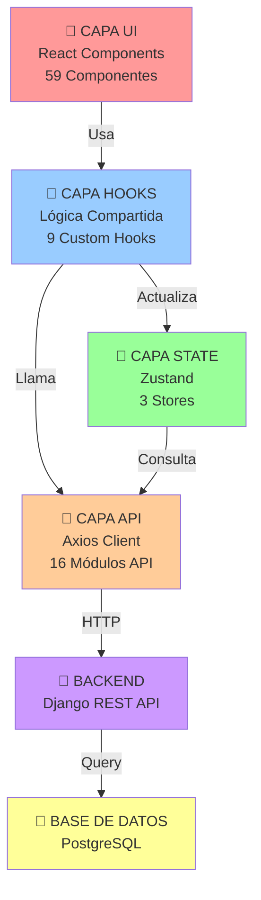

---

## 2️⃣ RELACIONES ENTRE PÁGINAS Y COMPONENTES PRINCIPALES

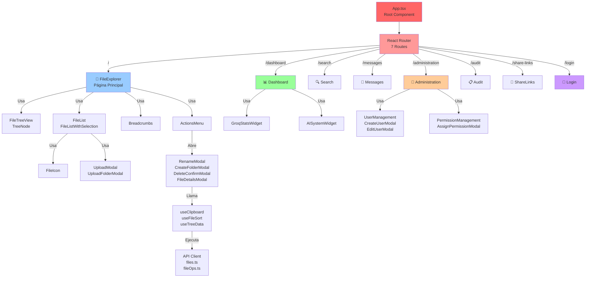

---

## 3️⃣ FLUJO DE DATOS Y ESTADO GLOBAL

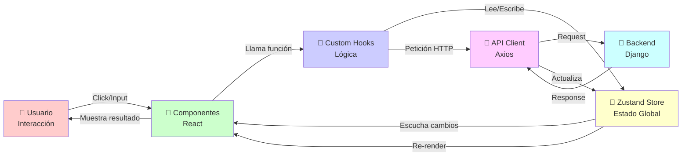

---

## 4️⃣ ESTRUCTURA DE COMPONENTES (ÁRBOL JERÁRQUICO)

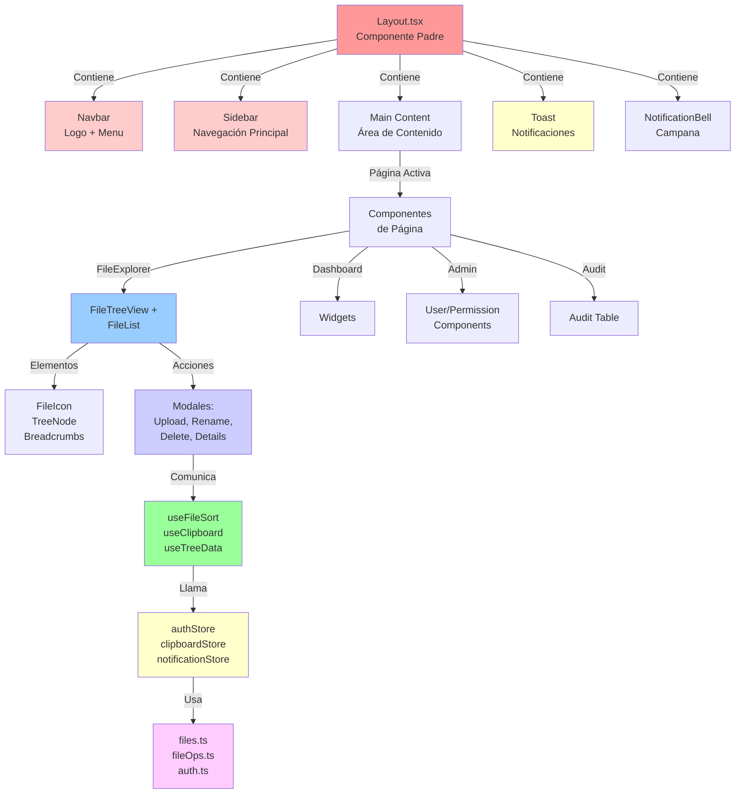

---

## 5️⃣ RELACIONES ENTRE STORES (ZUSTAND)

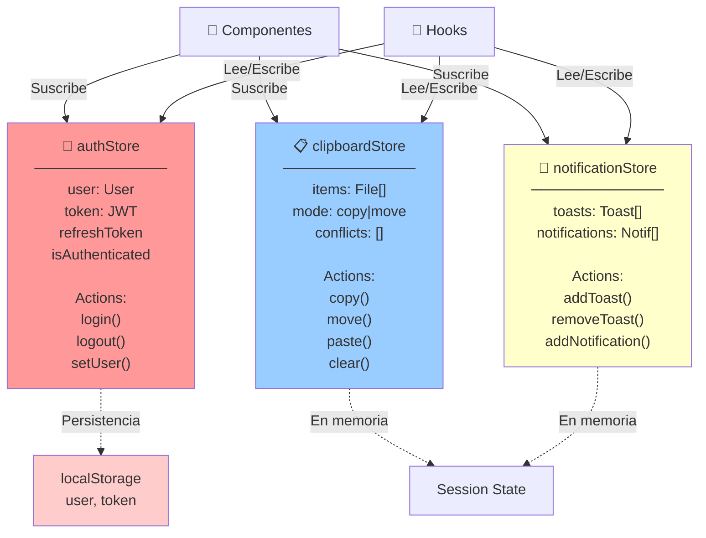

---

## 6️⃣ MÓDULOS DE API Y SUS FUNCIONES

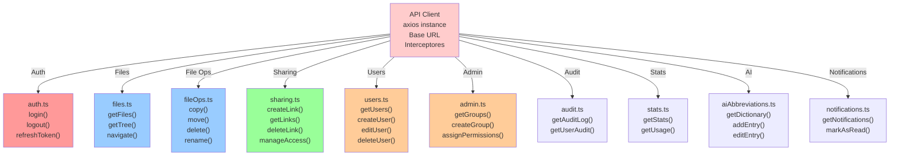

---

## 7️⃣ FLUJO COMPLETO: DESCARGAR ARCHIVO

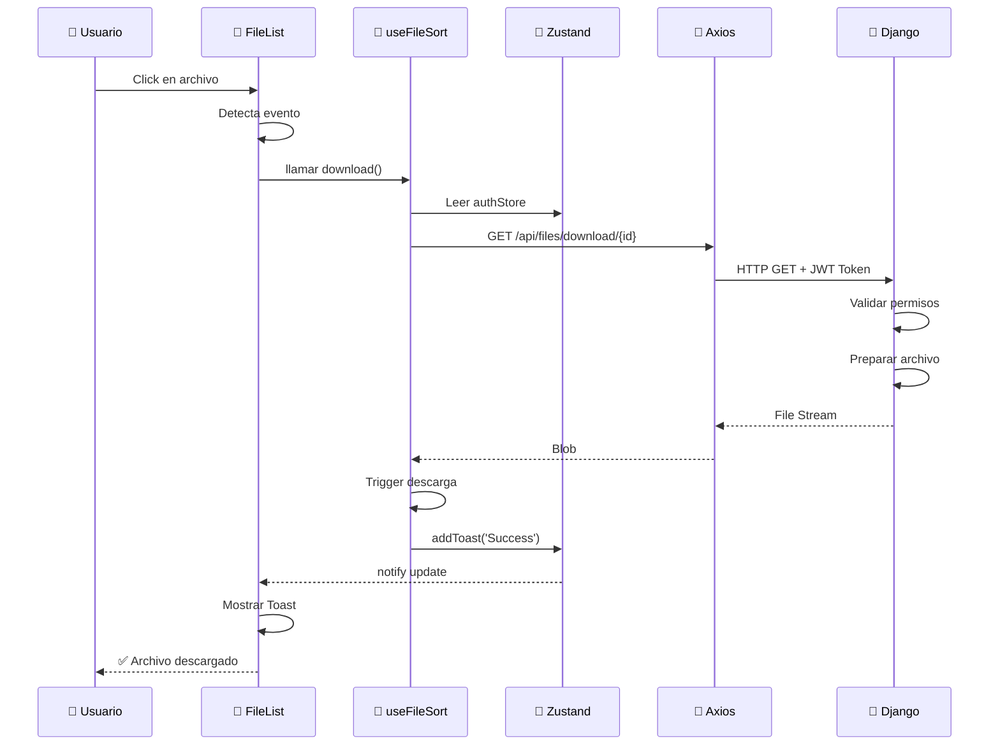

---

## 8️⃣ FLUJO COMPLETO: CREAR CARPETA

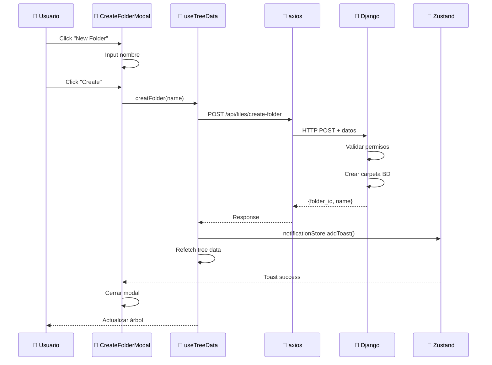

---

## 9️⃣ RELACIONES COMPONENTES - MODALES

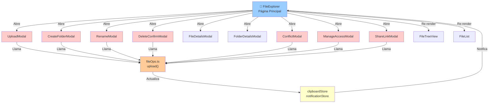

---

## 🔟 RELACIONES PÁGINA ADMINISTRACIÓN

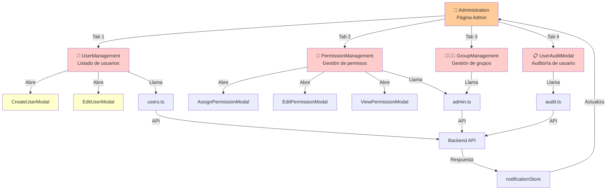

---

## 1️⃣1️⃣ CUSTOM HOOKS Y SUS DEPENDENCIAS

```mermaid
graph TB
    TREE["useTreeData<br/>─────────<br/>getTree()<br/>navigate()<br/>expand/collapse"]
    
    SORT["useFileSort<br/>─────────<br/>sortBy()<br/>filterBy()<br/>applySort()"]
    
    CLIP["useClipboard<br/>─────────<br/>copy()<br/>paste()<br/>move()"]
    
    CLIPCONF["useClipboardWithConflicts<br/>─────────<br/>detectConflicts()<br/>resolveConflict()"]
    
    PERMS["usePathPermissions<br/>─────────<br/>hasPermission()<br/>validatePath()"]
    
    MODAL["useModal<br/>─────────<br/>openModal()<br/>closeModal()"]
    
    TOAST["useToast<br/>─────────<br/>showToast()<br/>hideToast()"]
    
    THEME["useTheme<br/>─────────<br/>toggleTheme()<br/>setTheme()"]
    
    COLORS["useDirectoryColors<br/>─────────<br/>setColor()<br/>getColor()"]
    
    TREE -->|Usa| STORE1["authStore"]
    SORT -->|Usa| STORE1
    CLIP -->|Usa| STORE2["clipboardStore"]
    CLIPCONF -->|Usa| STORE2
    PERMS -->|Usa| STORE1
    MODAL -->|Usa| STORE2
    TOAST -->|Usa| STORE3["notificationStore"]
    THEME -->|Usa| CONTEXT["ThemeContext"]
    COLORS -->|Usa| STORE1
    
    TREE -->|Llama| API1["files.ts"]
    SORT -->|Llama| API1
    CLIP -->|Llama| API2["fileOps.ts"]
    CLIPCONF -->|Llama| API2
    PERMS -->|Llama| API1
    COLORS -->|Llama| API3["directoryColors.ts"]
    
    style TREE fill:#99ccff
    style SORT fill:#99ccff
    style CLIP fill:#99ccff
    style CLIPCONF fill:#99ccff
    style PERMS fill:#99ccff
    style MODAL fill:#99ccff
    style TOAST fill:#99ccff
    style THEME fill:#99ccff
    style COLORS fill:#99ccff
    style STORE1 fill:#ffffcc
    style STORE2 fill:#ffffcc
    style STORE3 fill:#ffffcc
    style CONTEXT fill:#ffcccc
```

---

## 1️⃣2️⃣ FLUJO DE AUTENTICACIÓN

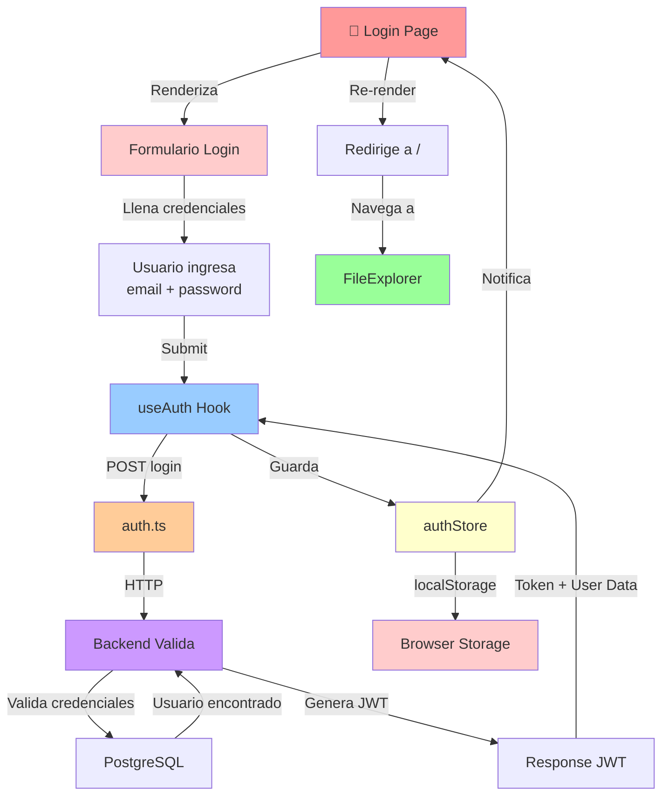

---

## 1️⃣3️⃣ MATRIZ DE DEPENDENCIAS (COMPONENTES - HOOKS)

```
                useTree  useSort  useClip  usePerm  useModal  useToast  useTheme
FileExplorer      ✅       ✅       ✅       ✅        ✅        ✅         ✅
FileList          ✅       ✅       ✅                 ✅        ✅
FileTreeView      ✅                                  ✅
UploadModal                         ✅                 ✅        ✅
CreateFolderModal                   ✅        ✅       ✅        ✅
RenameModal                         ✅                 ✅        ✅
DeleteConfirm                       ✅                 ✅        ✅
FileDetails       ✅       ✅                  ✅       ✅
ManageAccess                        ✅        ✅       ✅        ✅
ShareLinkModal                      ✅        ✅       ✅        ✅
Dashboard                                              ✅        ✅         ✅
Administration    ✅       ✅                          ✅        ✅
Audit             ✅       ✅                          ✅        ✅
```

---

## 1️⃣4️⃣ MATRIZ DE DEPENDENCIAS (COMPONENTES - API)

```
              files  fileOps  sharing  auth  users  admin  audit  stats  AI
FileExplorer   ✅      ✅       ✅               ✅      ✅      ✅      ✅
UploadModal            ✅                       ✅
CreateFolder           ✅
DeleteConfirm          ✅
RenameModal            ✅
ShareLink              ✅       ✅              ✅
ManageAccess           ✅       ✅              ✅
Dashboard              ✅                              ✅      ✅       ✅
Admin                  ✅                ✅     ✅      ✅
Users                                     ✅     ✅      ✅
Audit                                      ✅     ✅
Search         ✅      ✅       ✅              ✅      ✅
Notifications                                        ✅       ✅
```

---

## 1️⃣5️⃣ CICLO DE VIDA DE UN COMPONENTE (FileExplorer)

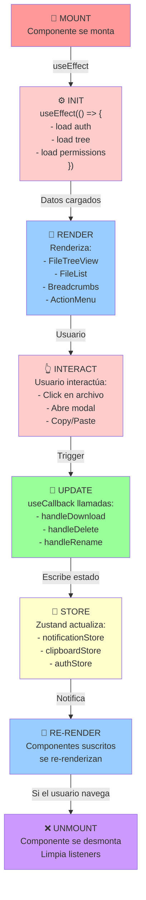

---

## 1️⃣6️⃣ RESUMEN VISUAL: COMPONENTES POR TIPO

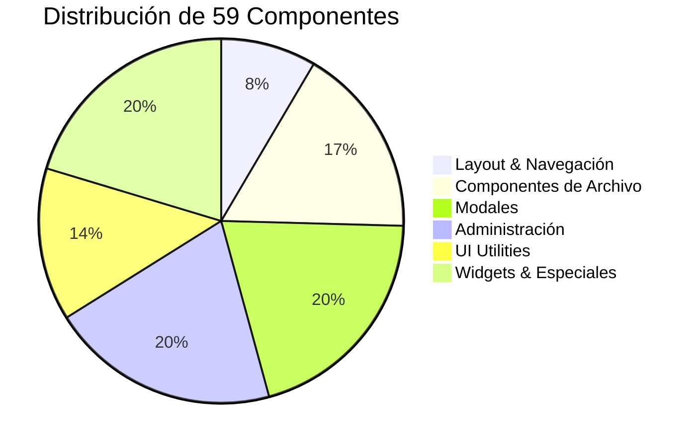

---

## 1️⃣7️⃣ RESUMEN: APIS POR CATEGORÍA

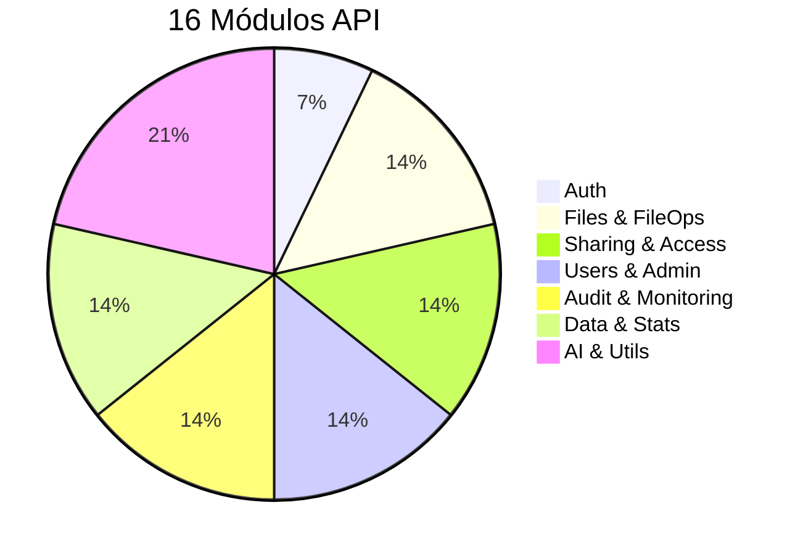

---

## 📊 RESUMEN VISUAL DE LA ARQUITECTURA

```
┌─────────────────────────────────────────────────────────────┐
│                    PRESENTACIÓN                              │
│  React Components (59) | Pages (13) | Modales (12)           │
└─────────────────────────────────────────────────────────────┘
                            ▲
                            │
┌─────────────────────────────────────────────────────────────┐
│                    LÓGICA                                     │
│  Custom Hooks (9) | ThemeContext | Utilidades               │
└─────────────────────────────────────────────────────────────┘
                            ▲
                            │
┌─────────────────────────────────────────────────────────────┐
│                  ESTADO GLOBAL                                │
│  Zustand Stores (3): Auth | Clipboard | Notifications        │
└─────────────────────────────────────────────────────────────┘
                            ▲
                            │
┌─────────────────────────────────────────────────────────────┐
│                  COMUNICACIÓN                                 │
│  API Client (Axios) | 16 Módulos API | Interceptores        │
└─────────────────────────────────────────────────────────────┘
                            ▲
                            │
┌─────────────────────────────────────────────────────────────┐
│                  BACKEND                                      │
│  Django REST API | PostgreSQL | Autenticación JWT            │
└─────────────────────────────────────────────────────────────┘
```

---

## 🎯 CONCLUSIÓN VISUAL

La arquitectura frontend sigue el patrón:

```
┌──────────────────────────────────────────────────┐
│  COMPONENTES (Presentación)                      │
│  Reutilizables | Responsivos | Accesibles       │
└─────────────────┬────────────────────────────────┘
                  │ Usa
┌─────────────────▼────────────────────────────────┐
│  HOOKS (Lógica Compartida)                       │
│  Custom | Reutilizables | Testeables            │
└─────────────────┬────────────────────────────────┘
                  │ Actualiza/Lee
┌─────────────────▼────────────────────────────────┐
│  ZUSTAND STORES (Estado Global)                  │
│  Reactividad | Persistencia | Suscripción        │
└─────────────────┬────────────────────────────────┘
                  │ Llama
┌─────────────────▼────────────────────────────────┐
│  API CLIENT (Comunicación HTTP)                  │
│  Axios | Interceptores | Error Handling          │
└─────────────────┬────────────────────────────────┘
                  │ HTTP
┌─────────────────▼────────────────────────────────┐
│  BACKEND (Lógica de Servidor)                    │
│  Django | PostgreSQL | Autenticación             │
└──────────────────────────────────────────────────┘
```

**Esta es una arquitectura moderna, escalable y bien estructurada que permite:**
✅ Mantenimiento fácil
✅ Testing simplificado
✅ Reutilización de código
✅ Escalabilidad
✅ Separación de responsabilidades
