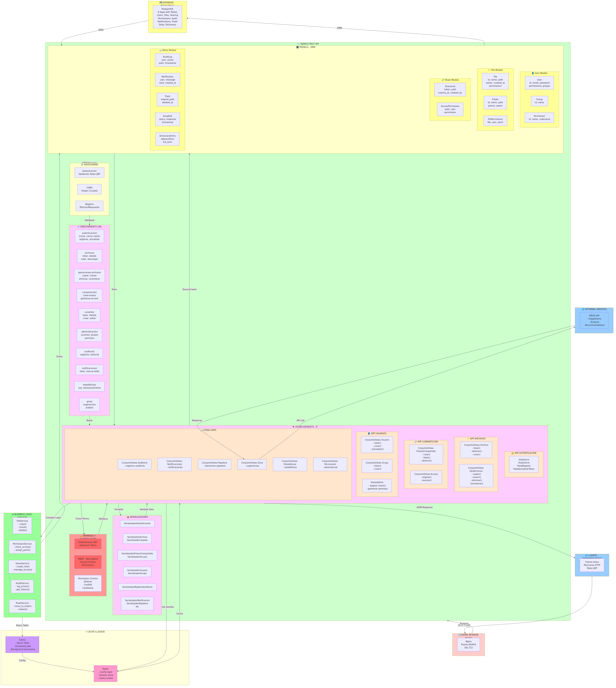

# 🔧 SUPER DIAGRAMA INTEGRADO - Arquitectura Backend Completa

## 📊 El Diagrama Integral del Backend



---

## 🔍 EXPLICACIÓN DETALLADA DEL SUPER DIAGRAMA BACKEND

### 1️⃣ **CLIENTE - FRONTEND REACT** (Azul)
```
🌐 Cliente
├── Axios Client
├── HTTP Requests
└── JWT Token en headers
```
El frontend envía peticiones HTTP al backend con autenticación JWT.

---

### 2️⃣ **NGINX REVERSE PROXY** (Rosa)
```
🔄 Nginx
├── Puerto 80 (HTTP)
├── Puerto 443 (HTTPS)
├── SSL/TLS termination
└── Forward a Django
```
Nginx actúa como proxy inverso, maneja SSL y redirecciona al backend.

---

### 3️⃣ **DJANGO REST API** (Verde)

#### 🛡️ MIDDLEWARE
```
Autenticación
├── JWT Token Validation
├── User extraction
└── Permission assignment

CORS (Cross-Origin)
├── Allow frontend requests
└── Headers validation

Logging
├── Request logging
├── Response logging
└── Performance monitoring
```

#### 🔗 URL ROUTING (8 módulos)
```
/api/auth/
├── login          → Autenticación
├── logout         → Cierre de sesión
├── register       → Registro
└── refresh        → Refresh token

/api/files/
├── list           → Listar archivos
├── detail         → Detalles
├── upload         → Subir archivos
└── download       → Descargar

/api/file-ops/
├── copy           → Copiar archivos
├── move           → Mover archivos
├── delete         → Eliminar
└── rename         → Renombrar

/api/sharing/
├── create-link    → Crear enlace público
├── manage-access  → Gestionar permisos
└── delete-link    → Eliminar enlace

/api/users/
├── list           → Listar usuarios
├── detail         → Detalles de usuario
├── create         → Crear usuario
└── edit           → Editar usuario

/api/admin/
├── users          → Gestión de usuarios
├── groups         → Gestión de grupos
└── permissions    → Asignación de permisos

/api/audit/
├── logs           → Historial de acciones
└── user-audit     → Auditoría por usuario

/api/notifications/
├── list           → Listar notificaciones
└── mark-read      → Marcar como leída
```

#### 👁️ VIEWS/VIEWSETS (8 Apps Django)

**🔐 AUTH APP - Autenticación**
```
LoginView
├── Valida credenciales
├── Genera JWT token
└── Retorna access + refresh

LogoutView
├── Invalida token
└── Limpia sesión

RegisterView
├── Crea nuevo usuario
├── Valida datos
└── Envía confirmación email

RefreshTokenView
├── Valida refresh token
└── Genera nuevo access token
```

**📁 FILES APP - Operaciones de Archivos**
```
FileViewSet
├── list()          → GET /files/ → Lista archivos
├── retrieve()      → GET /files/{id}/ → Detalles
├── create()        → POST /files/ → Crear/subir
├── update()        → PUT /files/{id}/ → Actualizar
└── destroy()       → DELETE /files/{id}/ → Eliminar

FileOpsViewSet
├── copy()          → POST /file-ops/copy/ → Copiar
├── move()          → POST /file-ops/move/ → Mover
├── delete()        → POST /file-ops/delete/ → Eliminar
└── rename()        → PUT /file-ops/rename/ → Renombrar

DirectoryColorViewSet
├── set_color()     → Asignar color a carpeta
└── get_colors()    → Obtener colores
```

**🔗 SHARING APP - Compartición**
```
ShareLinkViewSet
├── create()        → Crear enlace público
├── list()          → Listar enlaces
├── destroy()       → Eliminar enlace
└── update_perm()   → Actualizar permisos

AccessPermissionViewSet
├── assign()        → Asignar permisos a usuario
├── revoke()        → Revocar permisos
└── list()          → Listar permisos
```

**👤 USERS APP - Gestión de Usuarios**
```
UserViewSet
├── list()          → Listar usuarios
├── retrieve()      → Detalles de usuario
├── create()        → Crear usuario
├── update()        → Editar usuario
└── destroy()       → Eliminar usuario

GroupViewSet
├── list()          → Listar grupos
├── create()        → Crear grupo
├── update()        → Editar grupo
└── destroy()       → Eliminar grupo

AdminViews
├── bulk_assign()   → Asignar permisos en lote
├── manage_groups() → Gestionar grupos
└── user_audit()    → Auditoría de usuario
```

**📊 OTRAS APPS**
```
AuditViewSet
├── list()          → Historial de acciones
├── user_audit()    → Auditoría por usuario
└── action_history()→ Historial de archivo

NotificationViewSet
├── list()          → Notificaciones
├── mark_read()     → Marcar como leído
└── delete()        → Eliminar

TrashViewSet
├── list()          → Items en papelera
├── restore()       → Restaurar
└── destroy()       → Eliminar permanentemente

GroqViewSet
├── suggestions()   → Obtener sugerencias IA
├── analyze()       → Analizar patrón
└── stats()         → Estadísticas

StatsViewSet
├── usage()         → Uso del sistema
├── storage()       → Estadísticas almacenamiento
└── top_files()     → Top de archivos

DictionaryViewSet
├── list()          → Listar abreviaturas
├── create()        → Crear entrada
├── update()        → Editar entrada
└── destroy()       → Eliminar entrada
```

#### 📦 SERIALIZERS (Transformación de datos)
```
Validan y transforman datos:

AuthSerializer
├── Valida credenciales
└── Retorna JWT token

FileSerializer / FolderSerializer
├── Valida datos del archivo
├── Serializa a JSON
└── Deserializa de JSON

ShareLinkSerializer / AccessSerializer
├── Valida enlaces públicos
├── Serializa permisos
└── Maneja expiración

UserSerializer / GroupSerializer
├── Valida datos de usuario
├── Protege contraseña
└── Serializa grupos

AuditLogSerializer
├── Serializa logs
└── Formatea timestamps

NotificationSerializer / TrashSerializer
├── Serializa notificaciones
├── Serializa items trash
└── Maneja estado
```

#### 🔒 PERMISSIONS & AUTHENTICATION

**JWT Authentication**
```
1. Frontend envía credenciales
2. Backend valida en BD
3. Genera JWT token
4. Retorna access + refresh
5. Frontend almacena token
6. Envía en header Authorization
7. Middleware valida JWT
8. Extrae user info
9. Inyecta en request
```

**RBAC - Role Based Access Control**
```
Roles/Permisos:
├── Admin          → Acceso total
├── Editor         → Puede crear/editar/compartir
├── Viewer         → Solo lectura
└── Custom         → Permisos personalizados

Niveles:
├── Sistema        → Permisos globales
├── Carpeta        → Permisos por carpeta
└── Archivo        → Permisos por archivo
```

**Permission Checks**
```
IsOwner
├── Solo dueño puede modificar
└── Valida user == owner

CanEdit
├── Usuario tiene permiso Edit
└── Revisa RBAC

CanDelete
├── Usuario tiene permiso Delete
└── Revisa RBAC

CanShare
├── Usuario puede compartir
└── Revisa configuración
```

#### 🗄️ MODELS - ORM (Django ORM)

**👤 User Models**
```
User Model
├── id: PK
├── email: CharField unique
├── password: PasswordField (hashed)
├── first_name: CharField
├── last_name: CharField
├── groups: M2M Group
├── permissions: M2M Permission
├── created_at: DateTimeField
├── updated_at: DateTimeField
└── is_active: BooleanField

Group Model
├── id: PK
├── name: CharField unique
├── permissions: M2M Permission
└── users: M2M User (reverse)

Permission Model
├── id: PK
├── name: CharField
├── codename: CharField
├── content_type: ForeignKey
└── description: TextField
```

**📁 File Models**
```
File Model
├── id: PK
├── name: CharField
├── path: CharField
├── owner: ForeignKey User
├── created_at: DateTimeField
├── updated_at: DateTimeField
├── size: BigIntegerField
├── mime_type: CharField
├── is_public: BooleanField
├── permissions: M2M FilePermission
└── tags: M2M Tag

Folder Model
├── id: PK
├── name: CharField
├── path: CharField
├── parent: ForeignKey Folder (null)
├── owner: ForeignKey User
├── created_at: DateTimeField
├── color: CharField (optional)
└── permissions: M2M FilePermission

FilePermission Model
├── id: PK
├── file: ForeignKey File
├── user: ForeignKey User
└── permission: CharField (read/write/delete)
```

**🔗 Share Models**
```
ShareLink Model
├── id: PK
├── token: CharField unique
├── path: CharField
├── created_by: ForeignKey User
├── created_at: DateTimeField
├── expires_at: DateTimeField (optional)
├── download_count: IntegerField
└── is_active: BooleanField

AccessPermission Model
├── id: PK
├── path: CharField
├── user: ForeignKey User
├── permission: CharField (read/write/delete)
├── granted_by: ForeignKey User
├── granted_at: DateTimeField
└── expires_at: DateTimeField (optional)
```

**📊 Other Models**
```
AuditLog Model
├── id: PK
├── user: ForeignKey User
├── action: CharField (create/read/update/delete)
├── path: CharField
├── timestamp: DateTimeField
├── ip_address: CharField
├── user_agent: CharField
└── details: JSONField

Notification Model
├── id: PK
├── user: ForeignKey User
├── message: TextField
├── type: CharField (info/warning/error)
├── read: BooleanField
├── created_at: DateTimeField
└── related_object: ForeignKey (genérico)

Trash Model
├── id: PK
├── original_path: CharField
├── deleted_by: ForeignKey User
├── deleted_at: DateTimeField
├── expires_at: DateTimeField
└── data: JSONField (backup)

GroqStat Model
├── id: PK
├── query: TextField
├── response: TextField
├── tokens_used: IntegerField
├── model: CharField
├── timestamp: DateTimeField
└── user: ForeignKey User

DictionaryEntry Model
├── id: PK
├── abbreviation: CharField unique
├── full_form: CharField
├── created_by: ForeignKey User
├── created_at: DateTimeField
└── usage_count: IntegerField
```

---

### 4️⃣ **BUSINESS LOGIC SERVICES** (Verde)

Capa de servicios que contiene lógica de negocio compleja:

```
FileService
├── copy(source, dest)
│   ├── Valida permisos
│   ├── Copia en BD
│   ├── Copia en filesystem
│   ├── Copia permisos
│   └── Registra en audit
│
├── move(source, dest)
│   ├── Valida permisos
│   ├── Actualiza paths
│   ├── Actualiza permisos
│   └── Registra en audit
│
└── delete(path)
    ├── Valida permisos
    ├── Mueve a trash
    ├── Programa eliminación
    └── Notifica usuario

PermissionService
├── check_access(user, path, action)
│   ├── Revisa permisos usuario
│   ├── Revisa permisos grupo
│   └── Retorna bool
│
└── assign_perm(user, path, perm)
    ├── Valida admin
    ├── Crea permission
    └── Registra en audit

ShareService
├── create_link(path, expiration)
│   ├── Genera token único
│   ├── Crea registro
│   └── Retorna URL pública
│
└── manage_access(path, users, perm)
    ├── Asigna permisos
    ├── Notifica usuarios
    └── Registra en audit

AuditService
├── log_action(user, action, path)
│   ├── Crea AuditLog
│   ├── Captura metadata
│   └── Guarda en BD
│
└── get_history(path)
    ├── Query AuditLog
    └── Retorna historial

TrashService
├── move_to_trash(path)
│   ├── Copia a trash
│   ├── Programa restauración
│   └── Notifica usuario
│
└── restore(path)
    ├── Restaura de trash
    └── Notifica usuario
```

---

### 5️⃣ **CACHE & QUEUE** (Magenta y Púrpura)

#### ⚡ Redis
```
Redis Server
├── Cache Layer
│   ├── Cache de archivos
│   ├── Cache de usuarios
│   ├── Cache de permisos
│   └── TTL: 5 minutos
│
├── Session Store
│   ├── Sesiones de usuario
│   ├── Tokens
│   └── TTL: 24 horas
│
└── Celery Broker
    ├── Queue de tareas
    ├── Retry logic
    └── Message broker
```

#### 🎯 Celery - Async Tasks
```
Celery Worker
├── Email Tasks
│   ├── Enviar confirmación
│   ├── Notificaciones
│   └── Reporte diario
│
├── File Tasks
│   ├── Procesar upload
│   ├── Generar thumbnail
│   ├── Validar archivo
│   └── Cleanup cache
│
├── Cleanup Tasks
│   ├── Limpiar trash
│   ├── Limpiar links expirados
│   ├── Limpiar sesiones
│   └── Archiver antiguo
│
└── Scheduled Tasks
    ├── Generar estadísticas
    ├── Backup BD
    ├── Limpiar logs
    └── Enviar notificaciones
```

---

### 6️⃣ **DATABASE - POSTGRESQL** (Amarillo)

```
PostgreSQL
├── 8 Aplicaciones Django
├── 15+ Tablas
├── Índices optimizados
├── Backups programados
│
├── Tablas Principales:
│   ├── auth_user
│   ├── auth_group
│   ├── auth_permission
│   ├── files_file
│   ├── files_folder
│   ├── files_permission
│   ├── sharing_sharelink
│   ├── sharing_accesspermission
│   ├── audit_auditlog
│   ├── notifications_notification
│   ├── trash_trash
│   ├── groq_groqstat
│   ├── dictionary_entry
│   └── Custom tables
│
└── Características:
    ├── JSON fields
    ├── Full-text search
    ├── Triggers
    └── Constraints
```

---

### 7️⃣ **EXTERNAL SERVICES** (Cyan)

**GROQ API**
```
GROQ Cloud Service
├── Sugerencias de archivos
├── Análisis de patrones
├── Recomendaciones IA
└── Modelos disponibles:
    ├── llama-3.3-70b
    ├── mixtral-8x7b
    └── otros modelos
```

---

## 🔄 FLUJOS PRINCIPALES

### Flujo 1: Usuario Descarga Archivo
```
1. Frontend: GET /api/files/download/{id}/
2. Nginx: Forward a Django
3. Middleware: Valida JWT token
4. URLRouter: Route a FileViewSet.download()
5. Permission: Check si user tiene acceso
6. Serializer: Valida parámetros
7. View: Llamaa FileService
8. Service: 
   ├── Check permisos
   ├── Log en AuditLog
   ├── Actualiza download_count
   └── Lee del filesystem
9. Response: File stream
10. Cache: Guarda en Redis
11. Nginx: Retorna a frontend
12. Frontend: Descarga el archivo
```

### Flujo 2: Crear Usuario (Admin)
```
1. Frontend: POST /api/users/
2. Nginx: Forward a Django
3. Middleware: Valida JWT
4. URLRouter: Route a UserViewSet.create()
5. Permission: Check si admin
6. Serializer: Valida datos (email, password, etc)
7. View: Llama UserService
8. Service:
   ├── Crea User
   ├── Hash password
   ├── Asigna grupo
   ├── Log en AuditLog
   └── Invalida cache
9. Celery: Envía email confirmación
10. Response: User data
11. Frontend: Mostrar éxito
```

### Flujo 3: Compartir Archivo
```
1. Frontend: POST /api/sharing/create-link/
2. Nginx: Forward a Django
3. Middleware: Valida JWT
4. URLRouter: Route a ShareLinkViewSet.create()
5. Permission: Check si owner
6. Serializer: Valida parámetros
7. View: Llama ShareService
8. Service:
   ├── Genera token único
   ├── Crea ShareLink record
   ├── Log en AuditLog
   ├── Invalida cache
   └── Genera URL pública
9. Celery: Envía notificación
10. Response: Link data
11. Frontend: Muestra enlace
```

---

## 📊 ARQUITECTURA EN CAPAS

```
┌──────────────────────────────────┐
│  Frontend React (NGINX Proxy)    │
└──────────────────────────────────┘
           ↓ HTTP + JWT
┌──────────────────────────────────┐
│   Middleware (Auth, CORS, Log)   │
└──────────────────────────────────┘
           ↓ Route
┌──────────────────────────────────┐
│   URL Router (/api/*)            │
└──────────────────────────────────┘
           ↓ Map
┌──────────────────────────────────┐
│   ViewSets (8 Apps)              │
│   - Manejan requests             │
│   - Validan con Serializers      │
│   - Chequean Permisos            │
└──────────────────────────────────┘
           ↓ Call
┌──────────────────────────────────┐
│   Business Logic Services        │
│   - Lógica de negocio            │
│   - Transacciones                │
│   - Validaciones complejas       │
└──────────────────────────────────┘
           ↓ Query
┌──────────────────────────────────┐
│   ORM Models                     │
│   - Mapeo a tablas               │
│   - Validaciones de modelo       │
│   - Relaciones                   │
└──────────────────────────────────┘
           ↓ SQL
┌──────────────────────────────────┐
│   PostgreSQL Database            │
│   - Persistencia                 │
│   - Constraints                  │
│   - Índices                      │
└──────────────────────────────────┘
```

---

## ✅ CARACTERÍSTICAS PRINCIPALES

✅ **8 Aplicaciones Django Independientes**
- Cada una con sus Models, Views, Serializers

✅ **JWT Authentication**
- Tokens en headers
- Refresh automático
- Validación en middleware

✅ **RBAC - Role Based Access Control**
- Permisos granulares
- Por usuario, grupo, carpeta, archivo

✅ **Async Processing**
- Celery para tareas de fondo
- Emails, backups, cleanup

✅ **Caching con Redis**
- Cache de queries
- Sesiones
- Broker para Celery

✅ **Auditoría Completa**
- Cada acción registrada
- Historial por usuario
- Historial por archivo

✅ **API REST Profesional**
- Endpoints RESTful
- Validaciones robustas
- Error handling
- Paginación
- Filtros

✅ **Base de Datos Robusta**
- PostgreSQL enterprise
- Índices optimizados
- Constraints
- Backups

---

## 🎯 CONCLUSIÓN

El **Super Diagrama Integrado del Backend** muestra:

✅ Flujo completo de request → response
✅ 8 aplicaciones Django independientes
✅ Middleware, views, serializers, models
✅ JWT authentication y RBAC
✅ Services con lógica de negocio
✅ Integración con Redis y Celery
✅ PostgreSQL como persistencia
✅ GROQ API para IA

**Este es el mapa COMPLETO de la arquitectura backend de Server Archivo.** 🗺️
