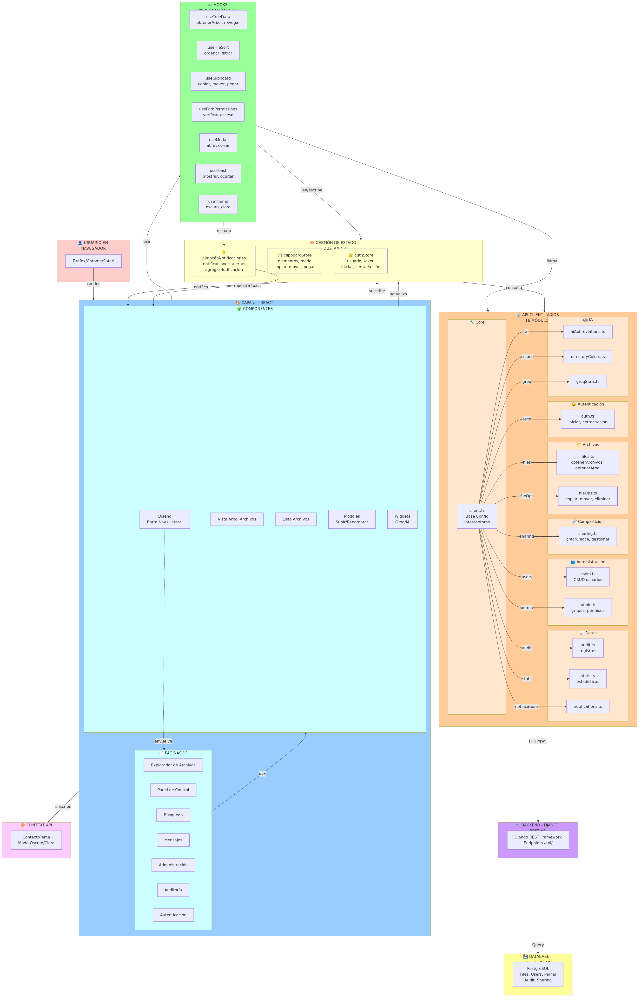

# 🎯 SUPER DIAGRAMA INTEGRADO - Arquitectura Frontend Completa

## 📊 El Diagrama Integral



---

## 🔍 EXPLICACIÓN DETALLADA DEL SUPER DIAGRAMA

### 1️⃣ **CAPA USUARIO** (Rojo)
```
👤 USUARIO EN NAVEGADOR
├── Firefox
├── Chrome
└── Safari
```
El usuario interactúa con la aplicación a través de su navegador web.

---

### 2️⃣ **CAPA UI - REACT COMPONENTS** (Azul Claro - 59 Componentes)

#### 📄 PÁGINAS (13 Rutas)
```
FileExplorer     → Explorador principal de archivos
Dashboard        → Estadísticas y resumen
Search           → Búsqueda global
Messages         → Sistema de mensajería
Administration   → Gestión de usuarios/permisos
Audit            → Registro de auditoría
Login            → Autenticación
```

#### 🧩 COMPONENTES (Reutilizables)
```
Layout          → Estructura padre (Navbar + Sidebar)
FileTreeView    → Árbol de directorios
FileList        → Listado de archivos
Modales         → Upload, Rename, Delete, Create
Widgets         → Groq, AI, Stats
```

**Relación:** Layout envuelve las Páginas. Las Páginas usan Componentes.

---

### 3️⃣ **CAPA HOOKS** (Verde - 9 Custom Hooks)

```
useTreeData          → Cargar/navegar árbol de directorios
useFileSort          → Ordenar y filtrar archivos
useClipboard         → Copy/Move/Paste de archivos
usePathPermissions   → Validar permisos por ruta
useModal             → Abrir/cerrar modales
useToast             → Mostrar notificaciones toast
useTheme             → Cambiar tema Dark/Light
useDirectoryColors   → Colores de directorios
useClipboardMultiple → Múltiples elementos clipboard
```

**Responsabilidad:** Contienen la lógica de negocio reutilizable.
**Comunican con:** State Management y API Client.

---

### 4️⃣ **CAPA STATE - ZUSTAND** (Amarillo - 3 Stores)

#### 🔐 authStore
```
Estado:
  - user (Usuario actual)
  - token (JWT)
  - refreshToken
  - isAuthenticated (booleano)

Acciones:
  - login(email, password)
  - logout()
  - setUser(userData)
  - refreshAuth()

Persistencia: localStorage
```

#### 📋 clipboardStore
```
Estado:
  - items (archivos copiados/movidos)
  - mode ("copy" | "move")
  - conflicts (conflictos detectados)

Acciones:
  - copy(files)
  - move(files)
  - paste(targetPath)
  - clear()
  - resolveConflict()

Persistencia: En memoria (sesión)
```

#### 🔔 notificationStore
```
Estado:
  - toasts (array de notificaciones)
  - notifications (alertas importantes)

Acciones:
  - addToast(message, type)
  - removeToast(id)
  - addNotification(notif)

Persistencia: En memoria
```

---

### 5️⃣ **CAPA API CLIENT - AXIOS** (Naranja - 16 Módulos)

#### 🔧 Core
```
client.ts
  - Instancia de Axios configurada
  - URL base (/api)
  - Interceptores:
    * Request: Agrega JWT token
    * Response: Maneja errores
    * Refresh token automático
```

#### 🔐 Autenticación
```
auth.ts
  - login(email, password)
  - logout()
  - refreshToken()
  - register(userData)
```

#### 📁 Operaciones de Archivos
```
files.ts
  - getFiles(path)
  - getTree()
  - navigate(path)
  - searchFiles(query)

fileOps.ts
  - copy(sources, dest)
  - move(sources, dest)
  - delete(paths)
  - rename(oldPath, newPath)
  - uploadFiles(files)
```

#### 🔗 Compartición
```
sharing.ts
  - createShareLink(path)
  - getShareLinks()
  - updateShareLink(id, perms)
  - deleteShareLink(id)
  - manageAccess(path, users)
```

#### 👥 Usuarios y Administración
```
users.ts
  - getUsers()
  - createUser(userData)
  - editUser(id, userData)
  - deleteUser(id)
  - getUserPermissions(userId)

admin.ts
  - getGroups()
  - createGroup(groupData)
  - editGroup(id, data)
  - assignPermissions(userId, perms)
  - bulkPermissionAssignment(data)
```

#### 📊 Datos y Monitoreo
```
audit.ts
  - getAuditLog(filters)
  - getUserAudit(userId)
  - getActionHistory(path)

stats.ts
  - getStats()
  - getUsageStats()
  - getStorageStats()

notifications.ts
  - getNotifications()
  - markAsRead(notifId)
  - deleteNotification(notifId)
```

#### 🤖 IA y Utilidades
```
aiAbbreviations.ts
  - getDictionary()
  - addEntry(abbreviation, fullForm)
  - editEntry(id, data)
  - deleteEntry(id)

directoryColors.ts
  - setDirectoryColor(path, color)
  - getDirectoryColor(path)
  - getColorPalette()

groqStats.ts
  - getGroqStats()
  - getSuggestions()
  - analyzePattern(data)
```

---

### 6️⃣ **CAPA BACKEND** (Púrpura)

```
Django REST API
├── /api/auth/          → Autenticación
├── /api/files/         → Operaciones de archivos
├── /api/sharing/       → Compartición
├── /api/users/         → Gestión de usuarios
├── /api/admin/         → Administración
├── /api/audit/         → Auditoría
├── /api/notifications/ → Notificaciones
└── /api/stats/         → Estadísticas
```

**Responsabilidad:**
- Validar solicitudes
- Aplicar lógica de negocio
- Consultar base de datos
- Generar respuestas JSON

---

### 7️⃣ **BASE DE DATOS** (Amarillo Oscuro)

```
PostgreSQL
├── Tablas de Usuarios
│   ├── users (id, email, password, permissions)
│   ├── groups (id, name, members)
│   └── roles (id, name, permissions)
│
├── Tablas de Archivos
│   ├── files (id, name, path, owner, created_at)
│   ├── folders (id, name, path, owner)
│   └── file_permissions (file_id, user_id, permission)
│
├── Tablas de Compartición
│   ├── share_links (id, token, path, expires_at)
│   ├── shared_accesses (id, path, user_id, permission)
│   └── share_history (id, action, timestamp)
│
├── Tablas de Auditoría
│   ├── audit_logs (id, user_id, action, path, timestamp)
│   ├── action_history (id, file_id, action, user_id)
│   └── user_activity (id, user_id, action_type, timestamp)
│
└── Tablas de Notificaciones
    ├── notifications (id, user_id, message, read)
    └── notification_preferences (user_id, type, enabled)
```

---

### 8️⃣ **CONTEXT API** (Magenta)

```
ThemeContext
├── Proporciona: isDark (boolean)
├── Proporciona: colors (paleta)
└── Acciones: toggleTheme(), setTheme(theme)

Usado por:
└── useTheme hook → Todos los componentes
```

---

## 🔄 FLUJOS DE DATOS PRINCIPALES

### Flujo 1: Usuario interactúa
```
1. Usuario hace click en botón
   ↓
2. Componente React detecta evento (onClick)
   ↓
3. Llama función del custom hook
   ↓
4. Hook ejecuta lógica de negocio
   ↓
5. Hook actualiza Zustand Store
   ↓
6. Componentes suscritos se notifican
   ↓
7. Components se re-renderizan
   ↓
8. Usuario ve resultado
```

### Flujo 2: Petición a servidor
```
1. Hook necesita datos
   ↓
2. Llama API Client (axios)
   ↓
3. Axios agrga JWT token (interceptor)
   ↓
4. Petición HTTP a Backend
   ↓
5. Backend valida token
   ↓
6. Backend consulta PostgreSQL
   ↓
7. Backend envía respuesta JSON
   ↓
8. Axios interceptor procesa
   ↓
9. Hook actualiza Store
   ↓
10. UI se re-renderiza
```

---

## 📊 ESTADÍSTICAS

| Aspecto | Cantidad |
|---------|----------|
| **Componentes** | 59 |
| **Páginas/Rutas** | 13 |
| **Custom Hooks** | 9 |
| **Zustand Stores** | 3 |
| **Módulos API** | 16 |
| **Endpoints Django** | 40+ |
| **Tablas PostgreSQL** | 15+ |
| **Contextos** | 1 |
| **Dependencias npm** | 8 principales |

---

## 🎯 PUNTOS CLAVE

✅ **Separación de responsabilidades**
- UI: Solo presentación
- Hooks: Lógica compartida
- State: Estado global
- API: Comunicación
- Backend: Lógica servidor

✅ **Flujo unidireccional**
- Usuario → UI → Hooks → State → API → Backend → DB
- Response: DB → Backend → API → State → UI → Usuario

✅ **Reactividad**
- Zustand notifica componentes de cambios
- useEffect escucha cambios de state
- Componentes se re-renderizan automáticamente

✅ **Escalabilidad**
- Fácil agregar nuevos hooks
- Fácil agregar nuevos módulos API
- Fácil agregar nuevas páginas
- Estructura modular y reutilizable

✅ **Seguridad**
- JWT tokens en authStore
- Interceptor de Axios
- Validación backend
- Permisos por usuario

---

## 🚀 CÓMO NAVEGAR EL CÓDIGO

1. **Quiero entender el flujo general**
   → Lee este documento + mira el super diagrama

2. **Quiero entender un componente**
   → Abre el archivo en `/frontend/src/pages/`
   → Ve qué hooks usa
   → Ve qué APIs llama

3. **Quiero entender un hook**
   → Abre el archivo en `/frontend/src/hooks/`
   → Ve qué Store modifica
   → Ve qué APIs llama

4. **Quiero entender un API**
   → Abre el archivo en `/frontend/src/api/`
   → Ve qué endpoints Django llama
   → Ve qué datos transforma

5. **Quiero agregar una feature**
   → Crea componente/página
   → Crea hook si necesitas lógica
   → Crea módulo API si necesitas servidor
   → Crea endpoint Django si necesitas BD

---

## 📁 ESTRUCTURA VISUAL

```
🌐 NAVEGADOR (Usuario)
    ↓
┌─────────────────────────────┐
│ 🎨 REACT COMPONENTS (59)    │
│ ├── Pages (13)              │
│ ├── Componentes             │
│ └── Modales                 │
└─────────────────────────────┘
    ↓ usa
┌─────────────────────────────┐
│ 🎣 CUSTOM HOOKS (9)         │
│ ├── useTreeData             │
│ ├── useFileSort             │
│ ├── useClipboard            │
│ └── ...                     │
└─────────────────────────────┘
    ↓ lee/escribe
┌─────────────────────────────┐
│ 🧠 ZUSTAND STORES (3)       │
│ ├── authStore               │
│ ├── clipboardStore          │
│ └── notificationStore       │
└─────────────────────────────┘
    ↓ llama
┌─────────────────────────────┐
│ 📡 AXIOS API CLIENT (16)    │
│ ├── auth.ts                 │
│ ├── files.ts                │
│ ├── fileOps.ts              │
│ └── ...                     │
└─────────────────────────────┘
    ↓ HTTP/JWT
┌─────────────────────────────┐
│ 🔧 DJANGO BACKEND           │
│ ├── /api/auth/              │
│ ├── /api/files/             │
│ ├── /api/sharing/           │
│ └── ...                     │
└─────────────────────────────┘
    ↓ Query
┌─────────────────────────────┐
│ 💾 POSTGRESQL               │
│ ├── users                   │
│ ├── files                   │
│ ├── permissions             │
│ └── ...                     │
└─────────────────────────────┘
```

---

## ✅ CONCLUSIÓN

El **Super Diagrama Integrado** muestra:

✅ Todas las capas trabajando juntas
✅ 59 componentes organizados por tipo
✅ 9 hooks reutilizables
✅ 3 stores Zustand
✅ 16 módulos API
✅ Flujos completos de datos
✅ Relaciones entre capas
✅ Integración con Backend

**Este es el mapa completo de la arquitectura frontend de Server Archivo.** 🗺️
