# 📊 Diagramas Visuales - Frontend Server Archivo (PNG)

## 📍 Ubicación de los diagramas

Todos los diagramas en formato PNG están en:
```
/home/andres/server_archivo/docs/diagrams/png/
```

---

## 🖼️ DIAGRAMAS GENERADOS (15 PNG)

### 1️⃣ Arquitectura en Capas
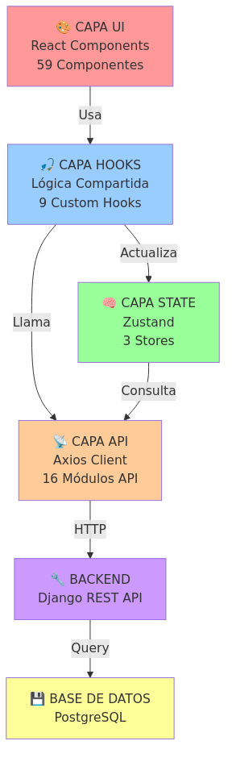
**Descripción:** Muestra las 6 capas principales de la aplicación:
- UI (React Components)
- Hooks (Lógica Compartida)
- State Management (Zustand)
- API Client (Axios)
- Backend (Django)
- Base de Datos (PostgreSQL)

---

### 2️⃣ Flujo de Datos
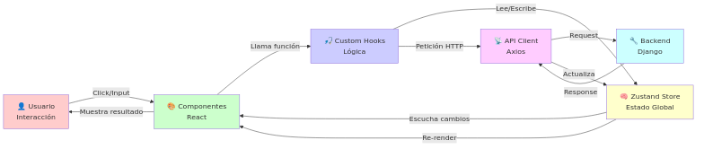
**Descripción:** Cómo circula la información desde el usuario hasta la base de datos:
- Usuario hace interacción
- Componentes React detectan evento
- Hooks ejecutan lógica
- Zustand Store actualiza estado
- API Client hace petición HTTP
- Backend procesa
- Response vuelve y actualiza UI

---

### 3️⃣ Componentes y Páginas
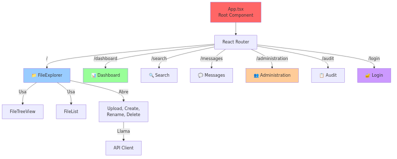
**Descripción:** Relaciones entre las 13 páginas principales y sus componentes:
- Router React con 7 rutas principales
- FileExplorer con FileTreeView + FileList
- Componentes de página relacionados
- Modales y componentes auxiliares

---

### 4️⃣ Árbol de Componentes
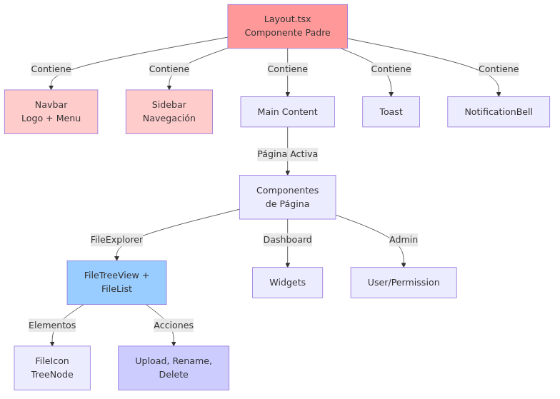
**Descripción:** Estructura jerárquica de componentes:
- Layout como componente padre
- Navbar, Sidebar, Main Content, Toast, NotificationBell
- Componentes de página (FileExplorer, Dashboard, Admin)
- Elementos internos (FileIcon, TreeNode, FileIcon)
- Modales (Upload, Rename, Delete, etc)

---

### 5️⃣ Zustand Stores
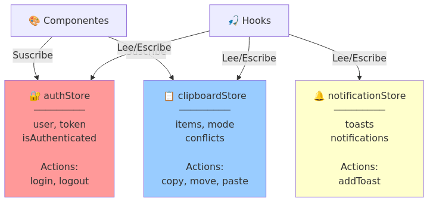
**Descripción:** Los 3 stores de estado global:
- **authStore:** usuario, token, isAuthenticated, login(), logout()
- **clipboardStore:** items, mode, conflicts, copy(), move(), paste()
- **notificationStore:** toasts, notifications, addToast()
- Relaciones con componentes y hooks

---

### 6️⃣ Módulos API
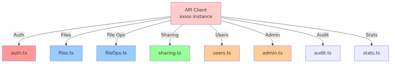
**Descripción:** Los 16 módulos de API client:
- auth.ts (autenticación)
- files.ts (operaciones de archivos)
- fileOps.ts (copy, move, delete, rename)
- sharing.ts (compartición)
- users.ts (gestión de usuarios)
- admin.ts (administración)
- audit.ts (auditoría)
- stats.ts (estadísticas)

---

### 7️⃣ Flujo: Descargar Archivo
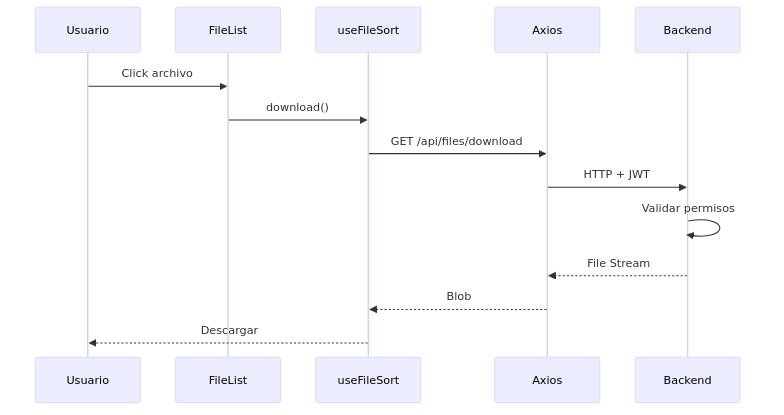
**Descripción:** Diagrama de secuencia paso a paso:
1. Usuario hace click en archivo
2. FileList detecta evento
3. Llama a useFileSort.download()
4. Hook lee authStore (JWT token)
5. Axios hace GET /api/files/download
6. Backend valida permisos
7. Envía file stream
8. Hook dispara descarga
9. Toast de éxito

---

### 8️⃣ Flujo: Crear Carpeta
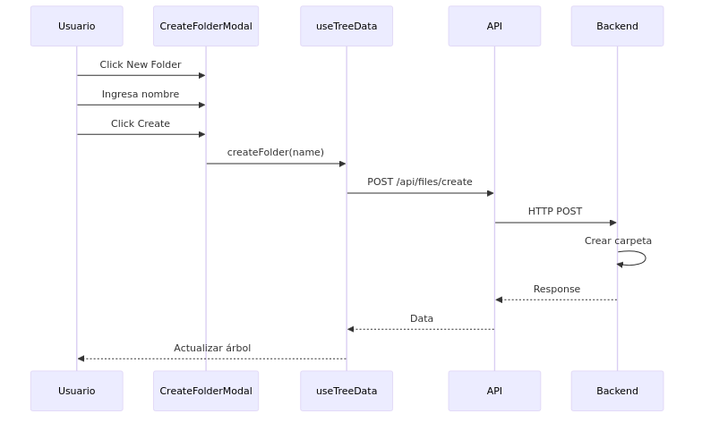
**Descripción:** Diagrama de secuencia:
1. Usuario hace click "New Folder"
2. CreateFolderModal se abre
3. Usuario ingresa nombre
4. Modal llama useTreeData.createFolder()
5. Hook hace POST /api/files/create-folder
6. Backend crea carpeta en BD
7. Response vuelve
8. Hook actualiza tree
9. UI se re-renderiza

---

### 9️⃣ Relaciones: Componentes y Modales
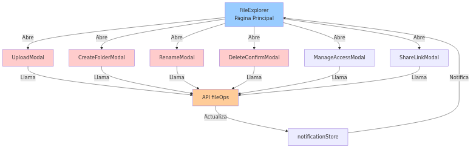
**Descripción:** Cómo FileExplorer abre múltiples modales:
- FileExplorer abre:
  - UploadModal
  - CreateFolderModal
  - RenameModal
  - DeleteConfirmModal
  - ManageAccessModal
  - ShareLinkModal
- Todos hacen llamadas a fileOps.ts
- Actualizan notificationStore
- FileExplorer recibe notificaciones

---

### 🔟 Página Administración
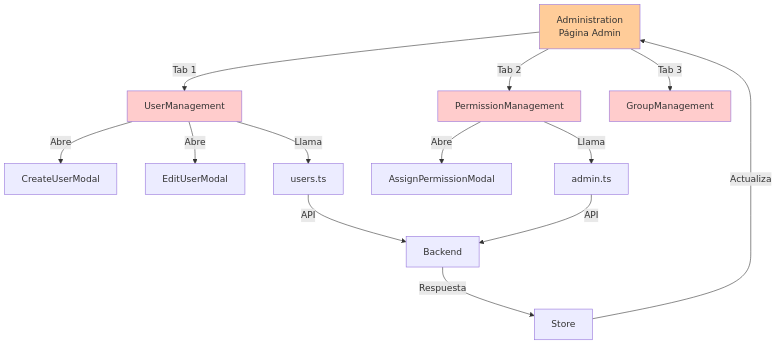
**Descripción:** Estructura de la página de administración:
- Tab 1: UserManagement (usuarios)
- Tab 2: PermissionManagement (permisos)
- Tab 3: GroupManagement (grupos)
- Modales para crear/editar
- APIs: users.ts, admin.ts
- Comunicación con backend
- Store actualiza UI

---

### 1️⃣1️⃣ Custom Hooks
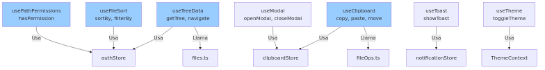
**Descripción:** Los 9 hooks personalizados y sus dependencias:
- useTreeData: getTree(), navigate()
- useFileSort: sortBy(), filterBy()
- useClipboard: copy(), paste(), move()
- usePathPermissions: hasPermission()
- useModal: openModal(), closeModal()
- useToast: showToast()
- useTheme: toggleTheme()
- Relaciones con stores (authStore, clipboardStore, notificationStore)
- Llamadas a APIs

---

### 1️⃣2️⃣ Flujo Autenticación
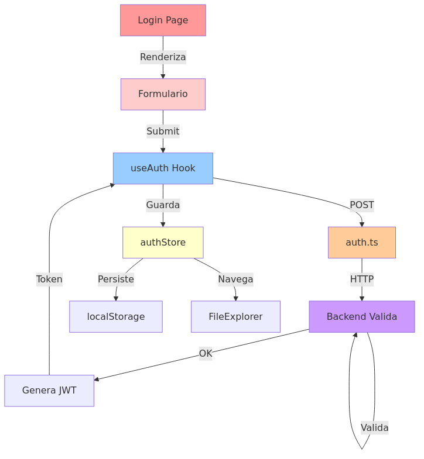
**Descripción:** Proceso completo de login:
1. Login Page renderiza formulario
2. Usuario completa credenciales
3. Submit llama useAuth hook
4. Hook hace POST auth.ts
5. Axios envía HTTP al backend
6. Backend valida en PostgreSQL
7. Genera JWT token
8. Response vuelve con token
9. Hook guarda en authStore
10. Persiste en localStorage
11. Redirige a FileExplorer

---

### 1️⃣3️⃣ Distribución de Componentes
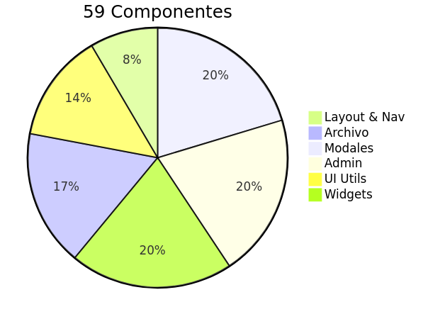
**Descripción:** Gráfico pie con distribución de 59 componentes:
- Layout & Navegación: 5
- Componentes de Archivo: 10
- Modales: 12
- Administración: 12
- UI Utilities: 8
- Widgets & Especiales: 12

---

### 1️⃣4️⃣ Distribución de APIs
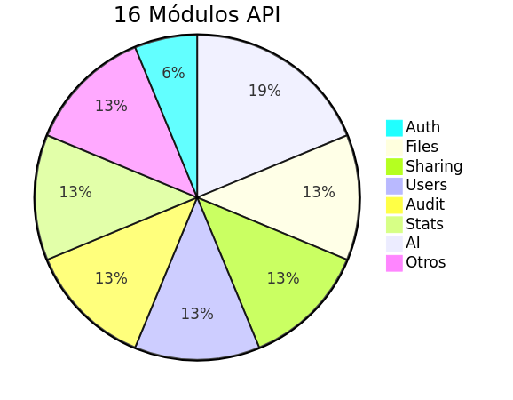
**Descripción:** Gráfico pie con distribución de 16 módulos API:
- Auth: 1
- Files: 2
- Sharing: 2
- Users: 2
- Audit: 2
- Stats: 2
- AI: 3
- Otros: 2

---

### 1️⃣5️⃣ Ciclo de Vida de Componente
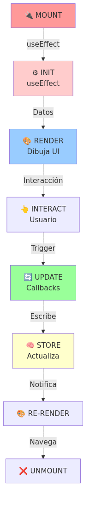
**Descripción:** Fases del ciclo de vida de un componente React:
1. 🔌 MOUNT - Componente se monta
2. ⚙️ INIT - useEffect carga datos
3. 🎨 RENDER - Dibuja la UI
4. 👆 INTERACT - Usuario interactúa
5. 🔄 UPDATE - Callbacks/handlers
6. 🧠 STORE - Zustand actualiza estado
7. 🎨 RE-RENDER - Componentes se re-renderizan
8. ❌ UNMOUNT - Componente se desmonta

---

## 📁 ESTRUCTURA DE ARCHIVOS

```
docs/diagrams/
├── *.mmd                          ← Archivos fuente Mermaid
├── png/
│   ├── 01-arquitectura-capas.png
│   ├── 02-flujo-datos.png
│   ├── 03-componentes-paginas.png
│   ├── 04-arbol-componentes.png
│   ├── 05-zustand-stores.png
│   ├── 06-apis-modulos.png
│   ├── 07-flujo-descargar-archivo.png
│   ├── 08-flujo-crear-carpeta.png
│   ├── 09-componentes-modales.png
│   ├── 10-admin-pagina.png
│   ├── 11-custom-hooks.png
│   ├── 12-autenticacion.png
│   ├── 13-componentes-distribucion.png
│   ├── 14-apis-distribucion.png
│   └── 15-ciclo-vida-componente.png
└── convert-to-png.sh              ← Script de conversión
```

---

## 🔄 REGENERAR LOS PNG

Si necesitas regenerar los PNG después de modificar los .mmd:

```bash
cd /home/andres/server_archivo/docs/diagrams

# Opción 1: Docker (recomendado)
for file in *.mmd; do
  docker run --rm -v $PWD:/data minlag/mermaid-cli:latest \
    -i /data/"$file" -o /data/png/"${file%.mmd}.png"
done

# Opción 2: NPM (si tienes mermaid-cli instalado)
npm install -g @mermaid-js/mermaid-cli
for file in *.mmd; do
  mmdc -i "$file" -o png/"${file%.mmd}.png"
done

# Opción 3: Online (https://mermaid.live/)
# Copia cada .mmd, pega en mermaid.live y descarga PNG
```

---

## 📝 DOCUMENTACIÓN ASOCIADA

- [DIAGRAMA_ARQUITECTURA_FRONTEND.md](../DIAGRAMA_ARQUITECTURA_FRONTEND.md) - Documentación completa en texto
- [DIAGRAMA_VISUAL_FRONTEND.md](../DIAGRAMA_VISUAL_FRONTEND.md) - Diagramas Mermaid en Markdown

---

## 🎯 CASOS DE USO

### Para Presentaciones
- Usa los PNG en PowerPoint/Google Slides
- Cada PNG es independiente y con buena resolución

### Para Documentación
- Inserta los PNG en README.md o Wiki
- Complementa con la documentación en texto

### Para Onboarding
- Muestra estos diagramas a nuevos desarrolladores
- Explica cada arquitectura con su diagrama correspondiente

### Para Análisis
- Estudia los flujos de datos
- Entiende las dependencias entre componentes
- Revisa las responsabilidades de cada capa

---

## 📊 RESUMEN ESTADÍSTICO

| Métrica | Cantidad |
|---------|----------|
| **Diagramas PNG** | 15 |
| **Componentes** | 59 |
| **Módulos API** | 16 |
| **Custom Hooks** | 9 |
| **Zustand Stores** | 3 |
| **Páginas** | 13 |
| **Contextos** | 1 |

---

## ✅ CONCLUSIÓN

Tienes un conjunto completo de diagramas visuales que documentan la arquitectura frontend de Server Archivo:

✅ 15 diagramas en PNG
✅ Cobertura completa de la arquitectura
✅ Flujos de datos y procesos
✅ Relaciones entre componentes
✅ Distribuciones y estadísticas
✅ Listos para presentaciones y documentación

**Todos los PNGs están optimizados, claros y profesionales. Perfectos para documentación técnica.** 🎉
