# Diagrama Entidad-Relación (ERD) - Sistema de Gestión de Archivos IGAC

## Resumen del Modelo de Datos

- **Total de Modelos:** 19
- **Total de Relaciones FK:** 37
- **Modelo Central:** User (conecta con todos los demás)
- **Base de Datos:** PostgreSQL 15

---

## Diagrama ERD Completo (Mermaid)

```mermaid
erDiagram
    %% ========================================
    %% APP: USERS (Usuarios y Permisos)
    %% ========================================

    User {
        int id PK
        string email UK "unique"
        string username UK "unique"
        string first_name
        string last_name
        string role "consultation|consultation_edit|admin|superadmin"
        string phone "nullable"
        string department "nullable"
        string position "nullable"
        boolean can_manage_dictionary "default false"
        boolean exempt_from_naming_rules "default false"
        boolean exempt_from_path_limit "default false"
        boolean exempt_from_name_length "default false"
        text exemption_reason "nullable"
        int exemption_granted_by_id FK "nullable, self"
        datetime exemption_granted_at "nullable"
        datetime created_at "auto"
        datetime updated_at "auto"
        int created_by_id FK "nullable, self"
        string last_login_ip "nullable"
        boolean is_active "default true"
    }

    UserPermission {
        int id PK
        int user_id FK
        text base_path
        string group_name "nullable"
        boolean can_read "default true"
        boolean can_write "default false"
        boolean can_delete "default false"
        boolean can_create_directories "default true"
        boolean exempt_from_dictionary "default false"
        string edit_permission_level "upload_only|upload_own|upload_all"
        string inheritance_mode "total|blocked|limited_depth|partial_write"
        json blocked_paths "default []"
        int max_depth "nullable"
        json read_only_paths "default []"
        boolean is_active "default true"
        int granted_by_id FK "nullable"
        datetime granted_at "auto"
        datetime revoked_at "nullable"
        datetime expires_at "nullable"
        boolean expiration_notified_7days "default false"
        boolean expiration_notified_3days "default false"
        string authorized_by_email "nullable"
        string authorized_by_name "nullable"
        text notes "nullable"
    }

    UserFavorite {
        int id PK
        int user_id FK
        text path
        string name
        text description "nullable"
        string color "default blue"
        int order "default 0"
        datetime created_at "auto"
        int access_count "default 0"
        datetime last_accessed "nullable"
    }

    PasswordResetToken {
        int id PK
        int user_id FK
        string token UK "unique"
        datetime created_at "auto"
        datetime expires_at
        boolean used "default false"
        datetime used_at "nullable"
    }

    %% ========================================
    %% APP: FILES (Archivos y Directorios)
    %% ========================================

    Directory {
        int id PK
        text path UK "unique"
        string name
        int parent_id FK "nullable, self"
        int depth "default 0"
        datetime created_date "nullable"
        datetime modified_date "nullable"
        int created_by_id FK "nullable"
        datetime created_at "auto"
        int file_count "default 0"
        int subdir_count "default 0"
        bigint total_size "default 0"
        datetime indexed_at "auto"
        boolean is_active "default true"
    }

    File {
        int id PK
        int directory_id FK
        text path UK "unique"
        text name
        string extension "nullable"
        bigint size "nullable"
        datetime modified_date "nullable"
        datetime created_date "nullable"
        string md5_hash "nullable"
        int uploaded_by_id FK "nullable"
        datetime uploaded_at "nullable"
        int modified_by_id FK "nullable"
        datetime modified_by_at "nullable"
        datetime indexed_at "auto"
    }

    Stats {
        int id PK
        bigint total_files "default 0"
        bigint total_directories "default 0"
        bigint total_size "default 0"
        datetime last_updated "auto"
    }

    DirectoryColor {
        int id PK
        int user_id FK
        text directory_path
        string color "default #3B82F6"
        datetime created_at "auto"
        datetime updated_at "auto"
    }

    %% ========================================
    %% APP: AUDIT (Auditoria)
    %% ========================================

    AuditLog {
        int id PK
        int user_id FK "nullable"
        string username
        string user_role
        string action "upload|download|delete|rename|create_folder|move|copy|login|logout"
        text target_path
        text target_name "nullable"
        bigint file_size "nullable"
        json details "default {}"
        string ip_address "nullable"
        text user_agent "nullable"
        boolean success "default true"
        text error_message "nullable"
        datetime timestamp "auto"
    }

    ZipAnalysis {
        int id PK
        text zip_path
        string zip_name
        int analyzed_by_id FK "nullable"
        datetime analyzed_at "auto"
        json contained_files "default []"
        int total_files "default 0"
        bigint total_size "default 0"
        bigint zip_size "nullable"
        float compression_ratio "nullable"
    }

    PermissionAudit {
        int id PK
        int user_id FK
        text base_path
        string action "granted|revoked|modified"
        string permission_type "read|write|delete|create_directories"
        int changed_by_id FK "nullable"
        datetime changed_at "auto"
        json details "default {}"
        string ip_address "nullable"
    }

    %% ========================================
    %% APP: DICTIONARY (Diccionario)
    %% ========================================

    DictionaryEntry {
        int id PK
        string key UK "unique"
        text value
        boolean is_active "default true"
        int created_by_id FK "nullable"
        datetime created_at "auto"
        int updated_by_id FK "nullable"
        datetime updated_at "auto"
    }

    AIGeneratedAbbreviation {
        int id PK
        string original_word UK "unique"
        string abbreviation
        int times_used "default 1"
        string status "pending|approved|rejected|corrected"
        string original_ai_abbreviation "nullable"
        datetime created_at "auto"
        datetime last_used_at "auto"
        int reviewed_by_id FK "nullable"
        datetime reviewed_at "nullable"
    }

    %% ========================================
    %% APP: GROQ_STATS (Estadisticas IA)
    %% ========================================

    GroqAPIKeyUsage {
        int id PK
        string key_identifier UK "unique"
        string key_name "nullable"
        int total_calls "default 0"
        int successful_calls "default 0"
        int failed_calls "default 0"
        int rate_limit_errors "default 0"
        int restriction_errors "default 0"
        int total_tokens_used "default 0"
        date last_reset_date "nullable"
        string last_error_message "nullable"
        boolean is_active "default true"
        boolean is_restricted "default false"
        datetime last_used_at "nullable"
        datetime last_error_at "nullable"
        datetime last_rate_limit_at "nullable"
        datetime last_success_at "nullable"
        datetime created_at "auto"
        datetime updated_at "auto"
    }

    %% ========================================
    %% APP: SHARING (Comparticion)
    %% ========================================

    ShareLink {
        int id PK
        string token UK "unique"
        string path
        boolean is_directory "default false"
        uuid trash_item_id FK "nullable"
        string permission "view|download"
        string password "nullable"
        boolean require_email "default false"
        string allowed_domain "nullable"
        int created_by_id FK
        datetime created_at "auto"
        datetime expires_at "nullable"
        int max_downloads "nullable"
        boolean is_active "default true"
        datetime deactivated_at "nullable"
        int deactivated_by_id FK "nullable"
        int access_count "default 0"
        int download_count "default 0"
        datetime last_accessed_at "nullable"
        text description "nullable"
    }

    ShareLinkAccess {
        int id PK
        int share_link_id FK
        datetime accessed_at "auto"
        string ip_address "nullable"
        text user_agent "nullable"
        string email_provided "nullable"
        string action "view|download|denied"
        boolean success "default true"
        text error_message "nullable"
    }

    %% ========================================
    %% APP: TRASH (Papelera)
    %% ========================================

    TrashItem {
        uuid trash_id PK
        string original_name
        text original_path
        boolean is_directory "default false"
        bigint size_bytes "default 0"
        int file_count "default 1"
        int dir_count "default 0"
        string file_hash "nullable"
        string mime_type "nullable"
        string extension "nullable"
        int deleted_by_id FK "nullable"
        datetime deleted_at "auto"
        datetime expires_at
        string status "pending|storing|stored|restoring|restored|expired|error"
        text error_message "nullable"
        json metadata "default {}"
        datetime restored_at "nullable"
        int restored_by_id FK "nullable"
        text restored_path "nullable"
        boolean notified_7days "default false"
        boolean notified_3days "default false"
    }

    TrashConfig {
        int id PK
        decimal max_size_gb "default 2048.0"
        decimal max_item_size_gb "default 5.0"
        int retention_days "default 30"
        boolean auto_cleanup_enabled "default true"
        datetime updated_at "auto"
        int updated_by_id FK "nullable"
    }

    %% ========================================
    %% APP: NOTIFICATIONS (Mensajeria)
    %% ========================================

    MessageThread {
        int id PK
        int participant_1_id FK "nullable"
        int participant_2_id FK "nullable"
        int admin_id FK "nullable, legacy"
        int user_id FK "nullable, legacy"
        string subject
        string thread_type "warning|info|support|direct"
        int assigned_to_id FK "nullable"
        boolean is_closed "default false"
        datetime closed_at "nullable"
        int closed_by_id FK "nullable"
        int participant_1_unread "default 0"
        int participant_2_unread "default 0"
        int admin_unread_count "default 0, legacy"
        int user_unread_count "default 0, legacy"
        datetime created_at "auto"
        datetime last_message_at "auto"
        string last_message_preview "default empty"
    }

    Notification {
        int id PK
        int recipient_id FK
        int thread_id FK "nullable"
        string notification_type "system|trash_expiry|permission_expiry|path_renamed|admin_message|user_message|support_ticket|warning|info"
        string priority "low|normal|high|urgent"
        string title
        text message
        text related_path "nullable"
        string related_object_type "nullable"
        string related_object_id "nullable"
        string action_url "nullable"
        int sender_id FK "nullable"
        boolean is_read "default false"
        datetime read_at "nullable"
        boolean is_archived "default false"
        boolean email_sent "default false"
        datetime created_at "auto"
        datetime expires_at "nullable"
    }

    NotificationTemplate {
        int id PK
        string template_id UK "unique"
        string name
        string notification_type
        string subject
        text message
        boolean is_active "default true"
        datetime created_at "auto"
        datetime updated_at "auto"
    }

    MessageAttachment {
        int id PK
        int notification_id FK
        string file
        string original_filename
        string file_type "image|video|document|other"
        string mime_type "default empty"
        bigint file_size "default 0"
        int width "nullable"
        int height "nullable"
        float duration "nullable"
        string thumbnail "nullable"
        int uploaded_by_id FK "nullable"
        datetime created_at "auto"
    }

    %% ========================================
    %% RELACIONES
    %% ========================================

    %% User self-references
    User ||--o{ User : "exemption_granted_by"
    User ||--o{ User : "created_by"

    %% User -> UserPermission
    User ||--o{ UserPermission : "has permissions"
    User ||--o{ UserPermission : "granted_by"

    %% User -> UserFavorite
    User ||--o{ UserFavorite : "has favorites"

    %% User -> PasswordResetToken
    User ||--o{ PasswordResetToken : "has tokens"

    %% Directory hierarchy
    Directory ||--o{ Directory : "parent/children"
    Directory ||--o{ File : "contains"

    %% User -> Directory/File
    User ||--o{ Directory : "created_by"
    User ||--o{ File : "uploaded_by"
    User ||--o{ File : "modified_by"

    %% User -> DirectoryColor
    User ||--o{ DirectoryColor : "customizes"

    %% User -> AuditLog
    User ||--o{ AuditLog : "performed"

    %% User -> ZipAnalysis
    User ||--o{ ZipAnalysis : "analyzed"

    %% User -> PermissionAudit
    User ||--o{ PermissionAudit : "affected"
    User ||--o{ PermissionAudit : "changed_by"

    %% User -> Dictionary
    User ||--o{ DictionaryEntry : "created"
    User ||--o{ DictionaryEntry : "updated"
    User ||--o{ AIGeneratedAbbreviation : "reviewed"

    %% User -> ShareLink
    User ||--o{ ShareLink : "created"
    User ||--o{ ShareLink : "deactivated"

    %% ShareLink -> ShareLinkAccess
    ShareLink ||--o{ ShareLinkAccess : "has accesses"

    %% TrashItem -> ShareLink
    TrashItem ||--o{ ShareLink : "has links"

    %% User -> TrashItem
    User ||--o{ TrashItem : "deleted"
    User ||--o{ TrashItem : "restored"

    %% User -> TrashConfig
    User ||--o{ TrashConfig : "updated"

    %% User -> MessageThread
    User ||--o{ MessageThread : "participant_1"
    User ||--o{ MessageThread : "participant_2"
    User ||--o{ MessageThread : "assigned_to"
    User ||--o{ MessageThread : "closed_by"

    %% MessageThread -> Notification
    MessageThread ||--o{ Notification : "messages"

    %% User -> Notification
    User ||--o{ Notification : "recipient"
    User ||--o{ Notification : "sender"

    %% Notification -> MessageAttachment
    Notification ||--o{ MessageAttachment : "has attachments"

    %% User -> MessageAttachment
    User ||--o{ MessageAttachment : "uploaded"
```

---

## Tabla de Relaciones Detallada

| Modelo Origen | Relación | Modelo Destino | Tipo FK | On Delete | Nullable |
|---------------|----------|----------------|---------|-----------|----------|
| User | exemption_granted_by | User | Self | SET_NULL | Sí |
| User | created_by | User | Self | SET_NULL | Sí |
| UserPermission | user | User | FK | CASCADE | No |
| UserPermission | granted_by | User | FK | SET_NULL | Sí |
| UserFavorite | user | User | FK | CASCADE | No |
| PasswordResetToken | user | User | FK | CASCADE | No |
| Directory | parent | Directory | Self | CASCADE | Sí |
| Directory | created_by | User | FK | SET_NULL | Sí |
| File | directory | Directory | FK | CASCADE | No |
| File | uploaded_by | User | FK | SET_NULL | Sí |
| File | modified_by | User | FK | SET_NULL | Sí |
| DirectoryColor | user | User | FK | CASCADE | No |
| AuditLog | user | User | FK | SET_NULL | Sí |
| ZipAnalysis | analyzed_by | User | FK | SET_NULL | Sí |
| PermissionAudit | user | User | FK | CASCADE | No |
| PermissionAudit | changed_by | User | FK | SET_NULL | Sí |
| DictionaryEntry | created_by | User | FK | SET_NULL | Sí |
| DictionaryEntry | updated_by | User | FK | SET_NULL | Sí |
| AIGeneratedAbbreviation | reviewed_by | User | FK | SET_NULL | Sí |
| ShareLink | trash_item | TrashItem | FK | CASCADE | Sí |
| ShareLink | created_by | User | FK | CASCADE | No |
| ShareLink | deactivated_by | User | FK | SET_NULL | Sí |
| ShareLinkAccess | share_link | ShareLink | FK | CASCADE | No |
| TrashItem | deleted_by | User | FK | SET_NULL | Sí |
| TrashItem | restored_by | User | FK | SET_NULL | Sí |
| TrashConfig | updated_by | User | FK | SET_NULL | Sí |
| MessageThread | participant_1 | User | FK | CASCADE | Sí |
| MessageThread | participant_2 | User | FK | CASCADE | Sí |
| MessageThread | assigned_to | User | FK | SET_NULL | Sí |
| MessageThread | closed_by | User | FK | SET_NULL | Sí |
| Notification | recipient | User | FK | CASCADE | No |
| Notification | thread | MessageThread | FK | CASCADE | Sí |
| Notification | sender | User | FK | SET_NULL | Sí |
| MessageAttachment | notification | Notification | FK | CASCADE | No |
| MessageAttachment | uploaded_by | User | FK | SET_NULL | Sí |

---

## Índices de Base de Datos

### Índices Críticos para Performance

| Modelo | Índice | Campos | Propósito |
|--------|--------|--------|-----------|
| User | idx_user_email | email | Búsqueda por email (login) |
| User | idx_user_username | username | Búsqueda por username |
| User | idx_user_role | role | Filtrado por rol |
| UserPermission | idx_perm_user_active | user_id, is_active | Permisos activos del usuario |
| UserPermission | idx_perm_path | base_path | Búsqueda por ruta |
| UserPermission | idx_perm_expires | expires_at, is_active | Permisos por vencer |
| Directory | idx_dir_path | path | Búsqueda por ruta (único) |
| Directory | idx_dir_parent | parent_id | Navegación jerárquica |
| Directory | idx_dir_depth | depth | Filtrado por nivel |
| File | idx_file_path | path | Búsqueda por ruta (único) |
| File | idx_file_dir_name | directory_id, name | Listado de directorio |
| File | idx_file_ext | extension | Filtrado por tipo |
| AuditLog | idx_audit_user_time | user_id, timestamp | Auditoría por usuario |
| AuditLog | idx_audit_action_time | action, timestamp | Auditoría por acción |
| Notification | idx_notif_recipient_read | recipient_id, is_read | Notificaciones no leídas |
| TrashItem | idx_trash_expires | expires_at | Items por expirar |
| TrashItem | idx_trash_status | status | Filtrado por estado |

---

## Constraints Únicos

| Modelo | Constraint | Campos |
|--------|------------|--------|
| User | unique_email | email |
| User | unique_username | username |
| UserPermission | unique_user_path | user_id, base_path |
| UserFavorite | unique_user_favorite | user_id, path |
| Directory | unique_path | path |
| File | unique_file_path | path |
| DirectoryColor | unique_user_dir_color | user_id, directory_path |
| DictionaryEntry | unique_key | key |
| AIGeneratedAbbreviation | unique_word | original_word |
| ShareLink | unique_token | token |
| PasswordResetToken | unique_token | token |

---

## Notas de Diseño

### Modelo User (Central)
- Extiende `AbstractUser` de Django
- Sistema de roles: `consultation`, `consultation_edit`, `admin`, `superadmin`
- Auto-referencias para tracking de creación y exempciones
- Campos de exención para reglas de nomenclatura

### Sistema de Permisos
- Permisos granulares por ruta (`base_path`)
- Herencia configurable: total, bloqueada, limitada por profundidad
- Soporte para rutas bloqueadas y de solo lectura (JSON arrays)
- Sistema de grupos para asignación masiva
- Notificaciones de expiración (7 días, 3 días)

### Sistema de Archivos
- Jerarquía de directorios con auto-referencia (parent/children)
- Tracking de propietario en uploads y modificaciones
- Contadores de archivos y tamaño en directorios
- Colores personalizados por usuario

### Auditoría
- Log completo de todas las acciones
- Tracking de IP y User-Agent
- Historial de cambios de permisos

### Papelera de Reciclaje
- UUID como primary key para seguridad
- Retención configurable (días)
- Notificaciones de expiración
- Metadata JSON para información adicional

### Sistema de Mensajería
- Hilos de conversación bidireccionales
- Tipos: warning, info, support, direct
- Soporte para archivos adjuntos
- Contadores de mensajes no leídos
