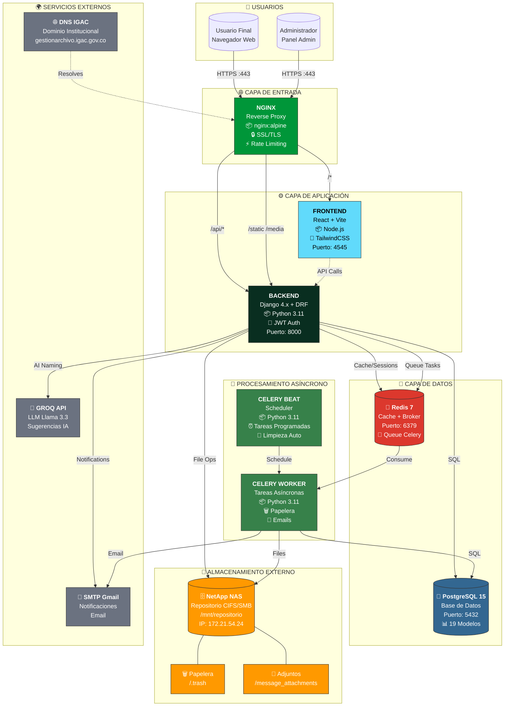
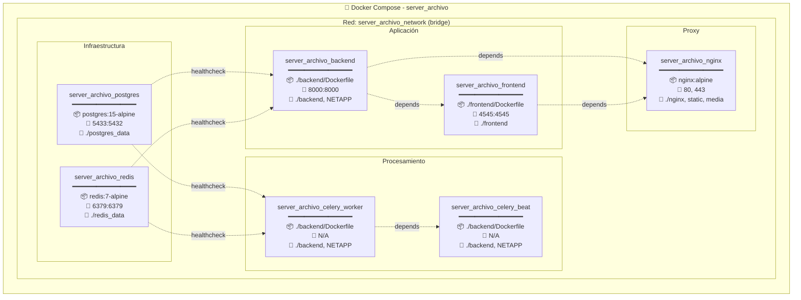
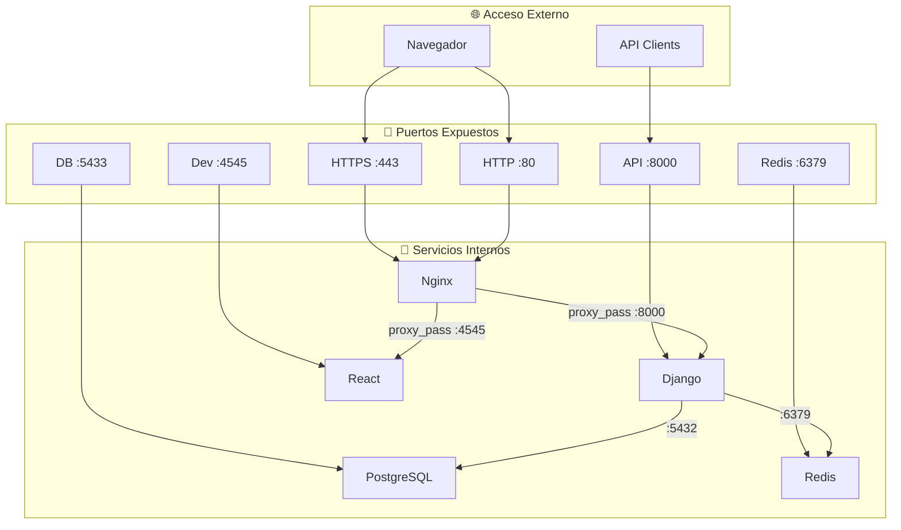
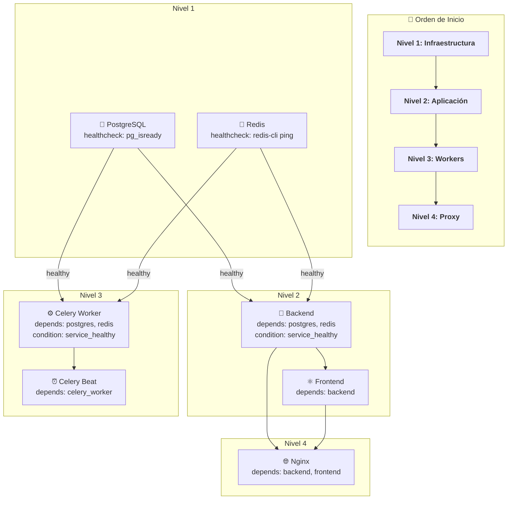
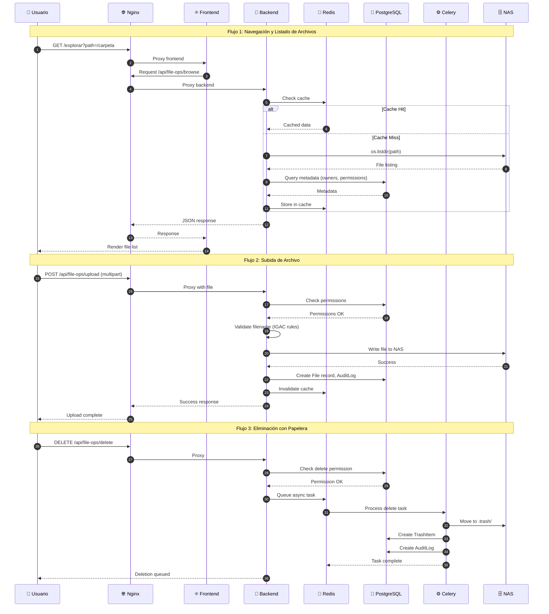

# Arquitectura de Infraestructura - Sistema de Gestión de Archivos IGAC

## Resumen de Infraestructura

- **Orquestación:** Docker Compose v3.8
- **Total de Servicios:** 7 contenedores
- **Red:** Bridge (server_archivo_network)
- **Almacenamiento:** PostgreSQL + Redis + NAS NetApp

---

## Diagrama de Arquitectura General



---

## Diagrama de Contenedores Docker



---

## Diagrama de Puertos y Comunicación



---

## Diagrama de Volúmenes y Almacenamiento

```mermaid
flowchart TB
    subgraph HOST["💻 Host System"]
        direction TB

        subgraph LOCAL["Volúmenes Locales"]
            V_PG["./postgres_data<br/>━━━━━━━━━━━━<br/>📊 Base de datos<br/>~500MB - 2GB"]
            V_RD["./redis_data<br/>━━━━━━━━━━━━<br/>📨 Cache AOF<br/>~50MB - 500MB"]
            V_BE["./backend<br/>━━━━━━━━━━━━<br/>🐍 Código Django<br/>~50MB"]
            V_FE["./frontend<br/>━━━━━━━━━━━━<br/>⚛️ Código React<br/>~200MB"]
            V_NX["./nginx<br/>━━━━━━━━━━━━<br/>⚙️ Configuración<br/>~10KB"]
            V_ST["./backend/static<br/>━━━━━━━━━━━━<br/>📁 Assets Django<br/>~5MB"]
            V_MD["./backend/media<br/>━━━━━━━━━━━━<br/>📷 Media files<br/>Variable"]
            V_DIST["./frontend/dist<br/>━━━━━━━━━━━━<br/>🏗️ Build React<br/>~2MB"]
        end

        subgraph REMOTE["Volumen Remoto NAS"]
            V_NAS["/mnt/repositorio<br/>━━━━━━━━━━━━<br/>🗄️ NetApp CIFS<br/>~2TB+"]
            V_TRASH["/.trash<br/>━━━━━━━━━━━━<br/>🗑️ Papelera<br/>Max 5GB"]
            V_ATTACH["/message_attachments<br/>━━━━━━━━━━━━<br/>📎 Adjuntos<br/>180 días"]
        end
    end

    subgraph CONTAINERS["🐳 Contenedores"]
        C_PG["postgres"]
        C_RD["redis"]
        C_BE["backend"]
        C_FE["frontend"]
        C_CW["celery_worker"]
        C_CB["celery_beat"]
        C_NX["nginx"]
    end

    %% Mappings
    V_PG -->|/var/lib/postgresql/data| C_PG
    V_RD -->|/data| C_RD
    V_BE -->|/app| C_BE
    V_BE -->|/app| C_CW
    V_BE -->|/app| C_CB
    V_FE -->|/app| C_FE
    V_NX -->|/etc/nginx| C_NX
    V_ST -->|/app/static| C_NX
    V_MD -->|/app/media| C_NX
    V_DIST -->|/app/frontend/dist| C_NX

    V_NAS -->|${NETAPP_BASE_PATH}| C_BE
    V_NAS -->|${NETAPP_BASE_PATH}| C_CW
    V_NAS -->|${NETAPP_BASE_PATH}| C_CB
    V_NAS --- V_TRASH
    V_NAS --- V_ATTACH
```

---

## Diagrama de Dependencias de Servicios



---

## Diagrama de Flujo de Datos



---

## Tabla de Configuración de Servicios

### Servicios de Infraestructura

| Servicio | Imagen | Puerto Ext | Puerto Int | Volúmenes | Healthcheck |
|----------|--------|------------|------------|-----------|-------------|
| PostgreSQL | postgres:15-alpine | 5433 | 5432 | ./postgres_data | pg_isready -U postgres |
| Redis | redis:7-alpine | 6379 | 6379 | ./redis_data | redis-cli ping |

### Servicios de Aplicación

| Servicio | Build | Puerto Ext | Puerto Int | Volúmenes | Dependencias |
|----------|-------|------------|------------|-----------|--------------|
| Backend | ./backend/Dockerfile | 8000 | 8000 | ./backend, NETAPP | postgres(healthy), redis(healthy) |
| Frontend | ./frontend/Dockerfile | 4545 | 4545 | ./frontend | backend |

### Servicios de Procesamiento

| Servicio | Build | Comando | Volúmenes | Dependencias |
|----------|-------|---------|-----------|--------------|
| Celery Worker | ./backend/Dockerfile | celery -A config worker -l INFO | ./backend, NETAPP | postgres(healthy), redis(healthy) |
| Celery Beat | ./backend/Dockerfile | celery -A config beat -l INFO | ./backend, NETAPP | celery_worker |

### Servicios de Proxy

| Servicio | Imagen | Puertos | Volúmenes | Dependencias |
|----------|--------|---------|-----------|--------------|
| Nginx | nginx:alpine | 80, 443 | ./nginx, static, media, dist | backend, frontend |

---

## Variables de Entorno Críticas

### Base de Datos
```env
POSTGRES_DB=gestion_archivo_db
POSTGRES_USER=postgres
POSTGRES_PASSWORD=********
POSTGRES_HOST=postgres
POSTGRES_PORT=5432
```

### Redis/Celery
```env
REDIS_HOST=redis
REDIS_PORT=6379
CELERY_BROKER_URL=redis://redis:6379/2
CELERY_RESULT_BACKEND=redis://redis:6379/2
```

### Django
```env
DEBUG=False
DJANGO_SECRET_KEY=********
ALLOWED_HOSTS=localhost,127.0.0.1,gestionarchivo.igac.gov.co
JWT_SECRET_KEY=********
```

### Almacenamiento NAS
```env
NETAPP_BASE_PATH=/mnt/repositorio/2510SP/H_Informacion_Consulta/Sub_Proy
SMB_SERVER=172.21.54.24
SMB_SHARE=DirGesCat
TRASH_PATH=04_bk/bk_temp_subproy/.trash
MESSAGE_ATTACHMENTS_PATH=04_bk/trans_doc_platform/message_attachments
```

### Servicios Externos
```env
GROQ_MODEL=llama-3.3-70b-versatile
EMAIL_HOST=smtp.gmail.com
EMAIL_PORT=587
DOMAIN=gestionarchivo.igac.gov.co
```

---

## Notas de Implementación

### Alta Disponibilidad
- PostgreSQL con volumen persistente para datos
- Redis con AOF (Append Only File) para persistencia
- Nginx como punto único de entrada con SSL

### Escalabilidad
- Celery workers pueden escalar horizontalmente
- Frontend estático servido por Nginx (cacheable)
- Backend stateless (sesiones en Redis)

### Seguridad
- SSL/TLS termination en Nginx
- JWT para autenticación stateless
- Secrets en variables de entorno (.env)
- Rate limiting en Nginx

### Monitoreo
- Healthchecks en PostgreSQL y Redis
- Logs centralizados en Docker
- Auditoría completa en base de datos
