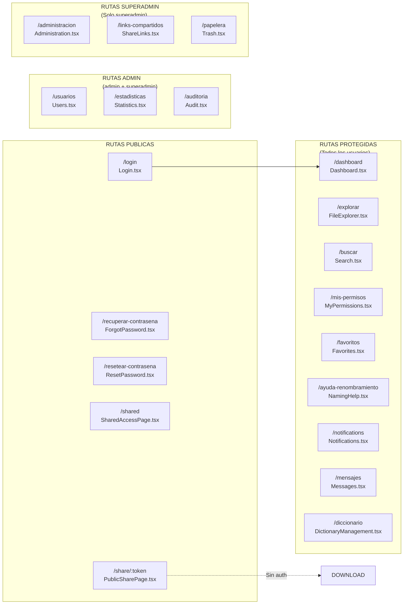
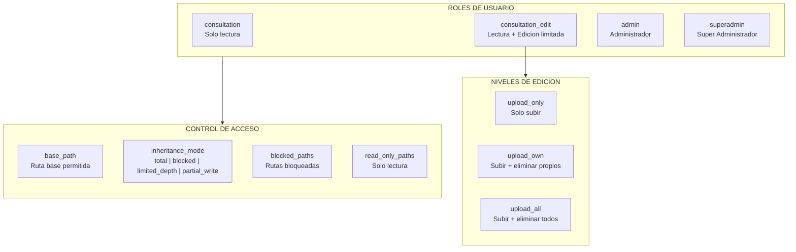
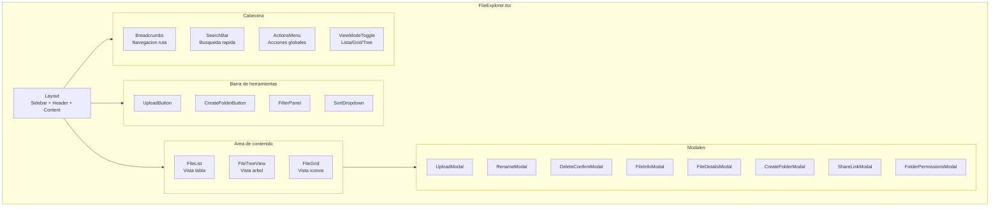
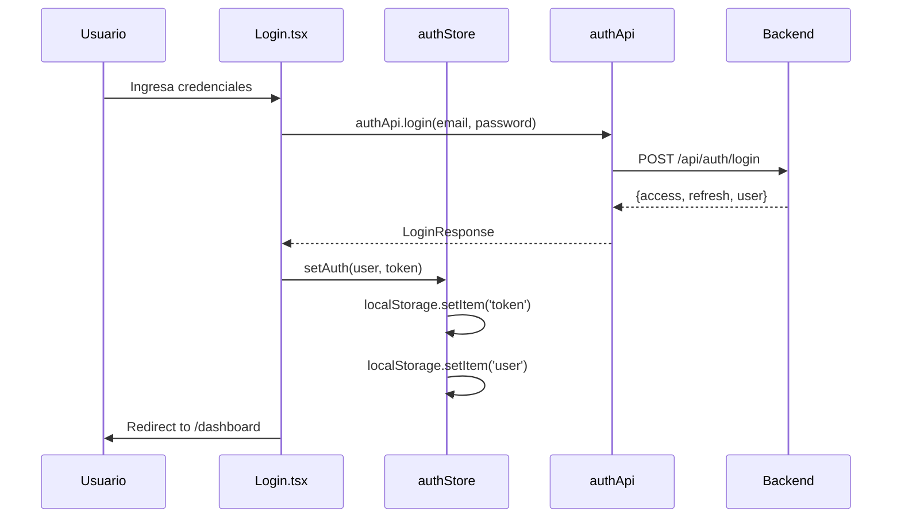
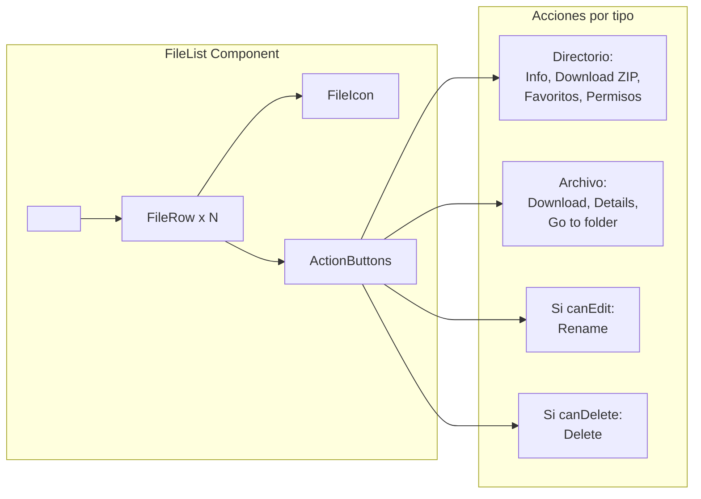
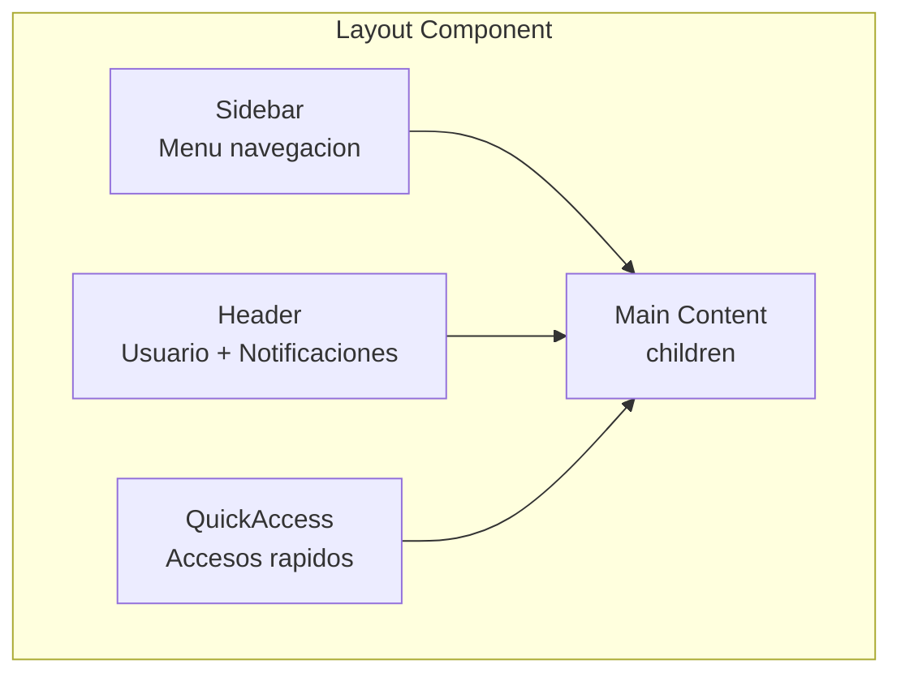

# Arquitectura Frontend - Sistema de Gestion de Archivos IGAC

## Resumen Tecnico

- **Framework:** React 18 + TypeScript
- **Build Tool:** Vite 5.x
- **Estilos:** TailwindCSS 3.x
- **Estado Global:** Zustand
- **Routing:** React Router DOM 6.x
- **HTTP Client:** Axios
- **Iconos:** Lucide React

---

## Diagrama de Arquitectura General

```mermaid
flowchart TB
    subgraph ENTRY["PUNTO DE ENTRADA"]
        MAIN["main.tsx<br/>ReactDOM.createRoot"]
        APP["App.tsx<br/>Router + Providers"]
    end

    subgraph PROVIDERS["PROVEEDORES DE CONTEXTO"]
        THEME["ThemeProvider<br/>Dark/Light Mode"]
        MODAL["ModalProvider<br/>Sistema de Modales"]
        BROWSER["BrowserRouter<br/>Navegacion SPA"]
    end

    subgraph GUARDS["ROUTE GUARDS"]
        PUBLIC["PublicRoute<br/>Sin autenticacion"]
        PROTECTED["ProtectedRoute<br/>Requiere login"]
        ADMIN["AdminRoute<br/>Rol admin+"]
        SUPERADMIN["SuperAdminRoute<br/>Solo superadmin"]
    end

    subgraph STATE["ESTADO GLOBAL - ZUSTAND"]
        AUTH_STORE["authStore<br/>Usuario + Token + Auth"]
        CLIP_STORE["clipboardStore<br/>Copiar/Cortar/Pegar"]
        NOTIF_STORE["notificationStore<br/>Notificaciones"]
    end

    subgraph API["CAPA DE API - AXIOS"]
        CLIENT["apiClient<br/>Interceptors + JWT"]
        AUTH_API["authApi"]
        FILES_API["filesApi"]
        USERS_API["usersApi"]
        AUDIT_API["auditApi"]
        FILEOPS_API["fileOpsApi"]
        SHARING_API["sharingApi"]
        TRASH_API["trashApi"]
        NOTIF_API["notificationsApi"]
        GROQ_API["groqStatsApi"]
    end

    MAIN --> APP
    APP --> THEME
    THEME --> MODAL
    MODAL --> BROWSER
    BROWSER --> GUARDS

    GUARDS --> STATE
    STATE --> API
```



---

## Estructura de Directorios

```
frontend/src/
|-- api/                 # Modulos de comunicacion con backend
|   |-- client.ts        # Configuracion Axios + interceptors
|   |-- auth.ts          # Login, logout, registro
|   |-- files.ts         # Browse, search, download, upload
|   |-- fileOps.ts       # Operaciones: rename, copy, move
|   |-- users.ts         # CRUD usuarios
|   |-- admin.ts         # Endpoints administrativos
|   |-- audit.ts         # Logs de auditoria
|   |-- trash.ts         # Papelera de reciclaje
|   |-- sharing.ts       # Enlaces compartidos
|   |-- favorites.ts     # Favoritos de usuario
|   |-- notifications.ts # Sistema de notificaciones
|   |-- groqStats.ts     # Estadisticas de IA
|   |-- aiAbbreviations.ts # Abreviaciones IA
|   |-- directoryColors.ts # Colores de carpetas
|   |-- stats.ts         # Estadisticas generales
|   +-- index.ts         # Barrel export
|
|-- components/          # Componentes reutilizables
|   |-- admin/           # Componentes de administracion
|   |-- dictionary/      # Gestion de diccionario
|   |-- ui/              # Componentes UI genericos
|   +-- ...              # Modales, listas, iconos
|
|-- contexts/            # Contextos React
|   +-- ThemeContext.tsx # Tema dark/light
|
|-- hooks/               # Custom hooks
|   |-- useModal.tsx     # Sistema de modales
|   |-- useToast.ts      # Notificaciones toast
|   |-- useClipboard.ts  # Portapapeles simple
|   |-- useClipboardMultiple.ts  # Multi-seleccion
|   |-- useClipboardWithConflicts.ts # Con resolucion conflictos
|   |-- usePathPermissions.ts # Permisos por ruta
|   |-- useFileSort.ts   # Ordenamiento archivos
|   |-- useTreeData.ts   # Datos para TreeView
|   |-- useDirectoryColors.ts # Colores directorios
|   +-- useTheme.ts      # Hook de tema
|
|-- pages/               # Paginas/Vistas principales
|   |-- Login.tsx        # Inicio de sesion
|   |-- Dashboard.tsx    # Panel principal
|   |-- FileExplorer.tsx # Explorador de archivos
|   |-- Search.tsx       # Busqueda global
|   |-- Favorites.tsx    # Favoritos
|   |-- Trash.tsx        # Papelera (superadmin)
|   |-- Users.tsx        # Gestion usuarios (admin)
|   |-- Administration.tsx # Panel admin (superadmin)
|   |-- Audit.tsx        # Logs auditoria (admin)
|   |-- Statistics.tsx   # Estadisticas (admin)
|   |-- Messages.tsx     # Sistema de mensajes
|   |-- Notifications.tsx # Centro notificaciones
|   |-- ShareLinks.tsx   # Links compartidos
|   |-- NamingHelp.tsx   # Ayuda nomenclatura
|   |-- DictionaryManagement.tsx # Diccionario
|   |-- MyPermissions.tsx # Mis permisos
|   +-- ...
|
|-- store/               # Estado global Zustand
|   |-- authStore.ts     # Autenticacion
|   |-- clipboardStore.ts # Portapapeles
|   +-- notificationStore.ts # Notificaciones
|
|-- types/               # Definiciones TypeScript
|   |-- file.ts          # FileItem, BrowseResponse
|   |-- user.ts          # User, UserPermission
|   |-- api.ts           # ApiResponse genericos
|   |-- stats.ts         # Tipos estadisticas
|   +-- index.ts         # Barrel export
|
+-- utils/               # Utilidades
    |-- formatDate.ts    # Formateo fechas
    |-- formatSize.ts    # Formateo tamanos
    |-- roleUtils.ts     # Utilidades de roles
    +-- security.ts      # Funciones seguridad
```

---

## Diagrama de Paginas y Rutas



---

## Sistema de Roles y Permisos



---

## Jerarquia de Componentes - FileExplorer



---

## Flujo de Autenticacion



---

## Componentes Principales

### FileList.tsx
Vista de tabla con columnas: Nombre, Tamano, Fecha Modificacion, Acciones.



### Layout.tsx
Estructura principal con sidebar responsive.



---

## Stores (Zustand)

### authStore
```typescript
interface AuthState {
  user: User | null;
  token: string | null;
  isAuthenticated: boolean;
  setAuth: (user, token) => void;
  logout: () => void;
  updateUser: (user) => void;
}
```

### clipboardStore
```typescript
interface ClipboardState {
  items: FileItem[];
  operation: 'copy' | 'cut' | null;
  setClipboard: (items, operation) => void;
  clearClipboard: () => void;
}
```

### notificationStore
```typescript
interface NotificationState {
  unreadCount: number;
  notifications: Notification[];
  fetchNotifications: () => void;
  markAsRead: (id) => void;
}
```

---

## API Client Configuration

```mermaid
flowchart TB
    subgraph CLIENT["apiClient (Axios)"]
        BASE["baseURL: /api"]
        TIMEOUT["timeout: 30000ms"]

        subgraph INTERCEPTORS["Interceptors"]
            REQ["Request Interceptor<br/>Add Authorization header"]
            RES["Response Interceptor<br/>Handle 401 -> logout"]
        end
    end

    REQ -->|"Bearer {token}"| API
    API -->|401 Unauthorized| RES
    RES -->|logout()| LOGIN
```

---

## Tipos Principales

### FileItem
```typescript
interface FileItem {
  id: number | null;
  path: string;
  name: string;
  extension: string | null;
  size: number;
  size_formatted: string;
  is_directory: boolean;
  modified_date: string;
  created_date: string;
  md5_hash: string | null;
  indexed_at: string | null;
  owner_name?: string;
  owner_username?: string;
  can_write?: boolean;
  can_delete?: boolean;
  can_rename?: boolean;
  read_only_mode?: boolean;
  item_count?: number | null;
}
```

### User
```typescript
interface User {
  id: number;
  username: string;
  email: string;
  first_name: string;
  last_name: string;
  full_name: string;
  role: 'consultation' | 'consultation_edit' | 'admin' | 'superadmin';
  phone?: string;
  department?: string;
  position?: string;
  is_active: boolean;
  exempt_from_naming_rules?: boolean;
  exempt_from_path_limit?: boolean;
  exempt_from_name_length?: boolean;
}
```

### UserPermission
```typescript
interface UserPermission {
  id?: number;
  user: number;
  base_path: string;
  can_read: boolean;
  can_write: boolean;
  can_delete: boolean;
  can_create_directories: boolean;
  edit_permission_level?: 'upload_only' | 'upload_own' | 'upload_all';
  inheritance_mode: 'total' | 'blocked' | 'limited_depth' | 'partial_write';
  blocked_paths: string[];
  read_only_paths: string[];
  max_depth?: number;
  expires_at?: string | null;
}
```

---

## Hooks Personalizados

| Hook | Proposito |
|------|-----------|
| `useModal` | Sistema de modales con stack |
| `useToast` | Notificaciones toast temporales |
| `useClipboard` | Copiar/Cortar archivos simples |
| `useClipboardMultiple` | Multi-seleccion de archivos |
| `useClipboardWithConflicts` | Resolver conflictos al pegar |
| `usePathPermissions` | Verificar permisos por ruta |
| `useFileSort` | Ordenamiento de listas |
| `useTreeData` | Datos para vista arbol |
| `useDirectoryColors` | Colores personalizados carpetas |
| `useTheme` | Toggle dark/light mode |

---

## Estadisticas del Frontend

| Metrica | Valor |
|---------|-------|
| Total archivos TSX | 82 |
| Total archivos TS | 39 |
| Total componentes | ~55 |
| Total paginas | 19 |
| Total hooks | 11 |
| Total APIs | 14 |
| Total stores | 3 |
| Total tipos | 4 archivos |

---

## Dependencias Principales

```json
{
  "react": "^18.x",
  "react-dom": "^18.x",
  "react-router-dom": "^6.x",
  "typescript": "^5.x",
  "vite": "^5.x",
  "tailwindcss": "^3.x",
  "axios": "^1.x",
  "zustand": "^4.x",
  "lucide-react": "^0.x",
  "date-fns": "^2.x"
}
```

---

## Notas de Implementacion

1. **Autenticacion JWT**: Tokens almacenados en localStorage, interceptor Axios agrega header automaticamente
2. **Tema oscuro**: Implementado via ThemeContext con persistencia en localStorage
3. **Permisos granulares**: Cada FileItem incluye flags can_write, can_delete, can_rename del backend
4. **Smart Naming**: Integracion con IA (GROQ) para sugerencias de nombres siguiendo normas IGAC
5. **Tree View**: Vista arbol con expansion lazy para grandes directorios
6. **Clipboard avanzado**: Soporta operaciones multi-archivo con resolucion de conflictos
