# Flujos de Usuario - Sistema de Gestion de Archivos IGAC

## Resumen de Flujos Documentados

Este documento describe los principales flujos de interaccion del usuario con el sistema.

---

## 1. Flujo de Autenticacion

### 1.1 Login

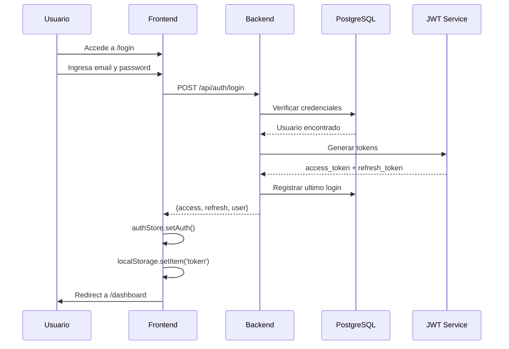
```mermaid
sequenceDiagram
    participant U as Usuario
    participant FE as Frontend
    participant BE as Backend
    participant DB as PostgreSQL
    participant JWT as JWT Service

    U->>FE: Accede a /login
    U->>FE: Ingresa email y password
    FE->>BE: POST /api/auth/login
    BE->>DB: Verificar credenciales
    DB-->>BE: Usuario encontrado
    BE->>JWT: Generar tokens
    JWT-->>BE: access_token + refresh_token
    BE->>DB: Registrar ultimo login
    BE-->>FE: {access, refresh, user}
    FE->>FE: authStore.setAuth()
    FE->>FE: localStorage.setItem('token')
    FE->>U: Redirect a /dashboard
```

### 1.2 Logout

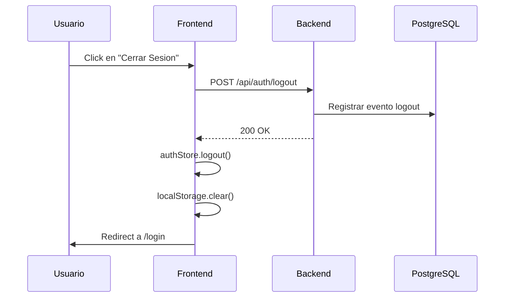
```mermaid
sequenceDiagram
    participant U as Usuario
    participant FE as Frontend
    participant BE as Backend
    participant DB as PostgreSQL

    U->>FE: Click en "Cerrar Sesion"
    FE->>BE: POST /api/auth/logout
    BE->>DB: Registrar evento logout
    BE-->>FE: 200 OK
    FE->>FE: authStore.logout()
    FE->>FE: localStorage.clear()
    FE->>U: Redirect a /login
```

### 1.3 Recuperar Contrasena

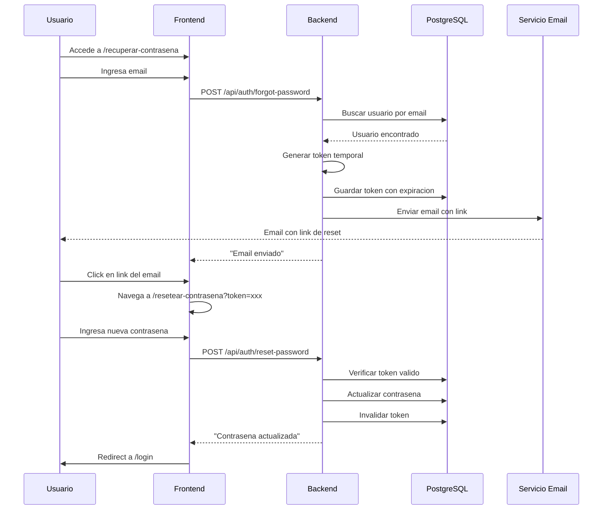
```mermaid
sequenceDiagram
    participant U as Usuario
    participant FE as Frontend
    participant BE as Backend
    participant DB as PostgreSQL
    participant EMAIL as Servicio Email

    U->>FE: Accede a /recuperar-contrasena
    U->>FE: Ingresa email
    FE->>BE: POST /api/auth/forgot-password
    BE->>DB: Buscar usuario por email
    DB-->>BE: Usuario encontrado
    BE->>BE: Generar token temporal
    BE->>DB: Guardar token con expiracion
    BE->>EMAIL: Enviar email con link
    EMAIL-->>U: Email con link de reset
    BE-->>FE: "Email enviado"

    U->>FE: Click en link del email
    FE->>FE: Navega a /resetear-contrasena?token=xxx
    U->>FE: Ingresa nueva contrasena
    FE->>BE: POST /api/auth/reset-password
    BE->>DB: Verificar token valido
    BE->>DB: Actualizar contrasena
    BE->>DB: Invalidar token
    BE-->>FE: "Contrasena actualizada"
    FE->>U: Redirect a /login
```

---

## 2. Flujo de Navegacion de Archivos

### 2.1 Explorar Directorio

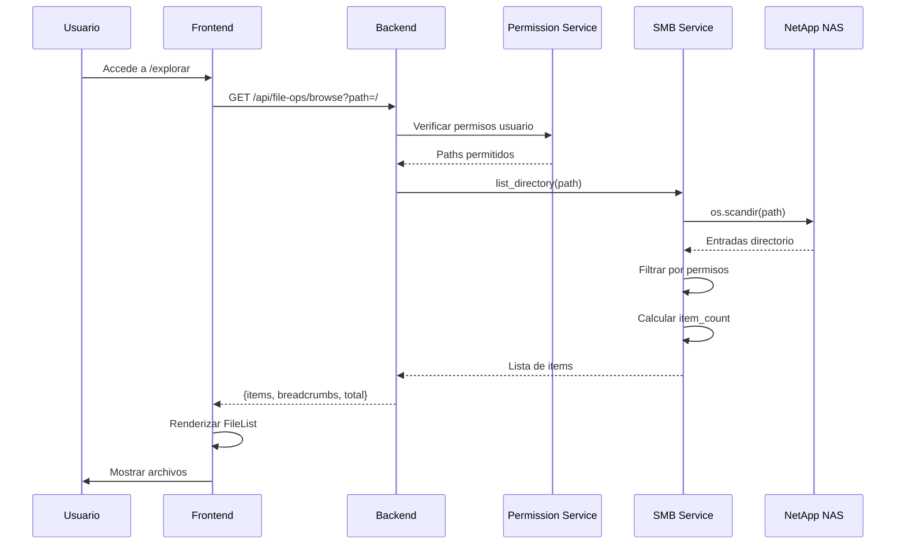
```mermaid
sequenceDiagram
    participant U as Usuario
    participant FE as Frontend
    participant BE as Backend
    participant PERM as Permission Service
    participant SMB as SMB Service
    participant NAS as NetApp NAS

    U->>FE: Accede a /explorar
    FE->>BE: GET /api/file-ops/browse?path=/
    BE->>PERM: Verificar permisos usuario
    PERM-->>BE: Paths permitidos
    BE->>SMB: list_directory(path)
    SMB->>NAS: os.scandir(path)
    NAS-->>SMB: Entradas directorio
    SMB->>SMB: Filtrar por permisos
    SMB->>SMB: Calcular item_count
    SMB-->>BE: Lista de items
    BE-->>FE: {items, breadcrumbs, total}
    FE->>FE: Renderizar FileList
    FE->>U: Mostrar archivos
```

### 2.2 Navegar a Subdirectorio

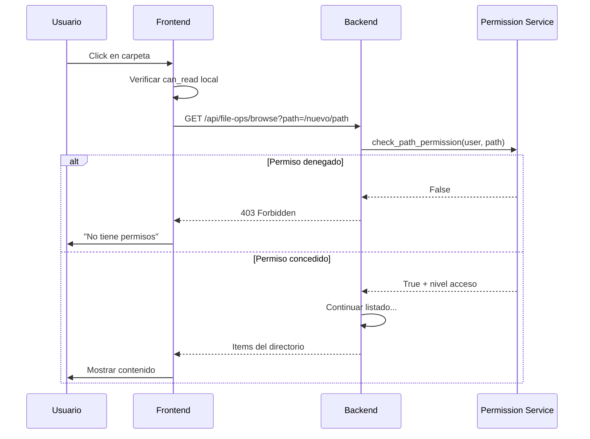
```mermaid
sequenceDiagram
    participant U as Usuario
    participant FE as Frontend
    participant BE as Backend
    participant PERM as Permission Service

    U->>FE: Click en carpeta
    FE->>FE: Verificar can_read local
    FE->>BE: GET /api/file-ops/browse?path=/nuevo/path
    BE->>PERM: check_path_permission(user, path)

    alt Permiso denegado
        PERM-->>BE: False
        BE-->>FE: 403 Forbidden
        FE->>U: "No tiene permisos"
    else Permiso concedido
        PERM-->>BE: True + nivel acceso
        BE->>BE: Continuar listado...
        BE-->>FE: Items del directorio
        FE->>U: Mostrar contenido
    end
```

---

## 3. Flujo de Subida de Archivos

### 3.1 Subir Archivo Simple

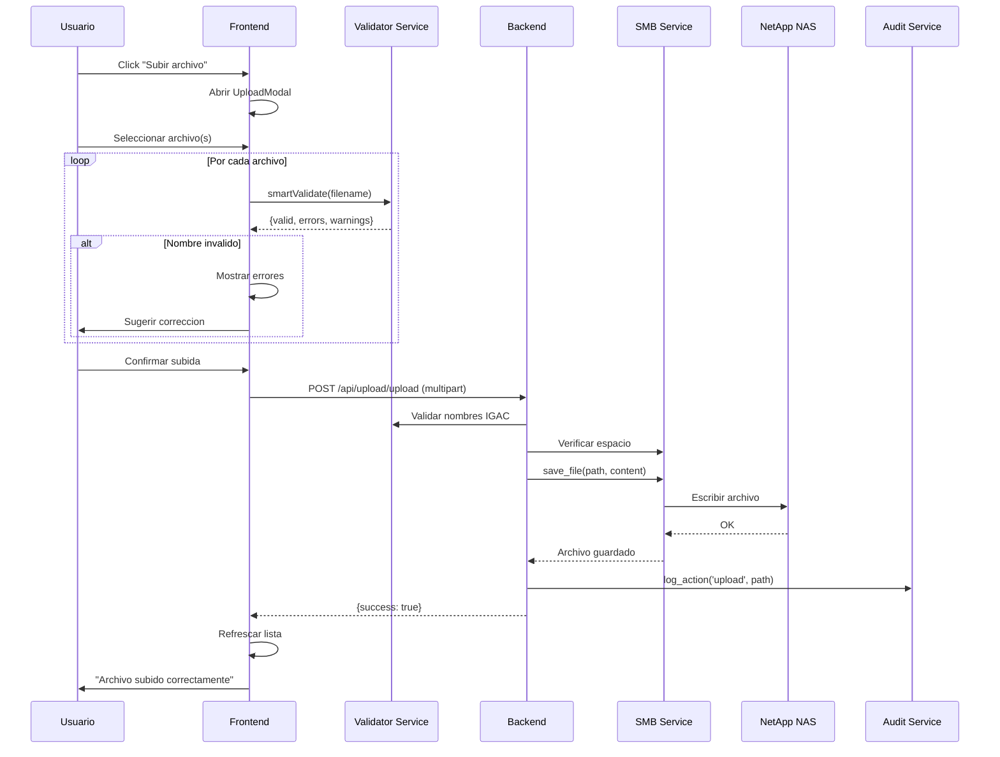
```mermaid
sequenceDiagram
    participant U as Usuario
    participant FE as Frontend
    participant VALID as Validator Service
    participant BE as Backend
    participant SMB as SMB Service
    participant NAS as NetApp NAS
    participant AUDIT as Audit Service

    U->>FE: Click "Subir archivo"
    FE->>FE: Abrir UploadModal
    U->>FE: Seleccionar archivo(s)

    loop Por cada archivo
        FE->>VALID: smartValidate(filename)
        VALID-->>FE: {valid, errors, warnings}

        alt Nombre invalido
            FE->>FE: Mostrar errores
            FE->>U: Sugerir correccion
        end
    end

    U->>FE: Confirmar subida
    FE->>BE: POST /api/upload/upload (multipart)
    BE->>VALID: Validar nombres IGAC
    BE->>SMB: Verificar espacio
    BE->>SMB: save_file(path, content)
    SMB->>NAS: Escribir archivo
    NAS-->>SMB: OK
    SMB-->>BE: Archivo guardado
    BE->>AUDIT: log_action('upload', path)
    BE-->>FE: {success: true}
    FE->>FE: Refrescar lista
    FE->>U: "Archivo subido correctamente"
```

### 3.2 Subir Carpeta Completa

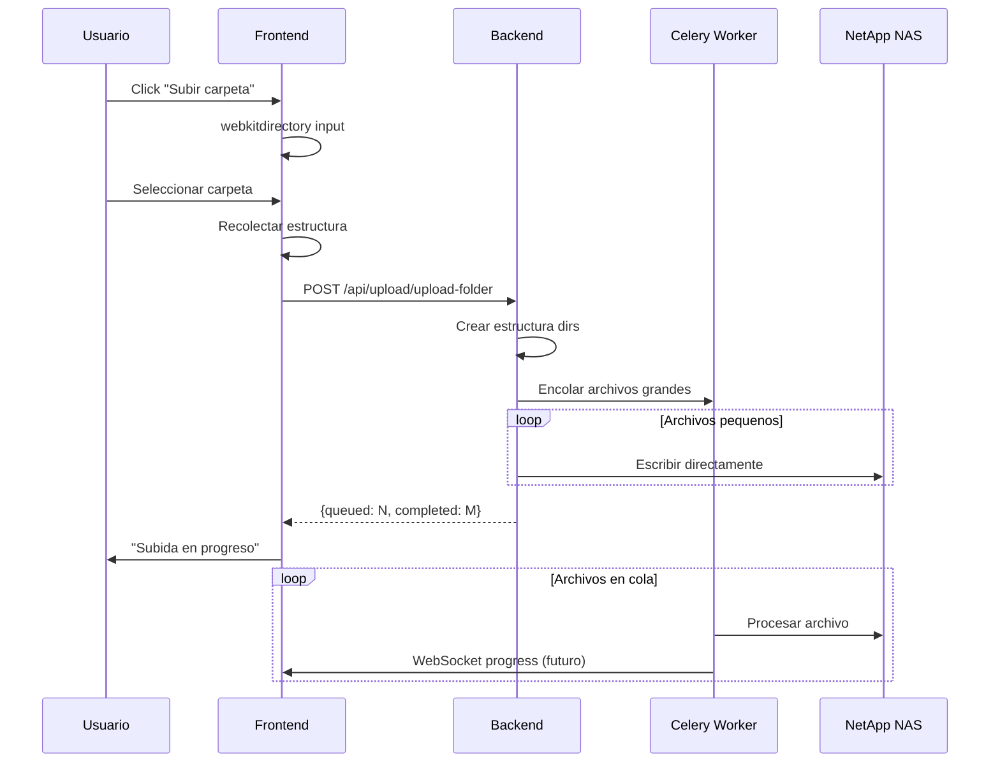
```mermaid
sequenceDiagram
    participant U as Usuario
    participant FE as Frontend
    participant BE as Backend
    participant CELERY as Celery Worker
    participant NAS as NetApp NAS

    U->>FE: Click "Subir carpeta"
    FE->>FE: webkitdirectory input
    U->>FE: Seleccionar carpeta
    FE->>FE: Recolectar estructura
    FE->>BE: POST /api/upload/upload-folder
    BE->>BE: Crear estructura dirs
    BE->>CELERY: Encolar archivos grandes

    loop Archivos pequenos
        BE->>NAS: Escribir directamente
    end

    BE-->>FE: {queued: N, completed: M}
    FE->>U: "Subida en progreso"

    loop Archivos en cola
        CELERY->>NAS: Procesar archivo
        CELERY->>FE: WebSocket progress (futuro)
    end
```

---

## 4. Flujo de Descarga

### 4.1 Descargar Archivo

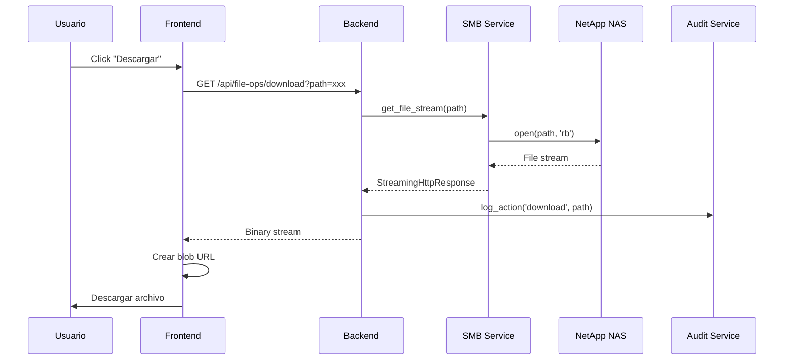
```mermaid
sequenceDiagram
    participant U as Usuario
    participant FE as Frontend
    participant BE as Backend
    participant SMB as SMB Service
    participant NAS as NetApp NAS
    participant AUDIT as Audit Service

    U->>FE: Click "Descargar"
    FE->>BE: GET /api/file-ops/download?path=xxx
    BE->>SMB: get_file_stream(path)
    SMB->>NAS: open(path, 'rb')
    NAS-->>SMB: File stream
    SMB-->>BE: StreamingHttpResponse
    BE->>AUDIT: log_action('download', path)
    BE-->>FE: Binary stream
    FE->>FE: Crear blob URL
    FE->>U: Descargar archivo
```

### 4.2 Descargar Carpeta (ZIP)

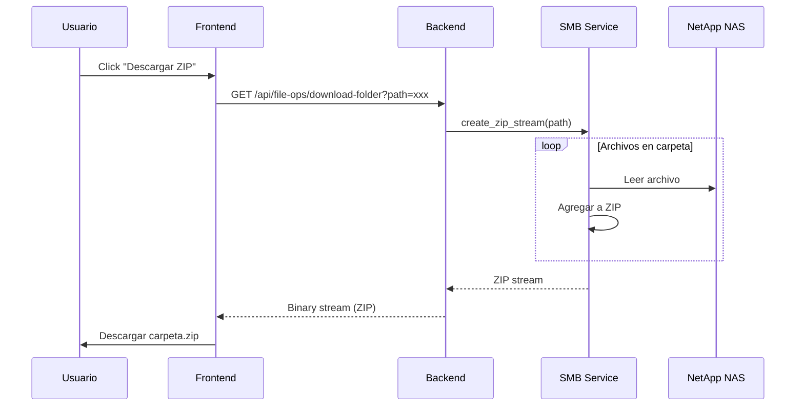
```mermaid
sequenceDiagram
    participant U as Usuario
    participant FE as Frontend
    participant BE as Backend
    participant SMB as SMB Service
    participant NAS as NetApp NAS

    U->>FE: Click "Descargar ZIP"
    FE->>BE: GET /api/file-ops/download-folder?path=xxx
    BE->>SMB: create_zip_stream(path)

    loop Archivos en carpeta
        SMB->>NAS: Leer archivo
        SMB->>SMB: Agregar a ZIP
    end

    SMB-->>BE: ZIP stream
    BE-->>FE: Binary stream (ZIP)
    FE->>U: Descargar carpeta.zip
```

---

## 5. Flujo de Renombrado con IA

### 5.1 Smart Rename

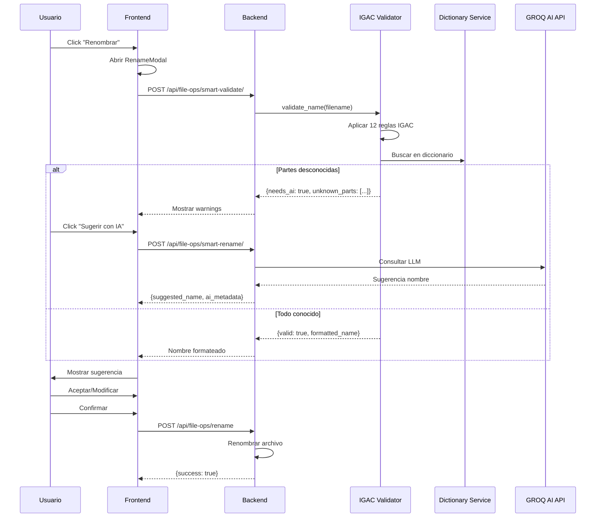
```mermaid
sequenceDiagram
    participant U as Usuario
    participant FE as Frontend
    participant BE as Backend
    participant VALID as IGAC Validator
    participant DICT as Dictionary Service
    participant GROQ as GROQ AI API

    U->>FE: Click "Renombrar"
    FE->>FE: Abrir RenameModal
    FE->>BE: POST /api/file-ops/smart-validate/
    BE->>VALID: validate_name(filename)
    VALID->>VALID: Aplicar 12 reglas IGAC
    VALID->>DICT: Buscar en diccionario

    alt Partes desconocidas
        VALID-->>BE: {needs_ai: true, unknown_parts: [...]}
        BE-->>FE: Mostrar warnings
        U->>FE: Click "Sugerir con IA"
        FE->>BE: POST /api/file-ops/smart-rename/
        BE->>GROQ: Consultar LLM
        GROQ-->>BE: Sugerencia nombre
        BE-->>FE: {suggested_name, ai_metadata}
    else Todo conocido
        VALID-->>BE: {valid: true, formatted_name}
        BE-->>FE: Nombre formateado
    end

    FE->>U: Mostrar sugerencia
    U->>FE: Aceptar/Modificar
    U->>FE: Confirmar
    FE->>BE: POST /api/file-ops/rename
    BE->>BE: Renombrar archivo
    BE-->>FE: {success: true}
```

### 5.2 Validacion de Nombre IGAC

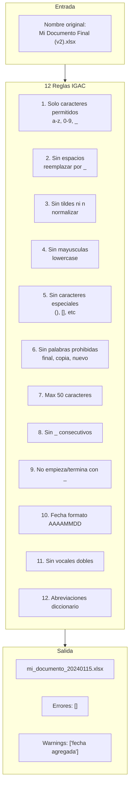
```mermaid
flowchart TB
    subgraph INPUT["Entrada"]
        NAME["Nombre original:<br/>Mi Documento Final (v2).xlsx"]
    end

    subgraph RULES["12 Reglas IGAC"]
        R1["1. Solo caracteres permitidos<br/>a-z, 0-9, _"]
        R2["2. Sin espacios<br/>reemplazar por _"]
        R3["3. Sin tildes ni n<br/>normalizar"]
        R4["4. Sin mayusculas<br/>lowercase"]
        R5["5. Sin caracteres especiales<br/>(), [], etc"]
        R6["6. Sin palabras prohibidas<br/>final, copia, nuevo"]
        R7["7. Max 50 caracteres"]
        R8["8. Sin _ consecutivos"]
        R9["9. No empieza/termina con _"]
        R10["10. Fecha formato AAAAMMDD"]
        R11["11. Sin vocales dobles"]
        R12["12. Abreviaciones diccionario"]
    end

    subgraph OUTPUT["Salida"]
        RESULT["mi_documento_20240115.xlsx"]
        ERRORS["Errores: []"]
        WARNINGS["Warnings: ['fecha agregada']"]
    end

    INPUT --> RULES
    RULES --> OUTPUT
```

---

## 6. Flujo de Permisos

### 6.1 Asignar Permiso (Admin)

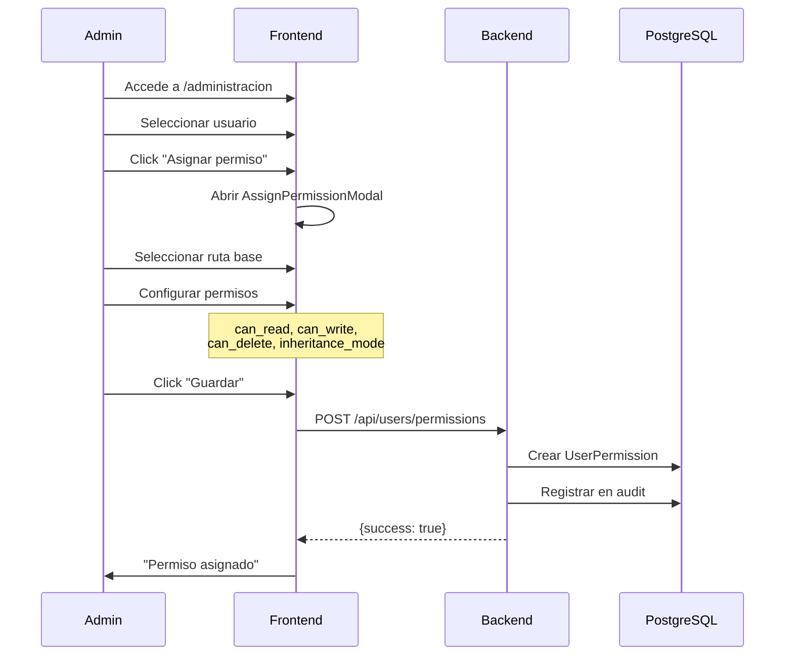
```mermaid
sequenceDiagram
    participant A as Admin
    participant FE as Frontend
    participant BE as Backend
    participant DB as PostgreSQL

    A->>FE: Accede a /administracion
    A->>FE: Seleccionar usuario
    A->>FE: Click "Asignar permiso"
    FE->>FE: Abrir AssignPermissionModal
    A->>FE: Seleccionar ruta base
    A->>FE: Configurar permisos
    Note over FE: can_read, can_write,<br/>can_delete, inheritance_mode
    A->>FE: Click "Guardar"
    FE->>BE: POST /api/users/permissions
    BE->>DB: Crear UserPermission
    BE->>DB: Registrar en audit
    BE-->>FE: {success: true}
    FE->>A: "Permiso asignado"
```

### 6.2 Verificar Permiso en Tiempo Real

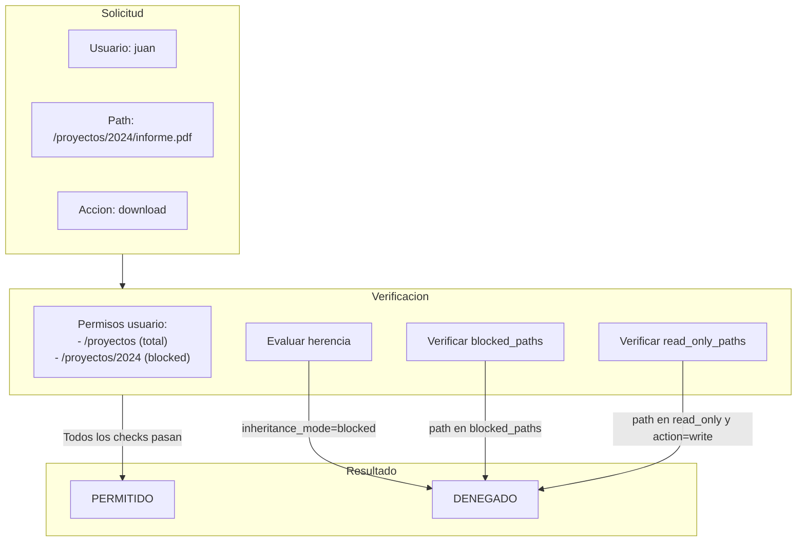
```mermaid
flowchart TB
    subgraph REQUEST["Solicitud"]
        USER["Usuario: juan"]
        PATH["Path: /proyectos/2024/informe.pdf"]
        ACTION["Accion: download"]
    end

    subgraph CHECK["Verificacion"]
        PERMS["Permisos usuario:<br/>- /proyectos (total)<br/>- /proyectos/2024 (blocked)"]

        INHERIT["Evaluar herencia"]
        BLOCKED["Verificar blocked_paths"]
        READONLY["Verificar read_only_paths"]
    end

    subgraph RESULT["Resultado"]
        ALLOW["PERMITIDO"]
        DENY["DENEGADO"]
    end

    REQUEST --> CHECK
    INHERIT -->|"inheritance_mode=blocked"| DENY
    BLOCKED -->|"path en blocked_paths"| DENY
    READONLY -->|"path en read_only y action=write"| DENY
    CHECK -->|"Todos los checks pasan"| ALLOW
```

---

## 7. Flujo de Papelera

### 7.1 Mover a Papelera

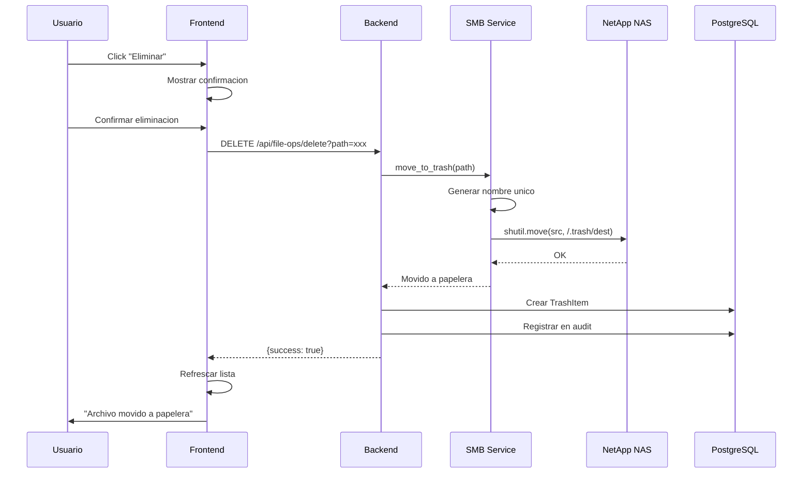
```mermaid
sequenceDiagram
    participant U as Usuario
    participant FE as Frontend
    participant BE as Backend
    participant SMB as SMB Service
    participant NAS as NetApp NAS
    participant DB as PostgreSQL

    U->>FE: Click "Eliminar"
    FE->>FE: Mostrar confirmacion
    U->>FE: Confirmar eliminacion
    FE->>BE: DELETE /api/file-ops/delete?path=xxx
    BE->>SMB: move_to_trash(path)
    SMB->>SMB: Generar nombre unico
    SMB->>NAS: shutil.move(src, /.trash/dest)
    NAS-->>SMB: OK
    SMB-->>BE: Movido a papelera
    BE->>DB: Crear TrashItem
    BE->>DB: Registrar en audit
    BE-->>FE: {success: true}
    FE->>FE: Refrescar lista
    FE->>U: "Archivo movido a papelera"
```

### 7.2 Restaurar de Papelera

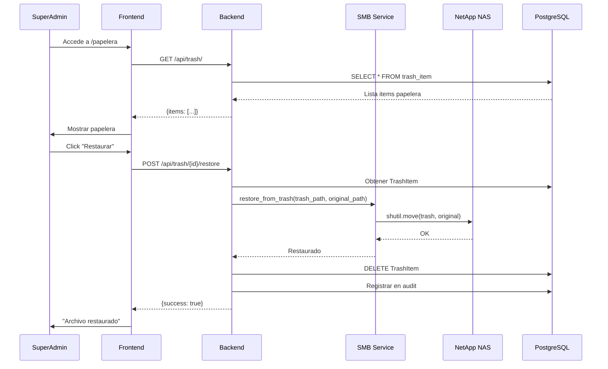
```mermaid
sequenceDiagram
    participant A as SuperAdmin
    participant FE as Frontend
    participant BE as Backend
    participant SMB as SMB Service
    participant NAS as NetApp NAS
    participant DB as PostgreSQL

    A->>FE: Accede a /papelera
    FE->>BE: GET /api/trash/
    BE->>DB: SELECT * FROM trash_item
    DB-->>BE: Lista items papelera
    BE-->>FE: {items: [...]}
    FE->>A: Mostrar papelera

    A->>FE: Click "Restaurar"
    FE->>BE: POST /api/trash/{id}/restore
    BE->>DB: Obtener TrashItem
    BE->>SMB: restore_from_trash(trash_path, original_path)
    SMB->>NAS: shutil.move(trash, original)
    NAS-->>SMB: OK
    SMB-->>BE: Restaurado
    BE->>DB: DELETE TrashItem
    BE->>DB: Registrar en audit
    BE-->>FE: {success: true}
    FE->>A: "Archivo restaurado"
```

### 7.3 Limpieza Automatica (Celery Beat)

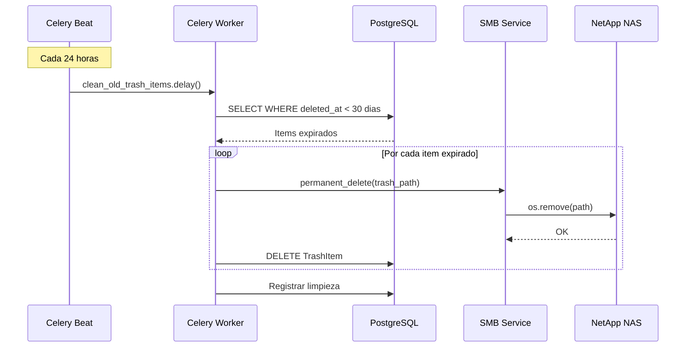
```mermaid
sequenceDiagram
    participant BEAT as Celery Beat
    participant WORKER as Celery Worker
    participant DB as PostgreSQL
    participant SMB as SMB Service
    participant NAS as NetApp NAS

    Note over BEAT: Cada 24 horas
    BEAT->>WORKER: clean_old_trash_items.delay()
    WORKER->>DB: SELECT WHERE deleted_at < 30 dias
    DB-->>WORKER: Items expirados

    loop Por cada item expirado
        WORKER->>SMB: permanent_delete(trash_path)
        SMB->>NAS: os.remove(path)
        NAS-->>SMB: OK
        WORKER->>DB: DELETE TrashItem
    end

    WORKER->>DB: Registrar limpieza
```

---

## 8. Flujo de Compartir Archivos

### 8.1 Crear Link Compartido

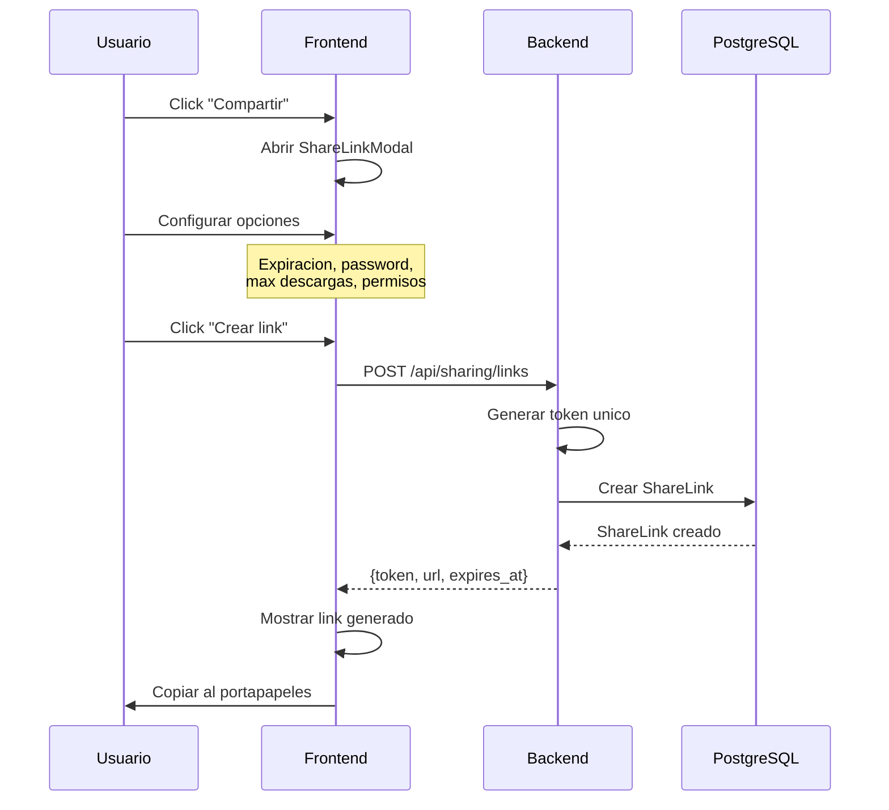
```mermaid
sequenceDiagram
    participant U as Usuario
    participant FE as Frontend
    participant BE as Backend
    participant DB as PostgreSQL

    U->>FE: Click "Compartir"
    FE->>FE: Abrir ShareLinkModal
    U->>FE: Configurar opciones
    Note over FE: Expiracion, password,<br/>max descargas, permisos
    U->>FE: Click "Crear link"
    FE->>BE: POST /api/sharing/links
    BE->>BE: Generar token unico
    BE->>DB: Crear ShareLink
    DB-->>BE: ShareLink creado
    BE-->>FE: {token, url, expires_at}
    FE->>FE: Mostrar link generado
    FE->>U: Copiar al portapapeles
```

### 8.2 Acceso via Link Publico

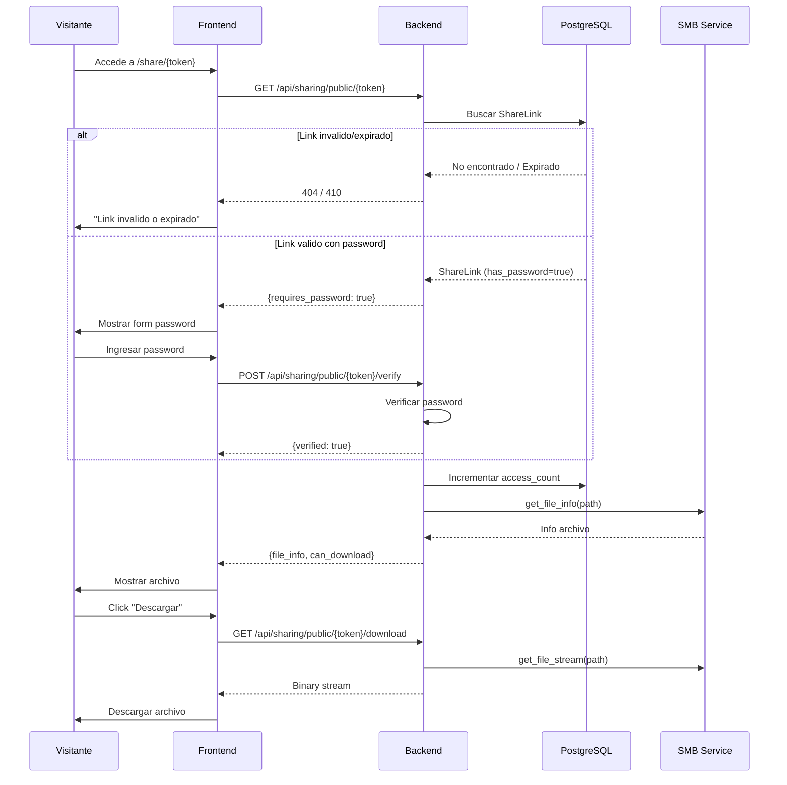
```mermaid
sequenceDiagram
    participant V as Visitante
    participant FE as Frontend
    participant BE as Backend
    participant DB as PostgreSQL
    participant SMB as SMB Service

    V->>FE: Accede a /share/{token}
    FE->>BE: GET /api/sharing/public/{token}
    BE->>DB: Buscar ShareLink

    alt Link invalido/expirado
        DB-->>BE: No encontrado / Expirado
        BE-->>FE: 404 / 410
        FE->>V: "Link invalido o expirado"
    else Link valido con password
        DB-->>BE: ShareLink (has_password=true)
        BE-->>FE: {requires_password: true}
        FE->>V: Mostrar form password
        V->>FE: Ingresar password
        FE->>BE: POST /api/sharing/public/{token}/verify
        BE->>BE: Verificar password
        BE-->>FE: {verified: true}
    end

    BE->>DB: Incrementar access_count
    BE->>SMB: get_file_info(path)
    SMB-->>BE: Info archivo
    BE-->>FE: {file_info, can_download}
    FE->>V: Mostrar archivo
    V->>FE: Click "Descargar"
    FE->>BE: GET /api/sharing/public/{token}/download
    BE->>SMB: get_file_stream(path)
    BE-->>FE: Binary stream
    FE->>V: Descargar archivo
```

---

## 9. Flujo de Notificaciones

### 9.1 Crear Notificacion (Sistema)

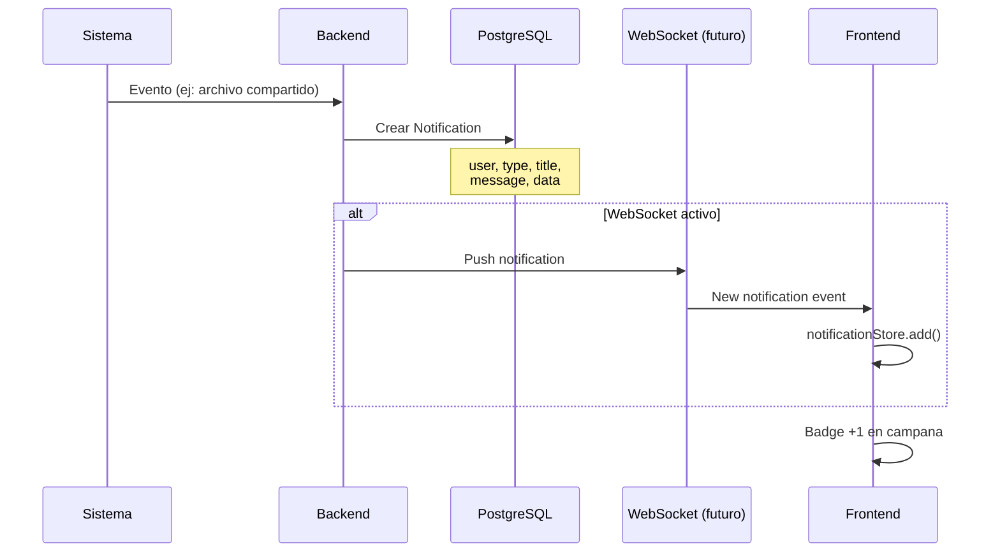
```mermaid
sequenceDiagram
    participant SYS as Sistema
    participant BE as Backend
    participant DB as PostgreSQL
    participant WS as WebSocket (futuro)
    participant FE as Frontend

    SYS->>BE: Evento (ej: archivo compartido)
    BE->>DB: Crear Notification
    Note over DB: user, type, title,<br/>message, data

    alt WebSocket activo
        BE->>WS: Push notification
        WS->>FE: New notification event
        FE->>FE: notificationStore.add()
    end

    FE->>FE: Badge +1 en campana
```

### 9.2 Leer Notificaciones

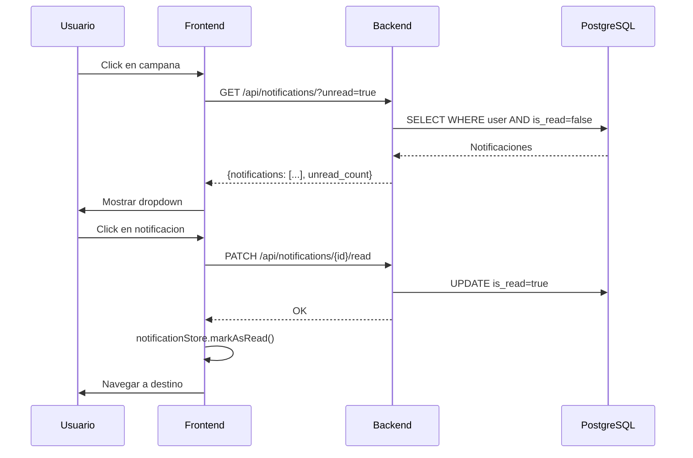
```mermaid
sequenceDiagram
    participant U as Usuario
    participant FE as Frontend
    participant BE as Backend
    participant DB as PostgreSQL

    U->>FE: Click en campana
    FE->>BE: GET /api/notifications/?unread=true
    BE->>DB: SELECT WHERE user AND is_read=false
    DB-->>BE: Notificaciones
    BE-->>FE: {notifications: [...], unread_count}
    FE->>U: Mostrar dropdown

    U->>FE: Click en notificacion
    FE->>BE: PATCH /api/notifications/{id}/read
    BE->>DB: UPDATE is_read=true
    BE-->>FE: OK
    FE->>FE: notificationStore.markAsRead()
    FE->>U: Navegar a destino
```

---

## 10. Flujo de Auditoria

### 10.1 Registro de Acciones

```mermaid
flowchart LR
    subgraph ACTIONS["Acciones Auditadas"]
        UPLOAD["upload"]
        DOWNLOAD["download"]
        DELETE["delete"]
        RENAME["rename"]
        MOVE["move"]
        COPY["copy"]
        CREATE_FOLDER["create_folder"]
        LOGIN["login"]
        LOGOUT["logout"]
    end

    subgraph AUDIT["AuditLog"]
        LOG["id, user, action,<br/>target_path, target_name,<br/>file_size, details,<br/>ip_address, user_agent,<br/>success, error_message,<br/>timestamp"]
    end

    subgraph STORAGE["Almacenamiento"]
        DB["PostgreSQL"]
        RETENTION["Retencion: 365 dias"]
    end

    ACTIONS --> LOG
    LOG --> DB
    DB --> RETENTION
```

### 10.2 Consultar Auditoria (Admin)

```mermaid
sequenceDiagram
    participant A as Admin
    participant FE as Frontend
    participant BE as Backend
    participant DB as PostgreSQL

    A->>FE: Accede a /auditoria
    A->>FE: Aplicar filtros
    Note over FE: Usuario, accion,<br/>rango fechas, path
    FE->>BE: GET /api/audit/?filters...
    BE->>DB: SELECT con filtros
    DB-->>BE: Logs paginados
    BE-->>FE: {logs: [...], total, pages}
    FE->>A: Mostrar tabla

    A->>FE: Click "Exportar"
    FE->>BE: GET /api/audit/export?format=csv
    BE->>DB: SELECT todos los filtrados
    BE-->>FE: CSV stream
    FE->>A: Descargar auditoria.csv
```

---

## Diagrama de Estados - Archivo

```mermaid
stateDiagram-v2
    [*] --> NoExiste
    NoExiste --> Activo: upload
    Activo --> Activo: rename/move/copy
    Activo --> EnPapelera: delete (soft)
    EnPapelera --> Activo: restore
    EnPapelera --> Eliminado: permanent_delete
    EnPapelera --> Eliminado: auto_cleanup (30 dias)
    Eliminado --> [*]

    state Activo {
        [*] --> Normal
        Normal --> Compartido: create_share_link
        Compartido --> Normal: revoke_share
    }
```

---

## Diagrama de Estados - Usuario

```mermaid
stateDiagram-v2
    [*] --> Creado
    Creado --> Activo: admin activa
    Activo --> Inactivo: admin desactiva
    Inactivo --> Activo: admin reactiva
    Activo --> Bloqueado: 5 intentos fallidos
    Bloqueado --> Activo: admin desbloquea
    Activo --> [*]: admin elimina

    state Activo {
        [*] --> Autenticado
        Autenticado --> SesionActiva: login
        SesionActiva --> Autenticado: logout
        SesionActiva --> Autenticado: token expira
    }
```
