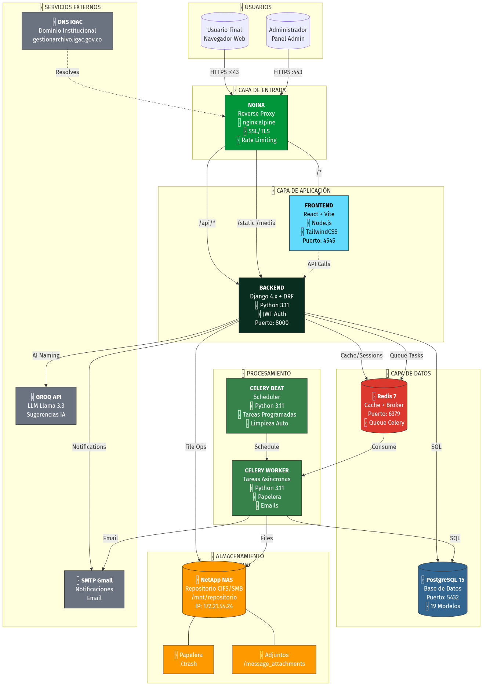
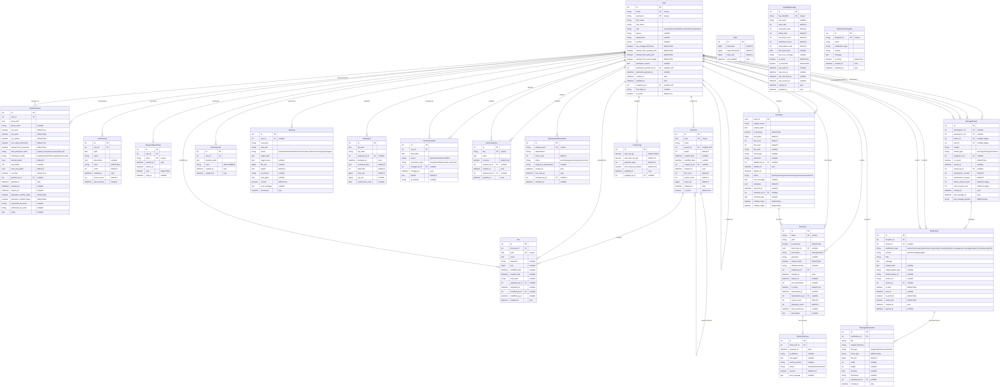
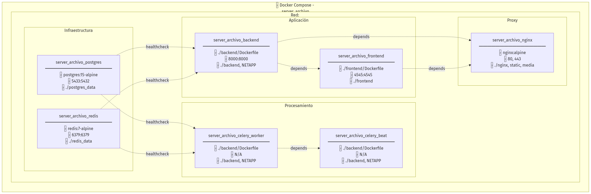

# MANUAL TÉCNICO
## Sistema de Gestión de Archivos NetApp
### Instituto Geográfico Agustín Codazzi (IGAC)

---

| Campo | Valor |
|-------|-------|
| **Versión del Documento** | 1.0.0 |
| **Fecha de Elaboración** | Enero 2025 |
| **Dependencia** | Dirección de Gestión Catastral |
| **Dominio de Producción** | gestionarchivo.igac.gov.co |
| **Clasificación** | Documento Técnico Interno |

---

## Control de Versiones

| Versión | Fecha | Autor | Descripción |
|---------|-------|-------|-------------|
| 1.0.0 | 2025-01-07 | DGC - Sistemas | Versión inicial del manual técnico |

---

## Tabla de Contenido

1. [Introducción](#1-introducción)
2. [Arquitectura General del Sistema](#2-arquitectura-general)
3. [Infraestructura y Despliegue](#3-infraestructura)
4. [Backend - Django REST Framework](#4-backend)
5. [Frontend - React + TypeScript](#5-frontend)
6. [Módulo: Explorador de Archivos](#6-explorador)
7. [Módulo: Sistema de Permisos](#7-permisos)
8. [Módulo: Smart Naming (IA)](#8-smart-naming)
9. [Módulo: Diccionario IGAC](#9-diccionario)
10. [Módulo: Favoritos](#10-favoritos)
11. [Módulo: Papelera de Reciclaje](#11-papelera)
12. [Módulo: Compartir Archivos](#12-compartir)
13. [Módulo: Notificaciones y Mensajes](#13-notificaciones)
14. [Módulo: Auditoría](#14-auditoria)
15. [Módulo: Administración](#15-administracion)
16. [Seguridad](#16-seguridad)
17. [Mantenimiento y Operación](#17-mantenimiento)
18. [Anexos](#18-anexos)

---

# 1. Introducción

## 1.1 Propósito del Documento

Este manual técnico tiene como objetivo proporcionar una guía completa y detallada del Sistema de Gestión de Archivos NetApp desarrollado para el Instituto Geográfico Agustín Codazzi (IGAC). El documento está dirigido a:

- **Desarrolladores**: Para entender la arquitectura, patrones de diseño y flujos de datos
- **Administradores de Sistemas**: Para la instalación, configuración y mantenimiento
- **Personal de Soporte**: Para diagnóstico y resolución de problemas
- **Auditores**: Para verificar controles de seguridad y trazabilidad

## 1.2 Alcance del Sistema

El Sistema de Gestión de Archivos NetApp es una aplicación web empresarial que centraliza el acceso y gestión de archivos almacenados en un servidor NAS NetApp mediante protocolo CIFS/SMB.

### Funcionalidades Principales:

| Módulo | Descripción |
|--------|-------------|
| **Explorador de Archivos** | Navegación, búsqueda, filtros, vistas múltiples |
| **Operaciones de Archivos** | Subida, descarga, renombrado, copia, movimiento |
| **Sistema de Permisos** | Control granular por usuario, ruta y herencia |
| **Smart Naming** | Validación IGAC + sugerencias con IA (GROQ) |
| **Diccionario** | Términos y abreviaciones oficiales IGAC |
| **Favoritos** | Accesos rápidos personalizados |
| **Papelera** | Eliminación suave con recuperación |
| **Compartir** | Enlaces públicos con seguridad |
| **Notificaciones** | Alertas y mensajería interna |
| **Auditoría** | Registro completo de operaciones |
| **Administración** | Gestión de usuarios y configuración |

## 1.3 Requisitos Previos

Para trabajar con este sistema se requiere conocimiento en:

- Python 3.11+ y Django 4.x
- JavaScript/TypeScript y React 18
- Docker y Docker Compose
- PostgreSQL 15
- Redis 7
- Nginx
- Protocolos CIFS/SMB
- APIs REST y JWT

## 1.4 Convenciones del Documento

| Símbolo | Significado |
|---------|-------------|
| `código` | Fragmentos de código o comandos |
| **Negrita** | Términos importantes |
| *Cursiva* | Nombres de archivos o rutas |
| ⚠️ | Advertencia importante |
| ℹ️ | Información adicional |
| ✅ | Paso completado o recomendación |

## 1.5 Glosario de Términos

| Término | Definición |
|---------|------------|
| **NAS** | Network Attached Storage - Almacenamiento en red |
| **CIFS/SMB** | Protocolo de compartición de archivos de Microsoft |
| **JWT** | JSON Web Token - Sistema de autenticación |
| **DRF** | Django REST Framework |
| **GROQ** | API de IA para modelos LLM (Llama 3.3) |
| **Celery** | Sistema de colas de tareas asíncronas |
| **Smart Naming** | Sistema de nomenclatura inteligente con IA |

---

# 2. Arquitectura General del Sistema

## 2.1 Visión General

El sistema sigue una arquitectura de microservicios containerizada, con separación clara entre:

- **Capa de Presentación**: React SPA servida por Nginx
- **Capa de API**: Django REST Framework
- **Capa de Datos**: PostgreSQL + Redis
- **Capa de Almacenamiento**: NetApp NAS
- **Capa de Procesamiento**: Celery Workers

```
┌─────────────────────────────────────────────────────────────────┐
│                         USUARIOS                                 │
│                    (Navegador Web)                               │
└─────────────────────────┬───────────────────────────────────────┘
                          │ HTTPS :443
                          ▼
┌─────────────────────────────────────────────────────────────────┐
│                         NGINX                                    │
│              (Reverse Proxy + SSL + Static)                      │
└──────────┬──────────────────────────────────────┬───────────────┘
           │ /api/*                               │ /*
           ▼                                      ▼
┌─────────────────────┐                ┌─────────────────────────┐
│      BACKEND        │                │       FRONTEND          │
│   Django + DRF      │◄──────────────►│    React + Vite         │
│    Puerto 8000      │   API Calls    │     Puerto 4545         │
└─────────┬───────────┘                └─────────────────────────┘
          │
          ├─────────────┬─────────────┬─────────────┐
          ▼             ▼             ▼             ▼
┌──────────────┐ ┌──────────────┐ ┌──────────┐ ┌──────────────┐
│  PostgreSQL  │ │    Redis     │ │ NetApp   │ │   GROQ API   │
│   Puerto     │ │   Puerto     │ │   NAS    │ │   (IA/LLM)   │
│    5432      │ │    6379      │ │  CIFS    │ │              │
└──────────────┘ └──────┬───────┘ └──────────┘ └──────────────┘
                        │
                        ▼
              ┌─────────────────────┐
              │   CELERY WORKERS    │
              │  (Tareas Async)     │
              └─────────────────────┘
```

## 2.2 Diagrama de Arquitectura



*Figura 2.1: Arquitectura General del Sistema*

## 2.3 Flujo de Datos

1. **Usuario** accede via HTTPS al dominio `gestionarchivo.igac.gov.co`
2. **Nginx** recibe la petición y la enruta:
   - Rutas `/api/*` → Backend Django (puerto 8000)
   - Otras rutas → Frontend React (puerto 4545)
   - Archivos estáticos → Servidos directamente
3. **Backend** procesa la lógica de negocio:
   - Autenticación JWT
   - Validación de permisos
   - Operaciones de archivos
   - Registro de auditoría
4. **Almacenamiento**:
   - Metadatos → PostgreSQL
   - Cache/Sesiones → Redis
   - Archivos → NetApp NAS via CIFS
5. **Procesamiento Async**:
   - Celery procesa tareas pesadas
   - Limpieza de papelera
   - Envío de emails

## 2.4 Stack Tecnológico Detallado

### Backend
| Tecnología | Versión | Propósito |
|------------|---------|-----------|
| Python | 3.11 | Lenguaje principal |
| Django | 4.x | Framework web |
| Django REST Framework | 3.14+ | API REST |
| Celery | 5.x | Tareas asíncronas |
| Gunicorn | 21.x | Servidor WSGI |
| psycopg2 | 2.9+ | Driver PostgreSQL |
| redis-py | 4.x | Cliente Redis |
| PyJWT | 2.x | Tokens JWT |

### Frontend
| Tecnología | Versión | Propósito |
|------------|---------|-----------|
| React | 18.x | Biblioteca UI |
| TypeScript | 5.x | Tipado estático |
| Vite | 5.x | Build tool |
| TailwindCSS | 3.x | Estilos |
| Zustand | 4.x | Estado global |
| React Router | 6.x | Enrutamiento |
| Axios | 1.x | Cliente HTTP |
| Lucide React | 0.x | Iconos |

### Infraestructura
| Tecnología | Versión | Propósito |
|------------|---------|-----------|
| Docker | 24.x | Containerización |
| Docker Compose | 2.x | Orquestación |
| Nginx | Alpine | Reverse proxy |
| PostgreSQL | 15 | Base de datos |
| Redis | 7 | Cache/Broker |
| NetApp | - | Almacenamiento NAS |

## 2.5 Modelo de Datos (Resumen)

El sistema cuenta con **19 modelos** distribuidos en **8 aplicaciones Django**:

| App | Modelos | Descripción |
|-----|---------|-------------|
| `users` | 4 | User, UserPermission, UserFavorite, PasswordResetToken |
| `files` | 2 | Directory, DirectoryColor |
| `audit` | 2 | AuditLog, PermissionChangeLog |
| `dictionary` | 2 | DictionaryTerm, AIGeneratedAbbreviation |
| `groq_stats` | 1 | GroqAPIKey |
| `sharing` | 2 | ShareLink, ShareLinkAccess |
| `trash` | 2 | TrashItem, TrashConfig |
| `notifications` | 4 | Notification, MessageThread, Message, MessageAttachment |



*Figura 2.2: Diagrama Entidad-Relación Completo*


---


# 3. Infraestructura y Despliegue

## 3.1 Docker Compose

El sistema utiliza Docker Compose v3.8 para orquestar todos los servicios. El archivo `docker-compose.yml` define 7 contenedores interconectados.

### Diagrama de Contenedores



*Figura 3.1: Diagrama de Contenedores Docker*

### Servicios Definidos

| Servicio | Container Name | Imagen | Puerto |
|----------|---------------|--------|--------|
| postgres | server_archivo_postgres | postgres:15-alpine | 5433:5432 |
| redis | server_archivo_redis | redis:7-alpine | 6379:6379 |
| backend | server_archivo_backend | ./backend/Dockerfile | 8000:8000 |
| frontend | server_archivo_frontend | ./frontend/Dockerfile | 4545:4545 |
| celery_worker | server_archivo_celery_worker | ./backend/Dockerfile | - |
| celery_beat | server_archivo_celery_beat | ./backend/Dockerfile | - |
| nginx | server_archivo_nginx | nginx:alpine | 80, 443 |

### Red Docker

Todos los servicios están conectados a una red bridge llamada `server_archivo_network`, lo que permite comunicación interna por nombre de servicio.

```yaml
networks:
  server_archivo_network:
    driver: bridge
```

### Volúmenes Persistentes

| Volumen | Propósito | Tamaño Estimado |
|---------|-----------|-----------------|
| `./postgres_data` | Datos PostgreSQL | 500MB - 2GB |
| `./redis_data` | Persistencia Redis AOF | 50MB - 500MB |
| `./backend` | Código Django (desarrollo) | ~50MB |
| `./frontend` | Código React (desarrollo) | ~200MB |
| `${NETAPP_BASE_PATH}` | Montaje NAS NetApp | 2TB+ |

---

## 3.2 PostgreSQL

### Configuración

```yaml
postgres:
  image: postgres:15-alpine
  container_name: server_archivo_postgres
  restart: unless-stopped
  environment:
    POSTGRES_DB: ${POSTGRES_DB}
    POSTGRES_USER: ${POSTGRES_USER}
    POSTGRES_PASSWORD: ${POSTGRES_PASSWORD}
  volumes:
    - ./postgres_data:/var/lib/postgresql/data
  ports:
    - "5433:5432"
  healthcheck:
    test: ["CMD-SHELL", "pg_isready -U ${POSTGRES_USER}"]
    interval: 10s
    timeout: 5s
    retries: 5
```

### Variables de Entorno

| Variable | Descripción | Ejemplo |
|----------|-------------|---------|
| `POSTGRES_DB` | Nombre de la base de datos | gestion_archivo_db |
| `POSTGRES_USER` | Usuario de PostgreSQL | postgres |
| `POSTGRES_PASSWORD` | Contraseña (en .env) | ******** |
| `POSTGRES_HOST` | Host (interno Docker) | postgres |
| `POSTGRES_PORT` | Puerto interno | 5432 |
| `POSTGRES_EXTERNAL_PORT` | Puerto externo | 5433 |

### Estadísticas de la Base de Datos

| Métrica | Valor |
|---------|-------|
| Total de Modelos | 19 |
| Total de Tablas | ~25 (incluyendo Django) |
| Relaciones FK | 37 |
| Índices Personalizados | 15+ |

### Backup y Restauración

**Crear backup:**
```bash
docker exec server_archivo_postgres pg_dump -U postgres gestion_archivo_db > backup_$(date +%Y%m%d).sql
```

**Restaurar backup:**
```bash
docker exec -i server_archivo_postgres psql -U postgres gestion_archivo_db < backup_20250107.sql
```

### Optimización para Producción

```sql
-- postgresql.conf recomendado
shared_buffers = 256MB
effective_cache_size = 768MB
maintenance_work_mem = 128MB
checkpoint_completion_target = 0.9
wal_buffers = 16MB
default_statistics_target = 100
random_page_cost = 1.1
effective_io_concurrency = 200
min_wal_size = 1GB
max_wal_size = 4GB
max_worker_processes = 4
max_parallel_workers_per_gather = 2
max_parallel_workers = 4
max_parallel_maintenance_workers = 2
```

---

## 3.3 Redis

### Configuración

```yaml
redis:
  image: redis:7-alpine
  container_name: server_archivo_redis
  restart: unless-stopped
  command: redis-server --appendonly yes
  volumes:
    - ./redis_data:/data
  ports:
    - "6379:6379"
  healthcheck:
    test: ["CMD", "redis-cli", "ping"]
    interval: 10s
    timeout: 5s
    retries: 5
```

### Usos en el Sistema

| Uso | Descripción |
|-----|-------------|
| **Cache** | Cache de consultas frecuentes |
| **Sesiones** | Almacenamiento de sesiones Django |
| **Celery Broker** | Cola de mensajes para tareas async |
| **Celery Result** | Almacenamiento de resultados de tareas |

### Variables de Entorno

| Variable | Descripción | Ejemplo |
|----------|-------------|---------|
| `REDIS_HOST` | Host interno | redis |
| `REDIS_PORT` | Puerto | 6379 |
| `CELERY_BROKER_URL` | URL del broker | redis://redis:6379/2 |
| `CELERY_RESULT_BACKEND` | URL de resultados | redis://redis:6379/2 |

### Monitoreo

**Ver estadísticas:**
```bash
docker exec server_archivo_redis redis-cli INFO
```

**Ver claves:**
```bash
docker exec server_archivo_redis redis-cli KEYS "*"
```

**Flush cache (solo desarrollo):**
```bash
docker exec server_archivo_redis redis-cli FLUSHALL
```

---

## 3.4 Nginx

### Configuración de Producción

El archivo `/nginx/conf.d/production.conf` contiene la configuración completa.

### Funciones Principales

| Función | Descripción |
|---------|-------------|
| **Reverse Proxy** | Enruta peticiones a backend/frontend |
| **SSL Termination** | Maneja certificados SSL/TLS |
| **Rate Limiting** | Protección contra abuso |
| **Static Files** | Sirve archivos estáticos |
| **Security Headers** | Headers de seguridad HTTP |

### Rate Limiting por Zona

| Zona | Límite | Aplicación |
|------|--------|------------|
| `login_limit` | 10 req/min | Login, registro, reset password |
| `api_limit` | 50 req/seg | Endpoints API generales |
| `general_limit` | 60 req/seg | Frontend y recursos |
| `upload_limit` | 20 req/seg | Uploads de archivos |

### Configuración de Rate Limiting

```nginx
# Rate limiting zones - POR USUARIO (IP real)
limit_req_zone $real_client_ip zone=login_limit:10m rate=10r/m;
limit_req_zone $real_client_ip zone=api_limit:10m rate=50r/s;
limit_req_zone $real_client_ip zone=general_limit:10m rate=60r/s;
limit_req_zone $real_client_ip zone=upload_limit:10m rate=20r/s;

# Connection limiting
limit_conn_zone $real_client_ip zone=addr:10m;
```

### Headers de Seguridad

```nginx
add_header X-Frame-Options "DENY" always;
add_header X-Content-Type-Options "nosniff" always;
add_header X-XSS-Protection "1; mode=block" always;
add_header Referrer-Policy "strict-origin-when-cross-origin" always;
server_tokens off;  # Ocultar versión de nginx
```

### Routing

| Ruta | Destino | Descripción |
|------|---------|-------------|
| `/` | `/app/frontend/dist` | SPA React |
| `/api/*` | `backend:8000` | API Django |
| `/admin/*` | `backend:8000` | Admin Django |
| `/static/*` | `/app/static/` | Estáticos Django |
| `/media/*` | `/app/media/` | Media files |

### Timeouts para Operaciones Largas

```nginx
proxy_connect_timeout 600s;
proxy_send_timeout 600s;
proxy_read_timeout 600s;
client_max_body_size 2048M;  # Para uploads grandes
```

### SSL/TLS

Los certificados se ubican en `/nginx/ssl/`:

| Archivo | Descripción |
|---------|-------------|
| `certificate.crt` | Certificado público |
| `private.key` | Llave privada |
| `ca_bundle.crt` | Cadena de certificados |

---

## 3.5 Celery (Workers Asíncronos)

### Celery Worker

Procesa tareas asíncronas como:
- Movimiento de archivos a papelera
- Envío de emails
- Limpieza de archivos temporales
- Procesamiento de uploads grandes

```yaml
celery_worker:
  command: celery -A config worker -l INFO -Q default
```

### Celery Beat

Scheduler para tareas programadas:

```yaml
celery_beat:
  command: celery -A config beat -l INFO --scheduler django_celery_beat.schedulers:DatabaseScheduler
```

### Tareas Programadas

| Tarea | Frecuencia | Descripción |
|-------|------------|-------------|
| `clean_expired_trash` | Diaria (3:00 AM) | Elimina archivos expirados de papelera |
| `clean_old_attachments` | Diaria (4:00 AM) | Limpia adjuntos de mensajes >180 días |
| `check_permission_expiry` | Diaria (6:00 AM) | Notifica permisos por expirar |
| `cleanup_audit_logs` | Semanal | Limpia logs de auditoría antiguos |

### Monitoreo de Celery

**Ver workers activos:**
```bash
docker exec server_archivo_celery_worker celery -A config inspect active
```

**Ver tareas programadas:**
```bash
docker exec server_archivo_celery_beat celery -A config inspect scheduled
```

---

## 3.6 Almacenamiento NAS (NetApp)

### Montaje CIFS/SMB

El sistema accede al NAS NetApp mediante protocolo CIFS montado en el host:

```bash
# /etc/fstab
//172.21.54.24/DirGesCat /mnt/repositorio cifs credentials=/etc/cifs.credentials,uid=1000,gid=1000 0 0
```

### Variables de Entorno

| Variable | Descripción | Ejemplo |
|----------|-------------|---------|
| `NETAPP_BASE_PATH` | Ruta base del repositorio | /mnt/repositorio/2510SP/... |
| `TRASH_PATH` | Subcarpeta de papelera | 04_bk/bk_temp_subproy/.trash |
| `MESSAGE_ATTACHMENTS_PATH` | Adjuntos de mensajes | 04_bk/trans_doc_platform/message_attachments |

### Estructura del Repositorio

```
/mnt/repositorio/
└── 2510SP/
    └── H_Informacion_Consulta/
        └── Sub_Proy/
            ├── [Carpetas de proyectos]
            └── 04_bk/
                ├── bk_temp_subproy/
                │   └── .trash/          # Papelera de reciclaje
                └── trans_doc_platform/
                    └── message_attachments/  # Adjuntos de mensajes
```

### Consideraciones de Permisos

⚠️ **Importante:** El usuario que ejecuta Docker debe tener permisos de lectura/escritura sobre el montaje NAS.

```bash
# Verificar montaje
mount | grep repositorio

# Verificar permisos
ls -la /mnt/repositorio/
```

---

## 3.7 Variables de Entorno (.env)

### Archivo .env de Ejemplo

```env
# ==========================================
# DJANGO CORE
# ==========================================
DEBUG=False
DJANGO_SECRET_KEY=your-super-secret-key-here
ALLOWED_HOSTS=localhost,127.0.0.1,gestionarchivo.igac.gov.co

# ==========================================
# DATABASE
# ==========================================
POSTGRES_DB=gestion_archivo_db
POSTGRES_USER=postgres
POSTGRES_PASSWORD=your-db-password
POSTGRES_HOST=postgres
POSTGRES_PORT=5432
POSTGRES_EXTERNAL_PORT=5433

# ==========================================
# REDIS
# ==========================================
REDIS_HOST=redis
REDIS_PORT=6379
CELERY_BROKER_URL=redis://redis:6379/2
CELERY_RESULT_BACKEND=redis://redis:6379/2

# ==========================================
# JWT
# ==========================================
JWT_SECRET_KEY=your-jwt-secret
JWT_ACCESS_TOKEN_LIFETIME_MINUTES=60
JWT_REFRESH_TOKEN_LIFETIME_DAYS=7

# ==========================================
# EMAIL (Gmail SMTP)
# ==========================================
EMAIL_BACKEND=django.core.mail.backends.smtp.EmailBackend
EMAIL_HOST=smtp.gmail.com
EMAIL_PORT=587
EMAIL_USE_TLS=True
EMAIL_HOST_USER=your-email@gmail.com
EMAIL_HOST_PASSWORD=your-app-password
DEFAULT_FROM_EMAIL=Sistema IGAC <noreply@igac.gov.co>

# ==========================================
# GROQ AI
# ==========================================
GROQ_API_KEYS=key1,key2,key3
GROQ_MODEL=llama-3.3-70b-versatile
GROQ_MAX_TOKENS=1000
GROQ_TEMPERATURE=0.3

# ==========================================
# STORAGE
# ==========================================
NETAPP_BASE_PATH=/mnt/repositorio/2510SP/H_Informacion_Consulta/Sub_Proy

# ==========================================
# PAPELERA
# ==========================================
TRASH_ENABLED=True
TRASH_PATH=04_bk/bk_temp_subproy/.trash
TRASH_MAX_SIZE_GB=5
TRASH_RETENTION_DAYS=30

# ==========================================
# MENSAJERÍA
# ==========================================
MESSAGE_ATTACHMENTS_PATH=04_bk/trans_doc_platform/message_attachments
MESSAGE_ATTACHMENTS_RETENTION_DAYS=180

# ==========================================
# UPLOADS
# ==========================================
MAX_UPLOAD_SIZE_MB=500
MAX_PATH_LENGTH=260
CLIENT_MAX_BODY_SIZE=2048M

# ==========================================
# AUDITORÍA
# ==========================================
AUDIT_LOG_RETENTION_DAYS=365

# ==========================================
# FRONTEND
# ==========================================
VITE_API_URL=http://localhost:8000/api
VITE_DEV_PORT=4545
BACKEND_PORT=8000

# ==========================================
# NGINX
# ==========================================
DOMAIN=gestionarchivo.igac.gov.co
NGINX_MODE=production
HTTP_PORT=80
HTTPS_PORT=443

# ==========================================
# CORS
# ==========================================
CORS_ALLOWED_ORIGINS=http://localhost:4545,https://gestionarchivo.igac.gov.co

# ==========================================
# LOGGING
# ==========================================
LOG_LEVEL=INFO
```

---

## 3.8 Comandos de Gestión

### Iniciar Servicios

```bash
# Iniciar todo
docker-compose up -d

# Iniciar servicio específico
docker-compose up -d backend

# Ver logs
docker-compose logs -f backend
```

### Detener Servicios

```bash
# Detener todo
docker-compose down

# Detener con eliminación de volúmenes (¡CUIDADO!)
docker-compose down -v
```

### Reiniciar Servicios

```bash
# Reiniciar todo
docker-compose restart

# Reiniciar servicio específico
docker-compose restart backend
```

### Ejecutar Comandos Django

```bash
# Migraciones
docker-compose exec backend python manage.py migrate

# Crear superusuario
docker-compose exec backend python manage.py createsuperuser

# Shell Django
docker-compose exec backend python manage.py shell

# Recolectar estáticos
docker-compose exec backend python manage.py collectstatic --noinput
```

### Rebuild de Imágenes

```bash
# Rebuild sin cache
docker-compose build --no-cache

# Rebuild y reiniciar
docker-compose up -d --build
```

---

## 3.9 Healthchecks

### PostgreSQL

```yaml
healthcheck:
  test: ["CMD-SHELL", "pg_isready -U ${POSTGRES_USER}"]
  interval: 10s
  timeout: 5s
  retries: 5
```

### Redis

```yaml
healthcheck:
  test: ["CMD", "redis-cli", "ping"]
  interval: 10s
  timeout: 5s
  retries: 5
```

### Verificar Estado

```bash
# Ver estado de todos los contenedores
docker-compose ps

# Ver healthcheck específico
docker inspect --format='{{.State.Health.Status}}' server_archivo_postgres
```

---

## 3.10 Troubleshooting

### Problema: Contenedor no inicia

```bash
# Ver logs del contenedor
docker-compose logs backend

# Ver eventos
docker events --filter container=server_archivo_backend
```

### Problema: Conexión a base de datos falla

```bash
# Verificar que postgres esté corriendo
docker-compose ps postgres

# Probar conexión
docker exec server_archivo_postgres pg_isready -U postgres
```

### Problema: Redis no responde

```bash
# Ping a Redis
docker exec server_archivo_redis redis-cli ping

# Ver info de memoria
docker exec server_archivo_redis redis-cli INFO memory
```

### Problema: Celery no procesa tareas

```bash
# Ver workers activos
docker exec server_archivo_celery_worker celery -A config inspect active

# Ver cola de tareas
docker exec server_archivo_celery_worker celery -A config inspect reserved
```

### Problema: NAS no accesible

```bash
# Verificar montaje en el host
mount | grep repositorio

# Verificar permisos
ls -la /mnt/repositorio/

# Remontar si es necesario
sudo mount -a
```


---


# 4. Backend - Django REST Framework

## 4.1 Estructura del Proyecto

```
backend/
├── config/                 # Configuración principal Django
│   ├── __init__.py
│   ├── settings.py        # Configuración general
│   ├── urls.py            # URLs principales
│   ├── celery.py          # Configuración Celery
│   ├── middleware.py      # Middleware personalizado
│   └── wsgi.py
├── users/                  # App de usuarios y permisos
│   ├── models.py          # User, UserPermission, UserFavorite
│   ├── views.py           # ViewSets de autenticación
│   ├── views_admin.py     # ViewSets de administración
│   ├── serializers.py     # Serializers de usuario
│   ├── middleware.py      # Middleware de expiración de permisos
│   └── permissions.py     # Clases de permisos personalizados
├── files/                  # App de operaciones de archivos
│   ├── models.py          # Directory, DirectoryColor
│   ├── views.py           # FileViewSet (browse, upload, download)
│   └── serializers.py
├── audit/                  # App de auditoría
│   ├── models.py          # AuditLog, PermissionChangeLog
│   ├── views.py           # AuditLogViewSet
│   ├── middleware.py      # Middleware de auditoría
│   └── signals.py         # Señales para registro automático
├── dictionary/             # App de diccionario IGAC
│   ├── models.py          # DictionaryTerm, AIGeneratedAbbreviation
│   ├── views.py           # DictionaryViewSet
│   └── management/        # Comandos de gestión
├── groq_stats/            # App de estadísticas GROQ
│   ├── models.py          # GroqAPIKey
│   └── views.py           # GroqStatsViewSet
├── sharing/               # App de compartir archivos
│   ├── models.py          # ShareLink, ShareLinkAccess
│   └── views.py           # ShareLinkViewSet
├── trash/                 # App de papelera
│   ├── models.py          # TrashItem, TrashConfig
│   ├── views.py           # TrashViewSet
│   └── tasks.py           # Tareas Celery
├── notifications/         # App de notificaciones
│   ├── models.py          # Notification, MessageThread, Message
│   └── views.py           # NotificationViewSet
├── services/              # Servicios compartidos
│   ├── smb_service.py     # Servicio de acceso a NAS
│   ├── smart_naming.py    # Servicio de nomenclatura inteligente
│   └── groq_service.py    # Servicio de IA GROQ
├── manage.py
├── requirements.txt
└── Dockerfile
```

---

## 4.2 Configuración (settings.py)

### Aplicaciones Instaladas

```python
INSTALLED_APPS = [
    # Django Core
    'django.contrib.admin',
    'django.contrib.auth',
    'django.contrib.contenttypes',
    'django.contrib.sessions',
    'django.contrib.messages',
    'django.contrib.staticfiles',

    # Third Party
    'rest_framework',
    'rest_framework_simplejwt',
    'corsheaders',
    'django_filters',
    'django_celery_beat',

    # Apps Locales
    'users.apps.UsersConfig',
    'files.apps.FilesConfig',
    'audit.apps.AuditConfig',
    'dictionary.apps.DictionaryConfig',
    'groq_stats.apps.GroqStatsConfig',
    'sharing.apps.SharingConfig',
    'trash.apps.TrashConfig',
    'notifications.apps.NotificationsConfig',
]
```

### Configuración REST Framework

```python
REST_FRAMEWORK = {
    'DEFAULT_AUTHENTICATION_CLASSES': [
        'rest_framework_simplejwt.authentication.JWTAuthentication',
    ],
    'DEFAULT_PERMISSION_CLASSES': [
        'rest_framework.permissions.IsAuthenticated',
    ],
    'DEFAULT_PAGINATION_CLASS': 'rest_framework.pagination.PageNumberPagination',
    'PAGE_SIZE': 50,
    'DEFAULT_FILTER_BACKENDS': [
        'django_filters.rest_framework.DjangoFilterBackend',
        'rest_framework.filters.SearchFilter',
        'rest_framework.filters.OrderingFilter',
    ],
}
```

### Configuración JWT

```python
from datetime import timedelta

SIMPLE_JWT = {
    'ACCESS_TOKEN_LIFETIME': timedelta(minutes=60),
    'REFRESH_TOKEN_LIFETIME': timedelta(days=7),
    'ROTATE_REFRESH_TOKENS': True,
    'BLACKLIST_AFTER_ROTATION': True,
    'ALGORITHM': 'HS256',
    'SIGNING_KEY': env('JWT_SECRET_KEY'),
    'AUTH_HEADER_TYPES': ('Bearer',),
}
```

### Middleware Personalizado

```python
MIDDLEWARE = [
    'django.middleware.security.SecurityMiddleware',
    'corsheaders.middleware.CorsMiddleware',
    'django.contrib.sessions.middleware.SessionMiddleware',
    'django.middleware.common.CommonMiddleware',
    'django.middleware.csrf.CsrfViewMiddleware',
    'django.contrib.auth.middleware.AuthenticationMiddleware',
    'users.middleware.PermissionExpirationMiddleware',  # Expiración de permisos
    'django.contrib.messages.middleware.MessageMiddleware',
    'django.middleware.clickjacking.XFrameOptionsMiddleware',
    'config.middleware.SecurityHeadersMiddleware',      # Headers de seguridad
    'audit.middleware.AuditMiddleware',                 # Auditoría automática
]
```

---

## 4.3 Modelo de Usuario

### Clase User

El sistema utiliza un modelo de usuario personalizado que extiende `AbstractUser`:

```python
class User(AbstractUser):
    """
    Modelo de usuario personalizado con roles y exenciones
    """
    ROLE_CHOICES = (
        ('consultation', 'Consulta'),
        ('consultation_edit', 'Consulta + Edición'),
        ('admin', 'Administrador'),
        ('superadmin', 'Super Administrador'),
    )

    # Campos base
    email = models.EmailField('Email', unique=True)
    username = models.CharField('Username', max_length=150, unique=True)
    first_name = models.CharField('Nombre', max_length=150)
    last_name = models.CharField('Apellido', max_length=150)

    # Rol y permisos
    role = models.CharField('Rol', max_length=20, choices=ROLE_CHOICES)
    phone = models.CharField('Teléfono', max_length=20, blank=True, null=True)
    department = models.CharField('Dependencia', max_length=200, blank=True, null=True)
    position = models.CharField('Cargo', max_length=200, blank=True, null=True)

    # Permisos especiales de diccionario
    can_manage_dictionary = models.BooleanField(default=False)

    # Exenciones de validación
    exempt_from_naming_rules = models.BooleanField(default=False)
    exempt_from_path_limit = models.BooleanField(default=False)
    exempt_from_name_length = models.BooleanField(default=False)
    exemption_reason = models.TextField(blank=True, null=True)
    exemption_granted_by = models.ForeignKey('self', null=True, blank=True)
    exemption_granted_at = models.DateTimeField(null=True, blank=True)

    # Auditoría
    created_at = models.DateTimeField(auto_now_add=True)
    updated_at = models.DateTimeField(auto_now=True)
    created_by = models.ForeignKey('self', null=True, blank=True)
    last_login_ip = models.GenericIPAddressField(null=True, blank=True)

    USERNAME_FIELD = 'email'
    REQUIRED_FIELDS = ['first_name', 'last_name']
```

### Jerarquía de Roles

| Rol | Nivel | Capacidades |
|-----|-------|-------------|
| `consultation` | 1 | Solo lectura en rutas asignadas |
| `consultation_edit` | 2 | Lectura + Escritura con validación IGAC |
| `admin` | 3 | Gestión de usuarios + Sin validación IGAC |
| `superadmin` | 4 | Acceso total al sistema |

---

## 4.4 Modelo de Permisos

### Clase UserPermission

```python
class UserPermission(models.Model):
    """
    Permisos granulares por ruta para cada usuario
    """
    EDIT_LEVEL_CHOICES = (
        ('upload_only', 'Solo subir'),
        ('upload_own', 'Subir + Eliminar propios'),
        ('upload_all', 'Subir + Eliminar todos'),
    )

    INHERITANCE_CHOICES = (
        ('total', 'Herencia total'),
        ('blocked', 'Sin herencia'),
        ('limited_depth', 'Profundidad limitada'),
        ('partial_write', 'Solo lectura en subdirectorios'),
    )

    user = models.ForeignKey(User, on_delete=models.CASCADE)
    base_path = models.TextField()
    group_name = models.CharField(max_length=100, blank=True, null=True)

    # Permisos básicos
    can_read = models.BooleanField(default=True)
    can_write = models.BooleanField(default=False)
    can_delete = models.BooleanField(default=False)
    can_create_directories = models.BooleanField(default=True)
    exempt_from_dictionary = models.BooleanField(default=False)

    # Nivel de edición granular
    edit_permission_level = models.CharField(max_length=20, choices=EDIT_LEVEL_CHOICES)

    # Herencia de permisos
    inheritance_mode = models.CharField(max_length=20, choices=INHERITANCE_CHOICES)
    blocked_paths = models.JSONField(default=list)
    read_only_paths = models.JSONField(default=list)
    max_depth = models.PositiveIntegerField(null=True, blank=True)

    # Control de vigencia
    is_active = models.BooleanField(default=True)
    granted_by = models.ForeignKey(User, null=True, related_name='permissions_granted')
    granted_at = models.DateTimeField(auto_now_add=True)
    expires_at = models.DateTimeField(null=True, blank=True)
    revoked_at = models.DateTimeField(null=True, blank=True)

    # Notificaciones de expiración
    expiration_notified_7days = models.BooleanField(default=False)
    expiration_notified_3days = models.BooleanField(default=False)

    notes = models.TextField(blank=True, null=True)
```

### Flujo de Verificación de Permisos

```
┌─────────────────────────────────────────────────────────────┐
│                    VERIFICACIÓN DE PERMISO                   │
└─────────────────────────────────────────────────────────────┘
                              │
                              ▼
                    ┌─────────────────┐
                    │ ¿Es superadmin? │
                    └────────┬────────┘
                             │
              ┌──────────────┴──────────────┐
              │ SÍ                          │ NO
              ▼                             ▼
    ┌─────────────────┐          ┌─────────────────────┐
    │ ACCESO TOTAL    │          │ Buscar permisos     │
    └─────────────────┘          │ para la ruta        │
                                 └──────────┬──────────┘
                                            │
                              ┌─────────────┴─────────────┐
                              │ ¿Permiso activo           │
                              │ y no expirado?            │
                              └─────────────┬─────────────┘
                                            │
                     ┌──────────────────────┴───────────────────────┐
                     │ SÍ                                          │ NO
                     ▼                                             ▼
           ┌─────────────────────┐                     ┌─────────────────┐
           │ Verificar herencia  │                     │ ACCESO DENEGADO │
           │ y paths bloqueados  │                     └─────────────────┘
           └──────────┬──────────┘
                      │
           ┌──────────┴──────────┐
           │ ¿Path bloqueado?    │
           └──────────┬──────────┘
                      │
        ┌─────────────┴─────────────┐
        │ SÍ                        │ NO
        ▼                           ▼
┌─────────────────┐     ┌─────────────────────────┐
│ ACCESO DENEGADO │     │ Retornar nivel de       │
└─────────────────┘     │ permiso (read/write/del)│
                        └─────────────────────────┘
```

---

## 4.5 Servicio SMB (smb_service.py)

### Propósito

El servicio SMB maneja todas las operaciones de archivos contra el NAS NetApp.

### Funciones Principales

| Función | Descripción |
|---------|-------------|
| `list_directory(path)` | Lista contenido de directorio |
| `create_directory(path)` | Crea un nuevo directorio |
| `delete_item(path)` | Mueve item a papelera |
| `rename_item(old, new)` | Renombra archivo/carpeta |
| `copy_item(src, dst)` | Copia archivo/carpeta |
| `move_item(src, dst)` | Mueve archivo/carpeta |
| `get_file_stream(path)` | Obtiene stream para descarga |
| `save_uploaded_file(path, file)` | Guarda archivo subido |

### Ejemplo de Implementación

```python
class SMBService:
    def __init__(self):
        self.base_path = settings.NETAPP_BASE_PATH

    def list_directory(self, relative_path: str) -> list:
        """
        Lista el contenido de un directorio.
        Retorna lista de items con metadatos.
        """
        full_path = os.path.join(self.base_path, relative_path.lstrip('/'))

        if not os.path.exists(full_path):
            raise FileNotFoundError(f"Directorio no encontrado: {relative_path}")

        items = []
        for entry in os.scandir(full_path):
            stat_info = entry.stat()
            is_dir = entry.is_dir()

            # Contar elementos si es directorio
            item_count = None
            if is_dir:
                try:
                    item_count = len(os.listdir(entry.path))
                except (PermissionError, OSError):
                    item_count = None

            items.append({
                'name': entry.name,
                'path': os.path.join(relative_path, entry.name),
                'is_directory': is_dir,
                'size': stat_info.st_size if not is_dir else 0,
                'modified_date': stat_info.st_mtime,
                'created_date': stat_info.st_ctime,
                'extension': os.path.splitext(entry.name)[1].lower() if not is_dir else None,
                'item_count': item_count,
            })

        return items
```

---

## 4.6 Servicio de Nomenclatura Inteligente (smart_naming.py)

### Propósito

Valida y sugiere nombres de archivos según las 12 reglas IGAC, integrando IA cuando es necesario.

### Reglas de Validación IGAC

| # | Regla | Ejemplo Incorrecto | Correcto |
|---|-------|-------------------|----------|
| 1 | Solo caracteres permitidos (a-z, 0-9, _) | `archivo@2024.pdf` | `archivo_2024.pdf` |
| 2 | Sin espacios | `mi archivo.pdf` | `mi_archivo.pdf` |
| 3 | Sin tildes ni ñ | `información.pdf` | `informacion.pdf` |
| 4 | Sin mayúsculas | `MiArchivo.PDF` | `miarchivo.pdf` |
| 5 | Sin caracteres especiales | `archivo(v2).pdf` | `archivo_v2.pdf` |
| 6 | Sin palabras prohibidas | `informe_final.pdf` | `informe_20240115.pdf` |
| 7 | Máximo 50 caracteres | `nombre_muy_largo...` | `nombre_corto.pdf` |
| 8 | Sin guiones bajos consecutivos | `archivo__doble.pdf` | `archivo_doble.pdf` |
| 9 | No empieza/termina con _ | `_archivo_.pdf` | `archivo.pdf` |
| 10 | Fecha formato AAAAMMDD | `archivo_15-01-2024.pdf` | `archivo_20240115.pdf` |
| 11 | Sin vocales dobles (excepto rr, ll) | `coordiinadas.pdf` | `coordenadas.pdf` |
| 12 | Usar abreviaciones del diccionario | `proyecto_catastro.pdf` | `proy_cat.pdf` |

### Flujo de Validación

```python
def smart_validate(name: str, current_path: str = None) -> dict:
    """
    Valida un nombre de archivo según reglas IGAC.

    Returns:
        {
            'valid': bool,
            'errors': list,
            'warnings': list,
            'formatted_name': str,
            'parts_analysis': list,
            'needs_ai': bool,
            'user_exemptions': dict
        }
    """
```

---

## 4.7 API ViewSets

### Estructura General

Todos los ViewSets siguen el patrón Django REST Framework:

```python
from rest_framework import viewsets, status
from rest_framework.decorators import action
from rest_framework.response import Response
from rest_framework.permissions import IsAuthenticated

class FileViewSet(viewsets.ViewSet):
    permission_classes = [IsAuthenticated]

    def list(self, request):
        """GET /api/files/"""
        pass

    @action(detail=False, methods=['get'])
    def browse(self, request):
        """GET /api/file-ops/browse?path=/"""
        pass

    @action(detail=False, methods=['post'])
    def upload(self, request):
        """POST /api/file-ops/upload"""
        pass
```

### ViewSets Principales

| ViewSet | Base URL | Descripción |
|---------|----------|-------------|
| `AuthViewSet` | `/api/auth/` | Autenticación (login, logout, me) |
| `UserViewSet` | `/api/users/` | CRUD de usuarios |
| `UserPermissionViewSet` | `/api/permissions/` | CRUD de permisos |
| `FileViewSet` | `/api/file-ops/` | Operaciones de archivos |
| `DictionaryViewSet` | `/api/dictionary/` | Gestión del diccionario |
| `AuditLogViewSet` | `/api/audit/` | Logs de auditoría |
| `ShareLinkViewSet` | `/api/sharing/` | Enlaces compartidos |
| `TrashViewSet` | `/api/trash/` | Papelera de reciclaje |
| `NotificationViewSet` | `/api/notifications/` | Notificaciones |

---

## 4.8 Serializers

### Ejemplo: UserSerializer

```python
class UserSerializer(serializers.ModelSerializer):
    full_name = serializers.CharField(source='get_full_name', read_only=True)
    permissions_count = serializers.SerializerMethodField()
    naming_exemptions = serializers.SerializerMethodField()

    class Meta:
        model = User
        fields = [
            'id', 'email', 'username', 'first_name', 'last_name',
            'full_name', 'role', 'phone', 'department', 'position',
            'is_active', 'can_manage_dictionary',
            'exempt_from_naming_rules', 'exempt_from_path_limit',
            'exempt_from_name_length', 'naming_exemptions',
            'permissions_count', 'created_at', 'last_login'
        ]

    def get_permissions_count(self, obj):
        return obj.userpermission_set.filter(is_active=True).count()

    def get_naming_exemptions(self, obj):
        return {
            'exempt_from_naming_rules': obj.exempt_from_naming_rules,
            'exempt_from_path_limit': obj.exempt_from_path_limit,
            'exempt_from_name_length': obj.exempt_from_name_length,
            'is_privileged_role': obj.role in ['admin', 'superadmin']
        }
```

---

## 4.9 Middleware Personalizado

### AuditMiddleware

Registra automáticamente todas las operaciones de archivos:

```python
class AuditMiddleware:
    def __init__(self, get_response):
        self.get_response = get_response

    def __call__(self, request):
        response = self.get_response(request)

        # Solo registrar operaciones de archivos exitosas
        if request.path.startswith('/api/file-ops/') and response.status_code < 400:
            self._log_operation(request, response)

        return response

    def _log_operation(self, request, response):
        from audit.models import AuditLog

        action_map = {
            'upload': 'upload',
            'download': 'download',
            'delete': 'delete',
            'rename': 'rename',
            # ...
        }
        # Crear registro de auditoría
```

### PermissionExpirationMiddleware

Verifica y desactiva permisos expirados:

```python
class PermissionExpirationMiddleware:
    def __init__(self, get_response):
        self.get_response = get_response

    def __call__(self, request):
        if request.user.is_authenticated:
            # Desactivar permisos expirados del usuario
            UserPermission.objects.filter(
                user=request.user,
                is_active=True,
                expires_at__lt=timezone.now()
            ).update(is_active=False, revoked_at=timezone.now())

        return self.get_response(request)
```

---

## 4.10 Señales (Signals)

### Registro Automático de Cambios

```python
# audit/signals.py
from django.db.models.signals import post_save, post_delete
from django.dispatch import receiver
from users.models import UserPermission
from .models import PermissionChangeLog

@receiver(post_save, sender=UserPermission)
def log_permission_change(sender, instance, created, **kwargs):
    """Registra cambios en permisos"""
    PermissionChangeLog.objects.create(
        permission=instance,
        action='created' if created else 'updated',
        changed_by=get_current_user(),
        old_values=get_old_values(),
        new_values=get_new_values(instance)
    )
```

---

## 4.11 Tareas Celery

### Definición de Tareas

```python
# trash/tasks.py
from celery import shared_task
from django.utils import timezone
from datetime import timedelta

@shared_task
def clean_expired_trash_items():
    """
    Elimina permanentemente items de papelera
    que hayan expirado (>30 días por defecto).
    """
    from .models import TrashItem, TrashConfig

    config = TrashConfig.get_config()
    expiry_date = timezone.now() - timedelta(days=config.retention_days)

    expired_items = TrashItem.objects.filter(
        deleted_at__lt=expiry_date
    )

    for item in expired_items:
        item.permanent_delete()

    return f"Eliminados {expired_items.count()} items expirados"
```

### Programación de Tareas

```python
# config/celery.py
from celery.schedules import crontab

app.conf.beat_schedule = {
    'clean-expired-trash': {
        'task': 'trash.tasks.clean_expired_trash_items',
        'schedule': crontab(hour=3, minute=0),  # 3:00 AM diario
    },
    'check-permission-expiry': {
        'task': 'users.tasks.check_permission_expiry',
        'schedule': crontab(hour=6, minute=0),  # 6:00 AM diario
    },
    'clean-old-attachments': {
        'task': 'notifications.tasks.clean_old_attachments',
        'schedule': crontab(hour=4, minute=0),  # 4:00 AM diario
    },
}
```

---

## 4.12 Manejo de Errores

### Excepciones Personalizadas

```python
# config/exceptions.py
from rest_framework.exceptions import APIException

class PermissionDeniedError(APIException):
    status_code = 403
    default_detail = 'No tiene permisos para esta operación'
    default_code = 'permission_denied'

class PathNotFoundError(APIException):
    status_code = 404
    default_detail = 'Ruta no encontrada'
    default_code = 'path_not_found'

class NamingValidationError(APIException):
    status_code = 400
    default_detail = 'El nombre no cumple con las reglas IGAC'
    default_code = 'naming_validation_error'
```

### Handler Global de Excepciones

```python
# config/exception_handler.py
from rest_framework.views import exception_handler

def custom_exception_handler(exc, context):
    response = exception_handler(exc, context)

    if response is not None:
        response.data['success'] = False
        response.data['error_code'] = getattr(exc, 'default_code', 'error')

    return response
```


---


# 4. Frontend - React + TypeScript

## 4.1 Visión General

El frontend es una **Single Page Application (SPA)** construida con tecnologías modernas que proporciona una interfaz de usuario rica y responsiva.

### Stack Tecnológico

| Tecnología | Versión | Propósito |
|------------|---------|-----------|
| React | 19.2.0 | Biblioteca UI principal |
| TypeScript | 5.9.3 | Tipado estático |
| Vite | 7.2.2 | Build tool y dev server |
| TailwindCSS | 4.1.17 | Framework CSS utility-first |
| Zustand | 5.0.8 | Estado global |
| React Router DOM | 7.9.6 | Enrutamiento SPA |
| Axios | 1.13.2 | Cliente HTTP |
| Lucide React | 0.553.0 | Iconografía |
| JSZip | 3.10.1 | Compresión de archivos |
| docx | 9.5.1 | Generación de documentos Word |

---

## 4.2 Estructura de Directorios

```
frontend/
├── src/
│   ├── api/                    # Clientes API
│   │   ├── client.ts           # Axios instance configurado
│   │   ├── auth.ts             # Endpoints de autenticación
│   │   ├── files.ts            # Operaciones de archivos
│   │   ├── fileOps.ts          # Operaciones avanzadas
│   │   ├── users.ts            # Gestión de usuarios
│   │   ├── admin.ts            # Endpoints administrativos
│   │   ├── audit.ts            # Auditoría
│   │   ├── notifications.ts    # Notificaciones y mensajes
│   │   ├── favorites.ts        # Favoritos
│   │   ├── trash.ts            # Papelera
│   │   ├── sharing.ts          # Compartir enlaces
│   │   ├── stats.ts            # Estadísticas
│   │   ├── groqStats.ts        # Estadísticas GROQ
│   │   ├── aiAbbreviations.ts  # Abreviaciones IA
│   │   └── directoryColors.ts  # Colores de carpetas
│   │
│   ├── components/             # Componentes reutilizables
│   │   ├── Layout.tsx          # Layout principal
│   │   ├── FileList.tsx        # Lista de archivos
│   │   ├── FileTreeView.tsx    # Vista de árbol
│   │   ├── Breadcrumbs.tsx     # Navegación breadcrumb
│   │   ├── FilterPanel.tsx     # Panel de filtros
│   │   ├── NotificationBell.tsx # Campana de notificaciones
│   │   ├── AISystemWidget.tsx  # Widget estado IA
│   │   ├── RenameModal.tsx     # Modal de renombrado
│   │   ├── UploadModal.tsx     # Modal de subida
│   │   ├── ShareLinkModal.tsx  # Modal compartir
│   │   ├── admin/              # Componentes admin
│   │   ├── dictionary/         # Componentes diccionario
│   │   └── ui/                 # Componentes UI base
│   │
│   ├── pages/                  # Páginas/Vistas
│   │   ├── Dashboard.tsx       # Inicio
│   │   ├── FileExplorer.tsx    # Explorador de archivos
│   │   ├── Search.tsx          # Búsqueda global
│   │   ├── Favorites.tsx       # Favoritos
│   │   ├── Notifications.tsx   # Notificaciones
│   │   ├── Messages.tsx        # Mensajería
│   │   ├── Login.tsx           # Inicio de sesión
│   │   ├── Administration.tsx  # Administración
│   │   ├── Users.tsx           # Gestión usuarios
│   │   ├── Audit.tsx           # Auditoría
│   │   ├── Statistics.tsx      # Estadísticas
│   │   ├── Trash.tsx           # Papelera
│   │   └── ...                 # Otras páginas
│   │
│   ├── store/                  # Estado global (Zustand)
│   │   ├── authStore.ts        # Estado de autenticación
│   │   ├── notificationStore.ts # Estado de notificaciones
│   │   └── clipboardStore.ts   # Portapapeles virtual
│   │
│   ├── hooks/                  # Custom hooks
│   │   ├── useModal.tsx        # Gestión de modales
│   │   ├── useToast.ts         # Notificaciones toast
│   │   ├── useFileSort.ts      # Ordenamiento de archivos
│   │   ├── useTreeData.ts      # Datos para vista árbol
│   │   ├── useDirectoryColors.ts # Colores de directorios
│   │   ├── usePathPermissions.ts # Permisos por ruta
│   │   └── useClipboardWithConflicts.ts # Portapapeles avanzado
│   │
│   ├── contexts/               # React Contexts
│   │   └── ThemeContext.tsx    # Tema claro/oscuro
│   │
│   ├── types/                  # Definiciones TypeScript
│   │   ├── index.ts            # Exportaciones
│   │   ├── api.ts              # Tipos de API
│   │   ├── file.ts             # Tipos de archivos
│   │   ├── user.ts             # Tipos de usuario
│   │   └── stats.ts            # Tipos de estadísticas
│   │
│   ├── utils/                  # Utilidades
│   │   ├── formatSize.ts       # Formateo de tamaños
│   │   ├── formatDate.ts       # Formateo de fechas
│   │   ├── roleUtils.ts        # Utilidades de roles
│   │   └── security.ts         # Sanitización
│   │
│   ├── App.tsx                 # Componente raíz
│   └── main.tsx                # Punto de entrada
│
├── package.json
├── vite.config.ts
├── tailwind.config.js
└── tsconfig.json
```

---

## 4.3 Sistema de Enrutamiento

El sistema utiliza **React Router DOM v7** con protección de rutas basada en roles.

### Tipos de Rutas

```typescript
// App.tsx - Componentes de protección

// Rutas públicas (sin autenticación)
const PublicRoute = ({ children }) => {
  // Login, recuperar contraseña, enlaces compartidos
};

// Rutas protegidas (requiere autenticación)
const ProtectedRoute = ({ children }) => {
  const { isAuthenticated } = useAuthStore();
  if (!isAuthenticated) return <Navigate to="/login" />;
  return children;
};

// Rutas de Admin (admin y superadmin)
const AdminRoute = ({ children }) => {
  const { user } = useAuthStore();
  if (user?.role !== 'admin' && user?.role !== 'superadmin') {
    return <Navigate to="/dashboard" />;
  }
  return children;
};

// Rutas de SuperAdmin (solo superadmin)
const SuperAdminRoute = ({ children }) => {
  const { user } = useAuthStore();
  if (user?.role !== 'superadmin') {
    return <Navigate to="/dashboard" />;
  }
  return children;
};
```

### Mapa de Rutas

| Ruta | Componente | Protección | Descripción |
|------|------------|------------|-------------|
| `/login` | Login | Pública | Inicio de sesión |
| `/recuperar-contrasena` | ForgotPassword | Pública | Recuperar contraseña |
| `/resetear-contrasena` | ResetPassword | Pública | Resetear contraseña |
| `/share/:token` | PublicShare | Pública | Enlace compartido público |
| `/dashboard` | Dashboard | Protegida | Página de inicio |
| `/explorar` | FileExplorer | Protegida | Explorador de archivos |
| `/buscar` | Search | Protegida | Búsqueda global |
| `/favoritos` | Favorites | Protegida | Directorios favoritos |
| `/notifications` | Notifications | Protegida | Notificaciones |
| `/mensajes` | Messages | Protegida | Mensajería interna |
| `/mis-permisos` | MyPermissions | Protegida | Ver permisos propios |
| `/ayuda-renombramiento` | NamingHelp | Protegida | Asistente de nombres |
| `/diccionario` | DictionaryManagement | Protegida | Diccionario IGAC |
| `/usuarios` | Users | Admin | Gestión de usuarios |
| `/estadisticas` | Statistics | Admin | Estadísticas de uso |
| `/auditoria` | Audit | Admin | Logs de auditoría |
| `/administracion` | Administration | SuperAdmin | Panel de admin |
| `/links-compartidos` | ShareLinks | SuperAdmin | Gestión de enlaces |
| `/papelera` | Trash | SuperAdmin | Papelera de reciclaje |

---

## 4.4 Diagrama de Arquitectura Frontend

```
┌─────────────────────────────────────────────────────────────────────────┐
│                           FRONTEND REACT                                 │
├─────────────────────────────────────────────────────────────────────────┤
│                                                                          │
│  ┌─────────────────────────────────────────────────────────────────┐    │
│  │                         App.tsx                                  │    │
│  │  ┌─────────────┐  ┌─────────────┐  ┌─────────────────────────┐  │    │
│  │  │ThemeProvider│  │BrowserRouter│  │    ModalProvider        │  │    │
│  │  └─────────────┘  └─────────────┘  └─────────────────────────┘  │    │
│  └─────────────────────────────────────────────────────────────────┘    │
│                                    │                                     │
│                                    ▼                                     │
│  ┌─────────────────────────────────────────────────────────────────┐    │
│  │                         Routes                                   │    │
│  │  ┌──────────┐ ┌──────────┐ ┌──────────┐ ┌──────────────────┐   │    │
│  │  │ Public   │ │Protected │ │  Admin   │ │    SuperAdmin    │   │    │
│  │  │ Routes   │ │ Routes   │ │  Routes  │ │     Routes       │   │    │
│  │  └──────────┘ └──────────┘ └──────────┘ └──────────────────┘   │    │
│  └─────────────────────────────────────────────────────────────────┘    │
│                                    │                                     │
│           ┌────────────────────────┼────────────────────────┐           │
│           ▼                        ▼                        ▼           │
│  ┌─────────────────┐    ┌─────────────────┐    ┌─────────────────┐     │
│  │     Layout      │    │     Pages       │    │   Components    │     │
│  │  ┌───────────┐  │    │  ┌───────────┐  │    │  ┌───────────┐  │     │
│  │  │  Header   │  │    │  │ Dashboard │  │    │  │ FileList  │  │     │
│  │  ├───────────┤  │    │  ├───────────┤  │    │  ├───────────┤  │     │
│  │  │  Sidebar  │  │    │  │FileExplorer│  │    │  │ TreeView  │  │     │
│  │  ├───────────┤  │    │  ├───────────┤  │    │  ├───────────┤  │     │
│  │  │  Main     │  │    │  │  Search   │  │    │  │  Modals   │  │     │
│  │  └───────────┘  │    │  └───────────┘  │    │  └───────────┘  │     │
│  └─────────────────┘    └─────────────────┘    └─────────────────┘     │
│                                    │                                     │
│           ┌────────────────────────┼────────────────────────┐           │
│           ▼                        ▼                        ▼           │
│  ┌─────────────────┐    ┌─────────────────┐    ┌─────────────────┐     │
│  │   Zustand       │    │      API        │    │     Hooks       │     │
│  │   Stores        │    │    Clients      │    │                 │     │
│  │  ┌───────────┐  │    │  ┌───────────┐  │    │  ┌───────────┐  │     │
│  │  │ authStore │  │    │  │  client   │  │    │  │ useModal  │  │     │
│  │  ├───────────┤  │    │  ├───────────┤  │    │  ├───────────┤  │     │
│  │  │notification│ │    │  │   files   │  │    │  │ useToast  │  │     │
│  │  │  Store    │  │    │  ├───────────┤  │    │  ├───────────┤  │     │
│  │  ├───────────┤  │    │  │   auth    │  │    │  │useFileSort│  │     │
│  │  │clipboard  │  │    │  └───────────┘  │    │  └───────────┘  │     │
│  │  │  Store    │  │    │                 │    │                 │     │
│  │  └───────────┘  │    │                 │    │                 │     │
│  └─────────────────┘    └─────────────────┘    └─────────────────┘     │
│                                    │                                     │
│                                    ▼                                     │
│  ┌─────────────────────────────────────────────────────────────────┐    │
│  │                      Backend API (/api)                          │    │
│  └─────────────────────────────────────────────────────────────────┘    │
│                                                                          │
└─────────────────────────────────────────────────────────────────────────┘
```

---

## 4.5 Cliente API (Axios)

### Configuración Base

```typescript
// src/api/client.ts
import axios from 'axios';

const API_BASE_URL = import.meta.env.VITE_API_URL || '/api';

const apiClient = axios.create({
  baseURL: API_BASE_URL,
  headers: {
    'Content-Type': 'application/json',
  },
});

// Request interceptor - agrega token JWT
apiClient.interceptors.request.use((config) => {
  const publicRoutes = [
    '/auth/login',
    '/auth/register',
    '/auth/request_password_reset',
    '/auth/confirm_password_reset'
  ];

  const isPublicRoute = publicRoutes.some(route =>
    config.url?.includes(route)
  );

  if (!isPublicRoute) {
    const token = localStorage.getItem('token');
    if (token) {
      config.headers.Authorization = `Bearer ${token}`;
    }
  }
  return config;
});

// Response interceptor - maneja errores 401
apiClient.interceptors.response.use(
  (response) => response,
  (error) => {
    if (error.response?.status === 401) {
      localStorage.removeItem('token');
      localStorage.removeItem('user');
      window.location.href = '/login';
    }
    return Promise.reject(error);
  }
);
```

### Módulos API

| Módulo | Archivo | Endpoints Principales |
|--------|---------|----------------------|
| Autenticación | `auth.ts` | login, logout, register, reset_password |
| Archivos | `files.ts` | browse, search, download, upload, delete |
| Operaciones | `fileOps.ts` | rename, move, copy, smart_validate |
| Usuarios | `users.ts` | list, create, update, delete, permissions |
| Admin | `admin.ts` | stats, bulk_permissions, system_config |
| Auditoría | `audit.ts` | logs, export, filters |
| Notificaciones | `notifications.ts` | list, mark_read, threads, messages |
| Favoritos | `favorites.ts` | list, add, remove, reorder |
| Papelera | `trash.ts` | list, restore, permanent_delete |
| Compartir | `sharing.ts` | create_link, list_links, revoke |
| GROQ Stats | `groqStats.ts` | usage, api_keys, stats |

---

## 4.6 Estado Global (Zustand)

### AuthStore - Autenticación

```typescript
// src/store/authStore.ts
interface AuthState {
  user: User | null;
  token: string | null;
  isAuthenticated: boolean;
  setAuth: (user: User, token: string) => void;
  logout: () => void;
  updateUser: (user: User) => void;
}

export const useAuthStore = create<AuthState>((set) => ({
  // Inicializar desde localStorage
  user: JSON.parse(localStorage.getItem('user') || 'null'),
  token: localStorage.getItem('token'),
  isAuthenticated: !!localStorage.getItem('token'),

  setAuth: (user, token) => {
    localStorage.setItem('token', token);
    localStorage.setItem('user', JSON.stringify(user));
    set({ user, token, isAuthenticated: true });
  },

  logout: () => {
    localStorage.removeItem('token');
    localStorage.removeItem('user');
    set({ user: null, token: null, isAuthenticated: false });
  },

  updateUser: (user) => {
    localStorage.setItem('user', JSON.stringify(user));
    set({ user });
  },
}));
```

### NotificationStore - Notificaciones

```typescript
// src/store/notificationStore.ts
interface NotificationState {
  notifications: Notification[];
  unreadCount: number;
  unreadByType: Record<NotificationType, number>;
  hasUrgent: boolean;
  isLoading: boolean;
  pollingInterval: number;
  isPollingActive: boolean;

  // Acciones
  fetchNotifications: (forceRefresh?: boolean) => Promise<void>;
  fetchUnreadCount: () => Promise<void>;
  markAsRead: (notificationId: number) => Promise<void>;
  markAllAsRead: () => Promise<void>;
  archiveNotification: (notificationId: number) => Promise<void>;
  startPolling: () => void;
  stopPolling: () => void;
}
```

**Características:**
- Polling automático cada 30 segundos
- Cache de 10 segundos para evitar requests excesivos
- Conteo separado por tipo de notificación
- Indicador de notificaciones urgentes

### ClipboardStore - Portapapeles Virtual

```typescript
// src/store/clipboardStore.ts
interface ClipboardState {
  items: FileItem[];
  operation: 'copy' | 'cut' | null;
  sourcePath: string | null;

  // Acciones
  setClipboard: (items: FileItem[], operation: 'copy' | 'cut', path: string) => void;
  clearClipboard: () => void;
  hasItems: () => boolean;
}
```

---

## 4.7 Sistema de Tipos (TypeScript)

### User Types

```typescript
// src/types/user.ts

// Roles del sistema
type UserRole = 'consultation' | 'consultation_edit' | 'admin' | 'superadmin';

// Niveles de permisos de edición
type EditPermissionLevel = 'upload_only' | 'upload_own' | 'upload_all';

// Modos de herencia
type InheritanceMode = 'total' | 'blocked' | 'limited_depth' | 'partial_write';

interface User {
  id: number;
  username: string;
  email: string;
  first_name: string;
  last_name: string;
  full_name: string;
  role: UserRole;
  phone?: string;
  department?: string;
  position?: string;
  is_active: boolean;
  // Exenciones de nombrado
  exempt_from_naming_rules?: boolean;
  exempt_from_path_limit?: boolean;
  exempt_from_name_length?: boolean;
  naming_exemptions?: NamingExemptions;
}

interface UserPermission {
  id?: number;
  user: number;
  base_path: string;
  can_read: boolean;
  can_write: boolean;
  can_delete: boolean;
  can_create_directories: boolean;
  exempt_from_dictionary: boolean;
  edit_permission_level?: EditPermissionLevel;
  inheritance_mode: InheritanceMode;
  blocked_paths: string[];
  read_only_paths: string[];
  max_depth?: number;
  expires_at?: string | null;
}
```

### File Types

```typescript
// src/types/file.ts

interface FileItem {
  id: number | null;
  path: string;
  name: string;
  extension: string | null;
  size: number;
  size_formatted: string;
  is_directory: boolean;
  modified_date: string;
  created_date: string;
  md5_hash: string | null;
  // Propietario
  owner_name?: string;
  owner_username?: string;
  // Permisos individuales
  can_write?: boolean;
  can_delete?: boolean;
  can_rename?: boolean;
  read_only_mode?: boolean;
  // Conteo de elementos
  item_count?: number | null;
}

interface BrowseResponse {
  files: FileItem[];
  total: number;
  page: number;
  pages: number;
  current_path: string;
  breadcrumbs: Breadcrumb[];
  available_filters: AvailableFilters;
}
```

### Smart Naming Types

```typescript
// src/api/files.ts

interface PartAnalysis {
  type: 'number' | 'date' | 'dictionary' | 'connector' |
        'generic' | 'standard_english' | 'proper_name' |
        'unknown' | 'unknown_with_suggestion' | 'cadastral_code' | 'empty';
  value: string;
  meaning?: string;
  suggestion?: { key: string; value: string };
  source: 'preserved' | 'dictionary' | 'removed' |
          'warning' | 'ai_candidate' | 'skip';
}

interface SmartValidateResponse {
  success: boolean;
  valid: boolean;
  errors: string[];
  warnings: string[];
  original_name: string;
  formatted_name: string;
  parts_analysis: PartAnalysis[];
  unknown_parts: string[];
  needs_ai: boolean;
  detected_date: string | null;
  user_exemptions: UserExemptions;
}

interface SmartRenameResponse {
  success: boolean;
  original_name: string;
  suggested_name: string;
  valid: boolean;
  errors: string[];
  warnings: string[];
  used_ai: boolean;
  ai_metadata?: Record<string, any>;
  parts_analysis: PartAnalysis[];
}
```

---

## 4.8 Custom Hooks

### useModal - Gestión de Modales

```typescript
// src/hooks/useModal.tsx
interface ModalContextType {
  openModal: (component: React.ReactNode) => void;
  closeModal: () => void;
  isOpen: boolean;
}

export const useModal = () => {
  const context = useContext(ModalContext);
  return context;
};

// Uso:
const { openModal, closeModal } = useModal();
openModal(<RenameModal file={file} onClose={closeModal} />);
```

### useToast - Notificaciones Toast

```typescript
// src/hooks/useToast.ts
interface Toast {
  id: string;
  type: 'success' | 'error' | 'warning' | 'info';
  message: string;
  duration?: number;
}

export const useToast = () => {
  const [toasts, setToasts] = useState<Toast[]>([]);

  const addToast = (type, message, duration = 5000) => {
    const id = Date.now().toString();
    setToasts(prev => [...prev, { id, type, message, duration }]);
    setTimeout(() => removeToast(id), duration);
  };

  return { toasts, success: (m) => addToast('success', m),
           error: (m) => addToast('error', m) };
};
```

### useFileSort - Ordenamiento

```typescript
// src/hooks/useFileSort.ts
type SortField = 'name' | 'size' | 'modified_date' | 'extension';
type SortOrder = 'asc' | 'desc';

export const useFileSort = (files: FileItem[]) => {
  const [sortField, setSortField] = useState<SortField>('name');
  const [sortOrder, setSortOrder] = useState<SortOrder>('asc');

  const sortedFiles = useMemo(() => {
    // Siempre directorios primero
    const dirs = files.filter(f => f.is_directory);
    const regularFiles = files.filter(f => !f.is_directory);

    const sortFn = (a, b) => {
      // Lógica de ordenamiento según campo
    };

    return [...dirs.sort(sortFn), ...regularFiles.sort(sortFn)];
  }, [files, sortField, sortOrder]);

  return { sortedFiles, sortField, sortOrder, setSortField, setSortOrder };
};
```

### usePathPermissions - Permisos por Ruta

```typescript
// src/hooks/usePathPermissions.ts
interface PathPermissions {
  can_read: boolean;
  can_write: boolean;
  can_delete: boolean;
  can_create_directories: boolean;
  is_loading: boolean;
}

export const usePathPermissions = (path: string): PathPermissions => {
  const [permissions, setPermissions] = useState({
    can_read: false,
    can_write: false,
    can_delete: false,
    can_create_directories: false,
    is_loading: true,
  });

  useEffect(() => {
    const fetchPermissions = async () => {
      const result = await adminApi.checkPathPermissions(path);
      setPermissions({ ...result, is_loading: false });
    };
    fetchPermissions();
  }, [path]);

  return permissions;
};
```

### useDirectoryColors - Colores de Carpetas

```typescript
// src/hooks/useDirectoryColors.ts
interface DirectoryColorHook {
  colors: Map<string, string>;
  setColor: (path: string, color: string) => Promise<void>;
  getColor: (path: string) => string | undefined;
  removeColor: (path: string) => Promise<void>;
}

export const useDirectoryColors = (): DirectoryColorHook => {
  const [colors, setColors] = useState<Map<string, string>>(new Map());

  // Cargar colores del servidor
  useEffect(() => {
    directoryColorsApi.list().then(data => {
      const colorMap = new Map(data.map(c => [c.path, c.color]));
      setColors(colorMap);
    });
  }, []);

  return { colors, setColor, getColor, removeColor };
};
```

---

## 4.9 Contextos React

### ThemeContext - Tema Claro/Oscuro

```typescript
// src/contexts/ThemeContext.tsx
interface ThemeContextType {
  isDark: boolean;
  toggleTheme: () => void;
}

export const ThemeProvider: React.FC<{ children: ReactNode }> = ({ children }) => {
  const [isDark, setIsDark] = useState(() => {
    // Verificar preferencia guardada o del sistema
    const saved = localStorage.getItem('theme');
    if (saved) return saved === 'dark';
    return window.matchMedia('(prefers-color-scheme: dark)').matches;
  });

  useEffect(() => {
    // Aplicar clase 'dark' al documento
    document.documentElement.classList.toggle('dark', isDark);
    localStorage.setItem('theme', isDark ? 'dark' : 'light');
  }, [isDark]);

  const toggleTheme = () => setIsDark(prev => !prev);

  return (
    <ThemeContext.Provider value={{ isDark, toggleTheme }}>
      {children}
    </ThemeContext.Provider>
  );
};

// Uso en componentes:
const { isDark, toggleTheme } = useThemeContext();
```

---

## 4.10 Componentes Principales

### Layout - Estructura Principal

El componente `Layout` proporciona la estructura base para todas las páginas protegidas:

**Características:**
- Header fijo con información del usuario
- Sidebar colapsable en móviles
- Menú dinámico según rol del usuario
- Widget de estado del sistema IA
- Notificaciones en tiempo real
- Toggle de tema claro/oscuro

```typescript
// Estructura del Layout
<div className="min-h-screen bg-gray-50 dark:bg-gray-900">
  <header>
    {/* Logo, info usuario, notificaciones, logout */}
  </header>

  <div className="flex">
    <aside>
      {/* Menú de navegación */}
      {/* Widget AI */}
    </aside>

    <main>
      {children}
    </main>
  </div>
</div>
```

### FileList - Lista de Archivos

Componente para mostrar archivos en formato de lista o grilla:

| Prop | Tipo | Descripción |
|------|------|-------------|
| `files` | `FileItem[]` | Array de archivos a mostrar |
| `viewMode` | `'list' \| 'grid'` | Modo de visualización |
| `onSelect` | `(file: FileItem) => void` | Callback al seleccionar |
| `onDoubleClick` | `(file: FileItem) => void` | Callback al hacer doble clic |
| `selectedItems` | `FileItem[]` | Items seleccionados |
| `onContextMenu` | `(e, file) => void` | Menú contextual |

### FileTreeView - Vista de Árbol

Navegación jerárquica de directorios con lazy loading:

**Características:**
- Expansión/colapso de nodos
- Carga bajo demanda
- Indicador de elementos
- Colores personalizados
- Drag & drop (futuro)

### Breadcrumbs - Navegación

Muestra la ruta actual con enlaces navegables:

```typescript
// Ejemplo de breadcrumbs
<Breadcrumbs
  items={[
    { name: 'Raíz', path: '/' },
    { name: 'Documentos', path: '/Documentos' },
    { name: 'Proyectos', path: '/Documentos/Proyectos' },
  ]}
  onNavigate={(path) => navigateTo(path)}
/>
```

### RenameModal - Renombrado Inteligente

Modal de renombrado con integración Smart Naming:

**Funcionalidades:**
1. Validación IGAC en tiempo real
2. Sugerencias con IA
3. Análisis de partes del nombre
4. Alertas de errores/advertencias
5. Vista previa del nombre sugerido
6. Búsqueda en diccionario

---

## 4.11 Utilidades

### formatSize - Formateo de Tamaños

```typescript
// src/utils/formatSize.ts
export const formatSize = (bytes: number): string => {
  if (bytes === 0) return '0 B';
  const k = 1024;
  const sizes = ['B', 'KB', 'MB', 'GB', 'TB'];
  const i = Math.floor(Math.log(bytes) / Math.log(k));
  return `${parseFloat((bytes / Math.pow(k, i)).toFixed(2))} ${sizes[i]}`;
};

// Ejemplos:
formatSize(1024);       // "1 KB"
formatSize(1048576);    // "1 MB"
formatSize(1073741824); // "1 GB"
```

### formatDate - Formateo de Fechas

```typescript
// src/utils/formatDate.ts
export const formatDate = (date: string | Date): string => {
  const d = new Date(date);
  return d.toLocaleDateString('es-CO', {
    year: 'numeric',
    month: '2-digit',
    day: '2-digit',
    hour: '2-digit',
    minute: '2-digit',
  });
};

export const formatRelativeDate = (date: string | Date): string => {
  const d = new Date(date);
  const now = new Date();
  const diff = now.getTime() - d.getTime();

  if (diff < 60000) return 'Hace un momento';
  if (diff < 3600000) return `Hace ${Math.floor(diff/60000)} minutos`;
  if (diff < 86400000) return `Hace ${Math.floor(diff/3600000)} horas`;
  return formatDate(date);
};
```

### roleUtils - Utilidades de Roles

```typescript
// src/utils/roleUtils.ts
export const getRoleLabel = (role: UserRole): string => {
  const labels: Record<UserRole, string> = {
    consultation: 'Solo Consulta',
    consultation_edit: 'Consulta y Edición',
    admin: 'Administrador',
    superadmin: 'Super Administrador',
  };
  return labels[role] || role;
};

export const getRoleColor = (role: UserRole): string => {
  const colors: Record<UserRole, string> = {
    consultation: 'bg-gray-100 text-gray-800',
    consultation_edit: 'bg-blue-100 text-blue-800',
    admin: 'bg-purple-100 text-purple-800',
    superadmin: 'bg-red-100 text-red-800',
  };
  return colors[role] || 'bg-gray-100 text-gray-800';
};

export const canManageUsers = (role: UserRole): boolean => {
  return role === 'admin' || role === 'superadmin';
};

export const canAccessAdmin = (role: UserRole): boolean => {
  return role === 'superadmin';
};
```

### security - Sanitización

```typescript
// src/utils/security.ts
export const sanitizeFilename = (filename: string): string => {
  // Remover caracteres peligrosos
  return filename
    .replace(/[<>:"/\\|?*]/g, '')
    .replace(/\.\./g, '')
    .trim();
};

export const escapeHtml = (text: string): string => {
  const map: Record<string, string> = {
    '&': '&amp;',
    '<': '&lt;',
    '>': '&gt;',
    '"': '&quot;',
    "'": '&#039;',
  };
  return text.replace(/[&<>"']/g, m => map[m]);
};
```

---

## 4.12 Configuración de Build

### Vite Config

```typescript
// vite.config.ts
import { defineConfig } from 'vite';
import react from '@vitejs/plugin-react';

export default defineConfig({
  plugins: [react()],
  server: {
    port: 4545,
    proxy: {
      '/api': {
        target: 'http://localhost:8000',
        changeOrigin: true,
      },
    },
  },
  build: {
    outDir: 'dist',
    sourcemap: false,
    rollupOptions: {
      output: {
        manualChunks: {
          vendor: ['react', 'react-dom', 'react-router-dom'],
          state: ['zustand', 'axios'],
          ui: ['lucide-react'],
        },
      },
    },
  },
});
```

### Tailwind Config

```javascript
// tailwind.config.js
export default {
  content: ['./index.html', './src/**/*.{js,ts,jsx,tsx}'],
  darkMode: 'class',
  theme: {
    extend: {
      colors: {
        primary: {
          50: '#f0f9ff',
          500: '#0ea5e9',
          600: '#0284c7',
          700: '#0369a1',
        },
      },
    },
  },
  plugins: [],
};
```

### TypeScript Config

```json
// tsconfig.json
{
  "compilerOptions": {
    "target": "ES2020",
    "useDefineForClassFields": true,
    "lib": ["ES2020", "DOM", "DOM.Iterable"],
    "module": "ESNext",
    "skipLibCheck": true,
    "moduleResolution": "bundler",
    "allowImportingTsExtensions": true,
    "resolveJsonModule": true,
    "isolatedModules": true,
    "noEmit": true,
    "jsx": "react-jsx",
    "strict": true,
    "noUnusedLocals": true,
    "noUnusedParameters": true,
    "noFallthroughCasesInSwitch": true
  },
  "include": ["src"],
  "references": [{ "path": "./tsconfig.node.json" }]
}
```

---

## 4.13 Flujo de Datos

```
┌─────────────────────────────────────────────────────────────────┐
│                    FLUJO DE DATOS FRONTEND                       │
└─────────────────────────────────────────────────────────────────┘

    Usuario interactúa
          │
          ▼
    ┌───────────┐
    │ Component │ ──────────────────────────────────┐
    └─────┬─────┘                                   │
          │ Acción del usuario                      │
          ▼                                         │
    ┌───────────┐                                   │
    │   Hook    │ useModal, useToast, etc.          │
    └─────┬─────┘                                   │
          │                                         │
          ▼                                         │
    ┌───────────┐      ┌───────────┐               │
    │   Store   │◄────►│    API    │               │
    │ (Zustand) │      │  Client   │               │
    └─────┬─────┘      └─────┬─────┘               │
          │                  │                      │
          │                  ▼                      │
          │           ┌───────────┐                │
          │           │  Backend  │                │
          │           │   Django  │                │
          │           └─────┬─────┘                │
          │                 │                      │
          │                 ▼                      │
          │           ┌───────────┐                │
          │           │ Response  │                │
          │           └─────┬─────┘                │
          │                 │                      │
          ▼                 ▼                      │
    ┌─────────────────────────────┐               │
    │    Estado Actualizado       │               │
    └─────────────┬───────────────┘               │
                  │                                │
                  ▼                                │
    ┌─────────────────────────────┐               │
    │      Re-render UI           │◄──────────────┘
    └─────────────────────────────┘
```

---

## 4.14 Resumen de Componentes

### Total: 82 Componentes TSX

| Categoría | Cantidad | Ejemplos |
|-----------|----------|----------|
| **Páginas** | 19 | Dashboard, FileExplorer, Login, Audit |
| **Modales** | 18 | RenameModal, UploadModal, ShareLinkModal |
| **UI Base** | 12 | Layout, Toast, Pagination, Breadcrumbs |
| **Archivos** | 10 | FileList, FileTreeView, FileIcon, FilterPanel |
| **Admin** | 11 | UserManagement, PermissionManagement |
| **Otros** | 12 | AISystemWidget, NotificationBell, CharacterCounter |

### Total: 39 Archivos TypeScript

| Categoría | Cantidad | Descripción |
|-----------|----------|-------------|
| **API** | 14 | Clientes para cada endpoint |
| **Hooks** | 11 | Custom hooks reutilizables |
| **Types** | 5 | Definiciones de tipos |
| **Store** | 3 | Estados globales Zustand |
| **Utils** | 4 | Funciones de utilidad |
| **Config** | 2 | Configuraciones |

---

*Figura 4.1: Arquitectura completa del Frontend React*


---


# 5. Módulo: Explorador de Archivos

## 5.1 Descripción General

El Explorador de Archivos es el módulo central del sistema, proporcionando una interfaz web completa para navegar, buscar y gestionar archivos almacenados en el NAS NetApp.

### Funcionalidades Principales

| Funcionalidad | Descripción |
|---------------|-------------|
| **Navegación** | Exploración jerárquica de directorios |
| **Vistas** | Lista, grilla y árbol |
| **Búsqueda** | Local y global con filtros |
| **Filtros** | Por extensión, fecha, tamaño |
| **Ordenamiento** | Por nombre, fecha, tamaño, tipo |
| **Operaciones** | Subir, descargar, copiar, mover, renombrar, eliminar |
| **Selección múltiple** | Operaciones en lote |
| **Breadcrumbs** | Navegación contextual |
| **Vista previa** | Previsualización de archivos |

---

## 5.2 Arquitectura del Módulo

```
┌─────────────────────────────────────────────────────────────────┐
│                     EXPLORADOR DE ARCHIVOS                       │
├─────────────────────────────────────────────────────────────────┤
│                                                                  │
│  ┌─────────────────────────────────────────────────────────┐    │
│  │                    FileExplorer.tsx                      │    │
│  │  ┌─────────────┬─────────────┬─────────────────────┐    │    │
│  │  │ Breadcrumbs │ FilterPanel │   ViewModeToggle    │    │    │
│  │  └─────────────┴─────────────┴─────────────────────┘    │    │
│  │                                                          │    │
│  │  ┌─────────────────────────────────────────────────┐    │    │
│  │  │                                                  │    │    │
│  │  │    FileList / FileTreeView / GridView           │    │    │
│  │  │                                                  │    │    │
│  │  └─────────────────────────────────────────────────┘    │    │
│  │                                                          │    │
│  │  ┌─────────────┬─────────────┬─────────────────────┐    │    │
│  │  │ActionsMenu  │ Pagination  │   SortDropdown      │    │    │
│  │  └─────────────┴─────────────┴─────────────────────┘    │    │
│  └─────────────────────────────────────────────────────────┘    │
│                              │                                   │
│                              ▼                                   │
│  ┌─────────────────────────────────────────────────────────┐    │
│  │                    API Layer                             │    │
│  │  files.ts → /api/file-ops/browse                        │    │
│  │  fileOps.ts → /api/file-ops/*                           │    │
│  └─────────────────────────────────────────────────────────┘    │
│                              │                                   │
│                              ▼                                   │
│  ┌─────────────────────────────────────────────────────────┐    │
│  │                    Backend                               │    │
│  │  FileOperationsViewSet → SMBService → NetApp NAS        │    │
│  └─────────────────────────────────────────────────────────┘    │
│                                                                  │
└─────────────────────────────────────────────────────────────────┘
```

---

## 5.3 Endpoints del Backend

### 5.3.1 Navegación de Archivos

```
GET /api/file-ops/browse
```

**Parámetros:**

| Parámetro | Tipo | Descripción |
|-----------|------|-------------|
| `path` | string | Ruta relativa al punto de montaje |
| `page` | int | Número de página (default: 1) |
| `per_page` | int | Items por página (default: 50, max: 100) |
| `extension` | string | Filtrar por extensión |
| `search` | string | Búsqueda en nombres |
| `show_hidden` | bool | Mostrar archivos ocultos |

**Response:**

```json
{
  "success": true,
  "path": "/Documentos/Proyectos",
  "items": [
    {
      "name": "informe_2025.pdf",
      "path": "/Documentos/Proyectos/informe_2025.pdf",
      "is_directory": false,
      "size": 1048576,
      "size_formatted": "1 MB",
      "modified_date": "2025-01-06T10:30:00",
      "extension": "pdf",
      "can_write": true,
      "can_delete": true,
      "can_rename": true
    }
  ],
  "total": 45,
  "breadcrumbs": [
    {"name": "Raíz", "path": "/"},
    {"name": "Documentos", "path": "/Documentos"},
    {"name": "Proyectos", "path": "/Documentos/Proyectos"}
  ]
}
```

### 5.3.2 Operaciones de Archivos

| Endpoint | Método | Descripción |
|----------|--------|-------------|
| `/api/file-ops/download` | GET | Descargar archivo/ZIP |
| `/api/file-ops/view` | GET | Ver archivo en navegador |
| `/api/file-ops/file-details` | GET | Metadatos detallados |
| `/api/upload/upload` | POST | Subir archivos |
| `/api/upload/create-folder` | POST | Crear directorio |
| `/api/file-ops/rename` | POST | Renombrar |
| `/api/file-ops/copy` | POST | Copiar |
| `/api/file-ops/move` | POST | Mover |
| `/api/file-ops/delete` | POST | Eliminar (a papelera) |
| `/api/file-ops/download-zip` | POST | Descargar múltiples como ZIP |

---

## 5.4 Servicio SMB (Backend)

El `SMBService` es la capa de abstracción entre Django y el sistema de archivos NAS.

```python
# services/smb_service.py

class SMBService:
    """Servicio para operaciones con el sistema de archivos NAS"""

    def __init__(self):
        self.base_path = settings.NAS_MOUNT_PATH  # /mnt/netapp

    def build_full_path(self, relative_path: str) -> str:
        """Construye la ruta absoluta del sistema de archivos"""
        if not relative_path:
            return self.base_path
        # Sanitizar y unir rutas
        clean_path = relative_path.lstrip('/')
        return os.path.join(self.base_path, clean_path)

    def list_directory(self, path: str) -> List[Dict]:
        """Lista contenidos de un directorio"""
        full_path = self.build_full_path(path)

        if not os.path.exists(full_path):
            raise FileNotFoundError(f"Ruta no encontrada: {path}")

        items = []
        for entry in os.scandir(full_path):
            stat = entry.stat()
            items.append({
                'name': entry.name,
                'path': os.path.join(path, entry.name),
                'is_directory': entry.is_dir(),
                'size': stat.st_size if not entry.is_dir() else None,
                'modified_date': datetime.fromtimestamp(stat.st_mtime),
                'created_date': datetime.fromtimestamp(stat.st_ctime),
            })
        return items

    def copy_file(self, src: str, dst: str) -> bool:
        """Copia archivo o directorio"""
        src_path = self.build_full_path(src)
        dst_path = self.build_full_path(dst)

        if os.path.isdir(src_path):
            shutil.copytree(src_path, dst_path)
        else:
            shutil.copy2(src_path, dst_path)
        return True

    def move_file(self, src: str, dst: str) -> bool:
        """Mueve archivo o directorio"""
        src_path = self.build_full_path(src)
        dst_path = self.build_full_path(dst)
        shutil.move(src_path, dst_path)
        return True

    def delete_file(self, path: str) -> bool:
        """Elimina archivo o directorio"""
        full_path = self.build_full_path(path)
        if os.path.isdir(full_path):
            shutil.rmtree(full_path)
        else:
            os.remove(full_path)
        return True
```

---

## 5.5 Verificación de Permisos

Cada operación verifica permisos del usuario antes de ejecutarse:

```python
# services/permission_service.py

class PermissionService:
    @staticmethod
    def check_path_access(user, path: str, action: str) -> dict:
        """
        Verifica si el usuario tiene permiso para la acción en la ruta.

        Args:
            user: Usuario autenticado
            path: Ruta relativa
            action: 'read', 'write', 'delete', 'create_dir'

        Returns:
            dict con 'allowed' y 'reason'
        """
        # Superadmin tiene acceso total
        if user.role == 'superadmin':
            return {'allowed': True, 'reason': 'Superadmin access'}

        # Buscar permisos específicos para la ruta
        from users.models import UserPermission

        permissions = UserPermission.objects.filter(
            user=user,
            is_active=True
        )

        for perm in permissions:
            if path.startswith(perm.base_path):
                # Verificar si la ruta está bloqueada
                if any(path.startswith(bp) for bp in perm.blocked_paths):
                    continue

                # Verificar acción específica
                if action == 'read' and perm.can_read:
                    return {'allowed': True, 'reason': 'Read permitted'}
                if action == 'write' and perm.can_write:
                    # Verificar si es ruta de solo lectura
                    if any(path.startswith(rp) for rp in perm.read_only_paths):
                        return {'allowed': False, 'reason': 'Read-only path'}
                    return {'allowed': True, 'reason': 'Write permitted'}
                if action == 'delete' and perm.can_delete:
                    return {'allowed': True, 'reason': 'Delete permitted'}
                if action == 'create_dir' and perm.can_create_directories:
                    return {'allowed': True, 'reason': 'Create directory permitted'}

        return {'allowed': False, 'reason': 'No permission found'}
```

---

## 5.6 Flujo de Navegación

```
┌─────────────────────────────────────────────────────────────────┐
│                    FLUJO DE NAVEGACIÓN                          │
└─────────────────────────────────────────────────────────────────┘

    Usuario hace clic en directorio
              │
              ▼
    ┌─────────────────┐
    │ FileExplorer    │
    │ setCurrentPath()│
    └────────┬────────┘
             │
             ▼
    ┌─────────────────┐
    │ filesApi.       │
    │ browseLive()    │
    └────────┬────────┘
             │ GET /api/file-ops/browse?path=/nueva/ruta
             ▼
    ┌─────────────────────────────────────────────────────────┐
    │                     BACKEND                              │
    ├─────────────────────────────────────────────────────────┤
    │                                                          │
    │  1. Validar autenticación (JWT)                         │
    │  2. Verificar permisos de lectura                       │
    │  3. Construir ruta absoluta                             │
    │  4. Listar directorio con os.scandir()                  │
    │  5. Enriquecer con permisos individuales                │
    │  6. Generar breadcrumbs                                 │
    │  7. Registrar acceso en auditoría                       │
    │                                                          │
    └────────────────────────┬────────────────────────────────┘
                             │
                             ▼
    ┌─────────────────────────────────────────────────────────┐
    │                    RESPONSE                              │
    │  { path, items[], total, breadcrumbs[] }                │
    └────────────────────────┬────────────────────────────────┘
                             │
                             ▼
    ┌─────────────────┐
    │ Estado          │
    │ actualizado     │
    │ (React state)   │
    └────────┬────────┘
             │
             ▼
    ┌─────────────────┐
    │ Re-render       │
    │ FileList/Grid   │
    └─────────────────┘
```

---

## 5.7 Componentes Frontend

### FileExplorer.tsx

Componente principal que orquesta la navegación:

```typescript
// Estructura simplificada
const FileExplorer = () => {
  const [currentPath, setCurrentPath] = useState('/');
  const [files, setFiles] = useState<FileItem[]>([]);
  const [viewMode, setViewMode] = useState<'list' | 'grid' | 'tree'>('list');
  const [selectedItems, setSelectedItems] = useState<FileItem[]>([]);
  const [filters, setFilters] = useState<FilterState>({});

  // Cargar archivos cuando cambia la ruta
  useEffect(() => {
    loadFiles(currentPath, filters);
  }, [currentPath, filters]);

  const loadFiles = async (path: string, filters: FilterState) => {
    const response = await filesApi.browseLive({ path, ...filters });
    if (response.success) {
      setFiles(response.data.files);
    }
  };

  // Navegación
  const handleNavigate = (path: string) => {
    setCurrentPath(path);
    setSelectedItems([]);
  };

  // Doble clic en item
  const handleDoubleClick = (item: FileItem) => {
    if (item.is_directory) {
      handleNavigate(item.path);
    } else {
      filesApi.viewFile(item.path);
    }
  };

  return (
    <Layout>
      <div className="flex flex-col h-full">
        {/* Header con breadcrumbs y controles */}
        <div className="flex items-center justify-between p-4">
          <Breadcrumbs items={breadcrumbs} onNavigate={handleNavigate} />
          <div className="flex items-center gap-2">
            <FilterPanel filters={filters} onChange={setFilters} />
            <ViewModeToggle mode={viewMode} onChange={setViewMode} />
            <SortDropdown sortField={sortField} onChange={setSortField} />
          </div>
        </div>

        {/* Lista de archivos */}
        <div className="flex-1 overflow-auto">
          {viewMode === 'list' && (
            <FileList
              files={sortedFiles}
              selectedItems={selectedItems}
              onSelect={handleSelect}
              onDoubleClick={handleDoubleClick}
              onContextMenu={handleContextMenu}
            />
          )}
          {viewMode === 'tree' && (
            <FileTreeView
              currentPath={currentPath}
              onNavigate={handleNavigate}
            />
          )}
        </div>

        {/* Barra de acciones */}
        {selectedItems.length > 0 && (
          <ActionsMenu
            items={selectedItems}
            onCopy={handleCopy}
            onMove={handleMove}
            onDelete={handleDelete}
            onDownload={handleDownload}
          />
        )}
      </div>
    </Layout>
  );
};
```

### FileList.tsx

Muestra archivos en formato de lista:

| Columna | Descripción |
|---------|-------------|
| Checkbox | Selección múltiple |
| Icono | Tipo de archivo/carpeta |
| Nombre | Con indicador de color para carpetas |
| Tamaño | Formateado (KB, MB, GB) |
| Fecha modificación | Relativa o absoluta |
| Acciones | Menú contextual |

### FileTreeView.tsx

Vista jerárquica con expansión lazy-load:

- Carga bajo demanda al expandir nodos
- Indicador de elementos en cada carpeta
- Colores personalizados por directorio
- Highlight de directorio actual

---

## 5.8 Subida de Archivos

### Modal de Subida

```typescript
// UploadModal.tsx
const UploadModal = ({ currentPath, onClose, onSuccess }) => {
  const [files, setFiles] = useState<File[]>([]);
  const [uploading, setUploading] = useState(false);
  const [progress, setProgress] = useState(0);

  const handleUpload = async () => {
    setUploading(true);
    try {
      await filesApi.uploadFiles(currentPath, files);
      onSuccess();
      onClose();
    } catch (error) {
      // Manejar error
    }
    setUploading(false);
  };

  return (
    <Modal>
      <DropZone onDrop={setFiles} />
      <FileList files={files} onRemove={removeFile} />
      <ProgressBar progress={progress} />
      <Button onClick={handleUpload} loading={uploading}>
        Subir {files.length} archivo(s)
      </Button>
    </Modal>
  );
};
```

### Backend de Subida

```python
# upload/views.py

class UploadViewSet(viewsets.ViewSet):
    permission_classes = [IsAuthenticated]
    parser_classes = [MultiPartParser, FormParser]

    @action(detail=False, methods=['post'])
    def upload(self, request):
        """Subir archivos al directorio especificado"""
        path = request.data.get('path', '')
        files = request.FILES.getlist('files')

        if not files:
            return Response({'error': 'No hay archivos'}, status=400)

        # Verificar permisos de escritura
        permission = PermissionService.check_path_access(
            request.user, path, 'write'
        )
        if not permission['allowed']:
            return Response({'error': permission['reason']}, status=403)

        smb = SMBService()
        uploaded = []
        errors = []

        for file in files:
            try:
                # Validar nombre con reglas IGAC
                validation = smart_naming_service.validate_name(
                    file.name, path, request.user
                )
                if not validation['valid']:
                    # Usar nombre sugerido o rechazar
                    if validation.get('suggested_name'):
                        filename = validation['suggested_name']
                    else:
                        errors.append({
                            'file': file.name,
                            'errors': validation['errors']
                        })
                        continue
                else:
                    filename = validation['formatted_name']

                # Guardar archivo
                dest_path = os.path.join(
                    smb.build_full_path(path),
                    filename
                )
                with open(dest_path, 'wb') as f:
                    for chunk in file.chunks():
                        f.write(chunk)

                uploaded.append(filename)

                # Auditoría
                AuditLog.objects.create(
                    user=request.user,
                    action='upload',
                    target_path=os.path.join(path, filename),
                    file_size=file.size,
                    success=True
                )

            except Exception as e:
                errors.append({'file': file.name, 'error': str(e)})

        return Response({
            'success': len(uploaded) > 0,
            'uploaded': uploaded,
            'errors': errors
        })
```

---

## 5.9 Descarga de Archivos

### Descarga Individual

```python
@action(detail=False, methods=['get'])
def download(self, request):
    """Descargar archivo individual"""
    path = request.query_params.get('path', '')

    # Verificar permisos
    permission = PermissionService.check_path_access(
        request.user, path, 'read'
    )
    if not permission['allowed']:
        return Response({'error': 'Sin permiso'}, status=403)

    smb = SMBService()
    full_path = smb.build_full_path(path)

    if not os.path.exists(full_path):
        return Response({'error': 'Archivo no encontrado'}, status=404)

    # Auditoría
    AuditLog.objects.create(
        user=request.user,
        action='download',
        target_path=path,
        file_size=os.path.getsize(full_path),
        success=True
    )

    # Respuesta de descarga
    response = FileResponse(
        open(full_path, 'rb'),
        as_attachment=True,
        filename=os.path.basename(full_path)
    )
    return response
```

### Descarga Múltiple (ZIP)

```python
@action(detail=False, methods=['post'], url_path='download-zip')
def download_zip(self, request):
    """Descargar múltiples archivos como ZIP"""
    paths = request.data.get('paths', [])

    if not paths:
        return Response({'error': 'No hay rutas'}, status=400)

    smb = SMBService()

    # Crear ZIP temporal
    temp_file = tempfile.NamedTemporaryFile(delete=True, suffix='.zip')
    with zipfile.ZipFile(temp_file, 'w', zipfile.ZIP_DEFLATED) as zf:
        for path in paths:
            # Verificar permiso para cada archivo
            permission = PermissionService.check_path_access(
                request.user, path, 'read'
            )
            if not permission['allowed']:
                continue

            full_path = smb.build_full_path(path)
            if os.path.isfile(full_path):
                zf.write(full_path, os.path.basename(full_path))
            elif os.path.isdir(full_path):
                for root, dirs, files in os.walk(full_path):
                    for file in files:
                        file_path = os.path.join(root, file)
                        arcname = os.path.relpath(file_path, full_path)
                        zf.write(file_path, arcname)

    temp_file.seek(0)
    return FileResponse(
        temp_file,
        content_type='application/zip',
        as_attachment=True,
        filename='descarga.zip'
    )
```

---

## 5.10 Diagrama de Estados de Archivo

```
┌─────────────────────────────────────────────────────────────────┐
│                  ESTADOS DE UN ARCHIVO                          │
└─────────────────────────────────────────────────────────────────┘

                    ┌─────────────┐
                    │   NUEVO     │
                    │  (Upload)   │
                    └──────┬──────┘
                           │
              ┌────────────┼────────────┐
              ▼            ▼            ▼
     ┌────────────┐ ┌────────────┐ ┌────────────┐
     │ ACTIVO     │ │ BLOQUEADO  │ │ COMPARTIDO │
     │ (Normal)   │ │ (Sin perm) │ │ (Link)     │
     └─────┬──────┘ └────────────┘ └─────┬──────┘
           │                              │
           │    ┌─────────────────────────┘
           │    │
           ▼    ▼
     ┌─────────────┐
     │  ELIMINADO  │
     │ (Papelera)  │
     └──────┬──────┘
            │
     ┌──────┴──────┐
     ▼             ▼
┌─────────┐  ┌──────────────┐
│RESTAURADO│  │  ELIMINADO   │
│         │  │  PERMANENTE  │
└─────────┘  └──────────────┘
```

---

## 5.11 Seguridad

### Validaciones

1. **Path Traversal Prevention**
   ```python
   def sanitize_path(path: str) -> str:
       # Eliminar ../ y otros intentos de escape
       path = os.path.normpath(path)
       if '..' in path:
           raise SecurityError("Path traversal detected")
       return path
   ```

2. **Validación de Extensiones**
   ```python
   BLOCKED_EXTENSIONS = ['.exe', '.bat', '.cmd', '.ps1', '.vbs']

   def validate_extension(filename: str) -> bool:
       ext = os.path.splitext(filename)[1].lower()
       return ext not in BLOCKED_EXTENSIONS
   ```

3. **Límites de Tamaño**
   ```python
   MAX_FILE_SIZE = 500 * 1024 * 1024  # 500 MB

   def validate_size(file) -> bool:
       return file.size <= MAX_FILE_SIZE
   ```

---

*Figura 5.1: Arquitectura del Módulo Explorador de Archivos*


---


# 6. Módulos Complementarios

## 6.1 Sistema de Favoritos

### Descripción

Permite a los usuarios marcar directorios como favoritos para acceso rápido desde el Dashboard.

### Modelo de Datos

```python
# users/models.py
class UserFavorite(models.Model):
    """Directorio favorito de un usuario"""
    user = models.ForeignKey(User, on_delete=models.CASCADE)
    path = models.CharField(max_length=1000)
    name = models.CharField(max_length=255)
    icon = models.CharField(max_length=50, default='folder')
    color = models.CharField(max_length=20, default='blue')
    position = models.IntegerField(default=0)
    created_at = models.DateTimeField(auto_now_add=True)

    class Meta:
        unique_together = ['user', 'path']
        ordering = ['position', 'name']
```

### Endpoints API

| Endpoint | Método | Descripción |
|----------|--------|-------------|
| `/api/favorites/` | GET | Listar favoritos del usuario |
| `/api/favorites/` | POST | Agregar nuevo favorito |
| `/api/favorites/{id}/` | DELETE | Eliminar favorito |
| `/api/favorites/reorder/` | POST | Reordenar favoritos |

### Flujo de Operación

```
Usuario hace clic en estrella
         │
         ▼
┌────────────────┐    POST /api/favorites/
│ Toggle         │───────────────────────────►┌──────────────┐
│ Favorito       │                            │   Backend    │
└────────────────┘◄───────────────────────────┤ Crear/Delete │
         │                                    └──────────────┘
         ▼
┌────────────────┐
│ Actualizar     │
│ Dashboard      │
└────────────────┘
```

---

## 6.2 Papelera de Reciclaje

### Descripción

Sistema de eliminación "suave" que permite recuperar archivos eliminados durante un período configurable.

### Modelo de Datos

```python
# trash/models.py
class TrashItem(models.Model):
    """Item en la papelera de reciclaje"""
    STATUS_CHOICES = [
        ('stored', 'Almacenado'),
        ('restoring', 'Restaurando'),
        ('restored', 'Restaurado'),
        ('deleted', 'Eliminado Permanentemente'),
        ('failed', 'Error'),
    ]

    trash_id = models.UUIDField(primary_key=True, default=uuid.uuid4)
    original_path = models.CharField(max_length=2000)
    original_name = models.CharField(max_length=500)
    is_directory = models.BooleanField(default=False)
    size_bytes = models.BigIntegerField(default=0)
    mime_type = models.CharField(max_length=255, null=True)
    file_count = models.IntegerField(default=0)
    dir_count = models.IntegerField(default=0)

    deleted_by = models.ForeignKey(User, on_delete=models.SET_NULL, null=True)
    deleted_at = models.DateTimeField(auto_now_add=True)
    expires_at = models.DateTimeField()
    status = models.CharField(max_length=20, choices=STATUS_CHOICES)

    restored_by = models.ForeignKey(User, null=True, on_delete=models.SET_NULL)
    restored_at = models.DateTimeField(null=True)
    restored_path = models.CharField(max_length=2000, null=True)


class TrashConfig(models.Model):
    """Configuración global de la papelera"""
    retention_days = models.IntegerField(default=30)
    max_size_gb = models.DecimalField(max_digits=10, decimal_places=2, default=100)
    auto_cleanup_enabled = models.BooleanField(default=True)
    excluded_extensions = models.JSONField(default=list)
```

### Endpoints API

| Endpoint | Método | Descripción |
|----------|--------|-------------|
| `/api/trash/` | GET | Listar items en papelera |
| `/api/trash/{id}/` | GET | Detalle de item |
| `/api/trash/{id}/restore/` | POST | Restaurar item |
| `/api/trash/{id}/` | DELETE | Eliminar permanentemente |
| `/api/trash/stats/` | GET | Estadísticas de uso |
| `/api/trash/cleanup/` | DELETE | Limpiar expirados |
| `/api/trash/config/` | GET/PUT | Configuración |

### Flujo de Eliminación

```
┌─────────────────────────────────────────────────────────────────┐
│                  FLUJO DE ELIMINACIÓN                           │
└─────────────────────────────────────────────────────────────────┘

Usuario elimina archivo
         │
         ▼
┌────────────────┐
│ Verificar      │
│ permisos       │
└────────┬───────┘
         │
         ▼
┌────────────────┐
│ Mover a        │  Físicamente a /var/trash/{uuid}/
│ papelera       │
└────────┬───────┘
         │
         ▼
┌────────────────┐
│ Crear registro │  TrashItem en BD
│ TrashItem      │  expires_at = now + retention_days
└────────┬───────┘
         │
         ▼
┌────────────────┐
│ Registrar      │  AuditLog.action = 'delete'
│ auditoría      │
└────────────────┘

         │ Después de retention_days...
         ▼
┌────────────────┐
│ Celery Beat    │  cleanup_expired_trash()
│ (cron diario)  │
└────────┬───────┘
         │
         ▼
┌────────────────┐
│ Eliminar       │
│ permanente     │
└────────────────┘
```

### Almacenamiento en Papelera

```python
# trash/services.py
class TrashService:
    TRASH_BASE_PATH = '/var/trash'

    def move_to_trash(self, path: str, user) -> TrashItem:
        """Mueve un archivo/directorio a la papelera"""
        smb = SMBService()
        full_path = smb.build_full_path(path)

        # Generar UUID para el item
        trash_id = uuid.uuid4()
        trash_path = os.path.join(self.TRASH_BASE_PATH, str(trash_id))
        os.makedirs(trash_path, exist_ok=True)

        # Si es directorio, comprimir como tar.gz
        if os.path.isdir(full_path):
            archive_path = os.path.join(trash_path, 'data.tar.gz')
            with tarfile.open(archive_path, 'w:gz') as tar:
                tar.add(full_path, arcname=os.path.basename(full_path))
            # Contar archivos y directorios
            file_count, dir_count = self._count_contents(full_path)
        else:
            # Archivo individual
            shutil.copy2(full_path, os.path.join(trash_path, 'data'))
            file_count, dir_count = 1, 0

        # Calcular tamaño
        size_bytes = self._get_size(full_path)

        # Crear registro en BD
        config = TrashConfig.get_config()
        item = TrashItem.objects.create(
            trash_id=trash_id,
            original_path=path,
            original_name=os.path.basename(path),
            is_directory=os.path.isdir(full_path),
            size_bytes=size_bytes,
            file_count=file_count,
            dir_count=dir_count,
            deleted_by=user,
            expires_at=timezone.now() + timedelta(days=config.retention_days),
            status='stored'
        )

        # Eliminar original
        if os.path.isdir(full_path):
            shutil.rmtree(full_path)
        else:
            os.remove(full_path)

        return item

    def restore_from_trash(self, trash_id: str, user, target_path=None) -> dict:
        """Restaura un item desde la papelera"""
        item = TrashItem.objects.get(trash_id=trash_id)

        if item.status != 'stored':
            return {'success': False, 'error': 'Item no disponible'}

        # Determinar ruta de restauración
        restore_path = target_path or item.original_path
        smb = SMBService()
        full_restore_path = smb.build_full_path(restore_path)

        # Verificar si existe (conflicto)
        if os.path.exists(full_restore_path):
            # Renombrar con sufijo
            base, ext = os.path.splitext(full_restore_path)
            counter = 1
            while os.path.exists(f"{base}_{counter}{ext}"):
                counter += 1
            full_restore_path = f"{base}_{counter}{ext}"

        # Restaurar
        trash_path = os.path.join(self.TRASH_BASE_PATH, str(trash_id))

        if item.is_directory:
            archive_path = os.path.join(trash_path, 'data.tar.gz')
            with tarfile.open(archive_path, 'r:gz') as tar:
                tar.extractall(os.path.dirname(full_restore_path))
        else:
            shutil.copy2(
                os.path.join(trash_path, 'data'),
                full_restore_path
            )

        # Actualizar registro
        item.status = 'restored'
        item.restored_by = user
        item.restored_at = timezone.now()
        item.restored_path = restore_path
        item.save()

        # Limpiar papelera
        shutil.rmtree(trash_path)

        return {
            'success': True,
            'restored_path': restore_path
        }
```

---

## 6.3 Sistema de Compartir Enlaces

### Descripción

Permite generar enlaces públicos para compartir archivos/directorios con usuarios externos.

### Modelo de Datos

```python
# sharing/models.py
class ShareLink(models.Model):
    """Enlace para compartir archivo/directorio"""
    PERMISSION_CHOICES = [
        ('view', 'Solo Ver'),
        ('download', 'Descargar'),
    ]

    token = models.CharField(max_length=64, unique=True, default=generate_token)
    path = models.CharField(max_length=2000)
    is_directory = models.BooleanField(default=False)

    permission = models.CharField(max_length=20, choices=PERMISSION_CHOICES)
    password = models.CharField(max_length=128, null=True, blank=True)
    require_email = models.BooleanField(default=False)
    allowed_domain = models.CharField(max_length=255, null=True)

    max_downloads = models.IntegerField(null=True)
    download_count = models.IntegerField(default=0)
    access_count = models.IntegerField(default=0)

    expires_at = models.DateTimeField(null=True)
    is_active = models.BooleanField(default=True)

    created_by = models.ForeignKey(User, on_delete=models.CASCADE)
    created_at = models.DateTimeField(auto_now_add=True)

    # Opcional: enlace a item de papelera
    trash_item = models.ForeignKey(TrashItem, null=True, on_delete=models.CASCADE)

    @property
    def is_valid(self) -> bool:
        if not self.is_active:
            return False
        if self.expires_at and timezone.now() > self.expires_at:
            return False
        if self.max_downloads and self.download_count >= self.max_downloads:
            return False
        return True

    @property
    def full_url(self) -> str:
        return f"{settings.SITE_URL}/share/{self.token}"


class ShareLinkAccess(models.Model):
    """Registro de accesos a enlaces compartidos"""
    share_link = models.ForeignKey(ShareLink, on_delete=models.CASCADE)
    ip_address = models.GenericIPAddressField()
    user_agent = models.TextField()
    email_provided = models.EmailField(null=True)
    action = models.CharField(max_length=20)  # view, download, denied
    success = models.BooleanField(default=True)
    error_message = models.TextField(null=True)
    accessed_at = models.DateTimeField(auto_now_add=True)
```

### Endpoints API

| Endpoint | Método | Acceso | Descripción |
|----------|--------|--------|-------------|
| `/api/sharing/` | GET | SuperAdmin | Listar todos los enlaces |
| `/api/sharing/create_share/` | POST | SuperAdmin | Crear enlace |
| `/api/sharing/{id}/deactivate/` | POST | SuperAdmin | Desactivar enlace |
| `/api/sharing/{id}/stats/` | GET | SuperAdmin | Estadísticas |
| `/api/shared/access/{token}/` | GET | Público | Acceder al enlace |
| `/api/shared/download/{token}/` | GET | Público | Descargar desde enlace |

### Flujo de Compartir

```
┌─────────────────────────────────────────────────────────────────┐
│                 FLUJO DE COMPARTIR ARCHIVO                      │
└─────────────────────────────────────────────────────────────────┘

SuperAdmin crea enlace
         │
         ▼
┌────────────────┐
│ ShareLinkModal │
│ - Ruta         │
│ - Permisos     │
│ - Contraseña   │
│ - Expiración   │
│ - Max descargas│
└────────┬───────┘
         │
         ▼
┌────────────────┐    POST /api/sharing/create_share/
│ Crear enlace   │─────────────────────────────────────►
└────────┬───────┘
         │
         ▼
┌────────────────┐
│ URL generada:  │
│ /share/abc123  │
└────────┬───────┘
         │
    Copiar y enviar a usuario externo
         │
         ▼
┌────────────────┐
│ Usuario externo│
│ accede al link │
└────────┬───────┘
         │
         ▼
┌────────────────┐
│ Validaciones:  │
│ - Token válido │
│ - No expirado  │
│ - Contraseña   │
│ - Email/Domain │
└────────┬───────┘
         │
         ▼
┌────────────────┐
│ Ver/Descargar  │
│ archivo        │
└────────────────┘
```

---

## 6.4 Sistema de Notificaciones

### Descripción

Sistema completo de notificaciones y mensajería interna entre usuarios.

### Modelos de Datos

```python
# notifications/models.py

class Notification(models.Model):
    """Notificación individual"""
    TYPES = [
        ('system', 'Sistema'),
        ('admin_message', 'Mensaje Admin'),
        ('direct_message', 'Mensaje Directo'),
        ('file_shared', 'Archivo Compartido'),
        ('permission_granted', 'Permiso Otorgado'),
        ('permission_revoked', 'Permiso Revocado'),
    ]

    PRIORITIES = [
        ('low', 'Baja'),
        ('normal', 'Normal'),
        ('high', 'Alta'),
        ('urgent', 'Urgente'),
    ]

    recipient = models.ForeignKey(User, on_delete=models.CASCADE, related_name='notifications')
    sender = models.ForeignKey(User, null=True, on_delete=models.SET_NULL, related_name='sent_notifications')
    thread = models.ForeignKey('MessageThread', null=True, on_delete=models.CASCADE)

    notification_type = models.CharField(max_length=30, choices=TYPES)
    priority = models.CharField(max_length=10, choices=PRIORITIES, default='normal')

    title = models.CharField(max_length=255)
    message = models.TextField()
    action_url = models.CharField(max_length=500, null=True)

    is_read = models.BooleanField(default=False)
    read_at = models.DateTimeField(null=True)
    is_archived = models.BooleanField(default=False)

    created_at = models.DateTimeField(auto_now_add=True)


class MessageThread(models.Model):
    """Hilo de conversación entre usuarios"""
    TYPES = [
        ('direct', 'Mensaje Directo'),
        ('support', 'Ticket de Soporte'),
        ('announcement', 'Anuncio'),
    ]

    subject = models.CharField(max_length=255)
    thread_type = models.CharField(max_length=20, choices=TYPES)

    # Participantes (nuevo sistema)
    participant_1 = models.ForeignKey(User, on_delete=models.CASCADE, related_name='threads_as_p1')
    participant_2 = models.ForeignKey(User, on_delete=models.CASCADE, related_name='threads_as_p2')

    # Contadores de no leídos
    participant_1_unread = models.IntegerField(default=0)
    participant_2_unread = models.IntegerField(default=0)

    is_closed = models.BooleanField(default=False)
    closed_at = models.DateTimeField(null=True)
    closed_by = models.ForeignKey(User, null=True, on_delete=models.SET_NULL)

    created_at = models.DateTimeField(auto_now_add=True)
    last_message_at = models.DateTimeField(auto_now_add=True)

    @classmethod
    def get_or_create_direct_thread(cls, user1, user2, subject='Conversación'):
        """Obtiene o crea un hilo entre dos usuarios"""
        from django.db.models import Q

        # Buscar hilo existente
        thread = cls.objects.filter(
            Q(participant_1=user1, participant_2=user2) |
            Q(participant_1=user2, participant_2=user1),
            thread_type='direct'
        ).first()

        if thread:
            return thread, False

        # Crear nuevo
        return cls.objects.create(
            subject=subject,
            thread_type='direct',
            participant_1=user1,
            participant_2=user2
        ), True


class MessageAttachment(models.Model):
    """Archivo adjunto a un mensaje"""
    notification = models.ForeignKey(Notification, on_delete=models.CASCADE)
    file = models.FileField(upload_to='message_attachments/')
    original_filename = models.CharField(max_length=255)
    file_type = models.CharField(max_length=20)  # image, document, video, audio, other
    mime_type = models.CharField(max_length=100)
    file_size = models.BigIntegerField()
    uploaded_by = models.ForeignKey(User, on_delete=models.CASCADE)
    uploaded_at = models.DateTimeField(auto_now_add=True)
```

### Endpoints API

| Endpoint | Método | Descripción |
|----------|--------|-------------|
| `/api/notifications/` | GET | Listar notificaciones |
| `/api/notifications/unread-count/` | GET | Contador de no leídas |
| `/api/notifications/{id}/mark-read/` | POST | Marcar como leída |
| `/api/notifications/mark-all-read/` | POST | Marcar todas como leídas |
| `/api/notifications/threads/` | GET | Listar conversaciones |
| `/api/notifications/{id}/thread/` | GET | Detalle de conversación |
| `/api/notifications/{id}/reply/` | POST | Responder en hilo |
| `/api/notifications/new-message/` | POST | Nuevo mensaje directo |
| `/api/notifications/send/` | POST | Enviar (solo admin) |

### Diagrama de Flujo de Mensajes

```
┌─────────────────────────────────────────────────────────────────┐
│                  FLUJO DE MENSAJERÍA                            │
└─────────────────────────────────────────────────────────────────┘

    Usuario A envía mensaje a Usuario B
              │
              ▼
    ┌─────────────────┐
    │ POST            │
    │ /new-message/   │
    │ recipient_id: B │
    │ message: "..."  │
    └────────┬────────┘
             │
             ▼
    ┌─────────────────┐
    │ Buscar/Crear    │
    │ MessageThread   │
    │ entre A y B     │
    └────────┬────────┘
             │
             ▼
    ┌─────────────────┐
    │ Crear           │
    │ Notification    │
    │ para B          │
    └────────┬────────┘
             │
             ▼
    ┌─────────────────┐
    │ Incrementar     │
    │ unread_count    │
    │ de B            │
    └────────┬────────┘
             │
             ▼
    ┌─────────────────┐
    │ Polling 30s     │  Frontend de B detecta
    │ fetchUnread()   │  nuevo mensaje
    └────────┬────────┘
             │
             ▼
    ┌─────────────────┐
    │ Badge rojo      │
    │ en campanita    │
    └─────────────────┘
```

### Polling de Notificaciones

```typescript
// store/notificationStore.ts
export const useNotificationStore = create<NotificationState>((set, get) => ({
  unreadCount: 0,
  pollingInterval: 30000, // 30 segundos

  startPolling: () => {
    // Fetch inicial
    get().fetchUnreadCount();

    // Configurar interval
    setInterval(() => {
      get().fetchUnreadCount();
    }, get().pollingInterval);
  },

  fetchUnreadCount: async () => {
    const response = await notificationsApi.getUnreadCount();
    set({
      unreadCount: response.unread_count,
      hasUrgent: response.has_urgent
    });
  },
}));
```

---

## 6.5 Colores de Directorio

### Descripción

Permite personalizar el color de carpetas para organización visual.

### Modelo

```python
# files/models.py
class DirectoryColor(models.Model):
    """Color personalizado para directorio"""
    user = models.ForeignKey(User, on_delete=models.CASCADE)
    path = models.CharField(max_length=2000)
    color = models.CharField(max_length=20)

    class Meta:
        unique_together = ['user', 'path']
```

### Colores Disponibles

```typescript
const DIRECTORY_COLORS = [
  { name: 'default', value: 'text-yellow-500' },
  { name: 'red', value: 'text-red-500' },
  { name: 'orange', value: 'text-orange-500' },
  { name: 'green', value: 'text-green-500' },
  { name: 'blue', value: 'text-blue-500' },
  { name: 'purple', value: 'text-purple-500' },
  { name: 'pink', value: 'text-pink-500' },
  { name: 'gray', value: 'text-gray-500' },
];
```

### Hook de Uso

```typescript
// hooks/useDirectoryColors.ts
export const useDirectoryColors = () => {
  const [colors, setColors] = useState<Map<string, string>>(new Map());

  useEffect(() => {
    directoryColorsApi.list().then(data => {
      const map = new Map(data.map(c => [c.path, c.color]));
      setColors(map);
    });
  }, []);

  const setColor = async (path: string, color: string) => {
    await directoryColorsApi.set(path, color);
    setColors(prev => new Map(prev).set(path, color));
  };

  return { colors, setColor, getColor: (p) => colors.get(p) };
};
```

---

## 6.6 Resumen de Módulos

| Módulo | Tablas BD | Endpoints | Permisos |
|--------|-----------|-----------|----------|
| **Favoritos** | 1 | 4 | Todos los usuarios |
| **Papelera** | 2 | 9 | Ver: según permisos, Gestionar: SuperAdmin |
| **Compartir** | 2 | 7 | SuperAdmin |
| **Notificaciones** | 4 | 15+ | Todos los usuarios |
| **Colores** | 1 | 3 | Todos los usuarios |

---

*Figura 6.1: Módulos Complementarios del Sistema*


---


# 7. Módulo: Smart Naming (IA) y Diccionario

## 7.1 Descripción General

El sistema **Smart Naming** implementa las **12 reglas oficiales de nomenclatura del IGAC** para archivos, combinando:

1. **Reglas determinísticas** para formato básico
2. **Diccionario IGAC** con términos/abreviaciones oficiales
3. **Inteligencia Artificial (GROQ/Llama)** para palabras desconocidas
4. **Cache de abreviaciones** para consistencia entre usuarios

### Las 12 Reglas IGAC

| # | Regla | Ejemplo |
|---|-------|---------|
| 1 | Todo en minúsculas | `Informe.PDF` → `informe.pdf` |
| 2 | Sin tildes/acentos | `información` → `informacion` |
| 3 | Sin conectores (a, y, de, entre, etc.) | `plan_de_accion` → `plan_accion` |
| 4 | Espacios → guiones bajos | `mi archivo` → `mi_archivo` |
| 5 | Sin paréntesis, guiones medios → _ | `doc(v2)` → `doc_v2` |
| 6 | Sin caracteres especiales | `@#$%` → eliminados |
| 7 | Sin caracteres duplicados consecutivos | `coorrecto` → `corecto` |
| 8 | Fecha al INICIO en formato YYYYMMDD | `informe_enero` → `20250115_informe` |
| 9 | Sin palabras genéricas | `archivo_final` → advertencia |
| 10 | Máximo 65 caracteres en nombre | Truncamiento automático |
| 11 | Sin prefijos como "nuevo_", "copia_" | `copia_doc` → `doc` |
| 12 | Ceros iniciales en secuencias numéricas | `v1` → `v01` |

---

## 7.2 Arquitectura del Sistema

```
┌─────────────────────────────────────────────────────────────────┐
│                    SMART NAMING SYSTEM                          │
├─────────────────────────────────────────────────────────────────┤
│                                                                  │
│  ┌─────────────────────────────────────────────────────────┐    │
│  │                   SmartNamingService                     │    │
│  │                                                          │    │
│  │  1. apply_format_rules()    - Reglas 1-7, 11            │    │
│  │  2. detect_and_format_date() - Regla 8                   │    │
│  │  3. classify_word()         - Análisis de partes        │    │
│  │  4. validate_name()         - Validación completa       │    │
│  │  5. suggest_name()          - Generar sugerencia        │    │
│  │                                                          │    │
│  └────────────────────────┬────────────────────────────────┘    │
│                           │                                      │
│           ┌───────────────┼───────────────┐                     │
│           ▼               ▼               ▼                     │
│  ┌─────────────┐  ┌─────────────┐  ┌─────────────────┐         │
│  │ Dictionary  │  │   AI Cache  │  │  GROQ API       │         │
│  │ Validator   │  │ (BD Cache)  │  │  (Llama 3.3)    │         │
│  │             │  │             │  │                 │         │
│  │ ┌─────────┐ │  │ ┌─────────┐ │  │ ┌─────────┐    │         │
│  │ │ Términos│ │  │ │AIGenerat│ │  │ │abbreviate│    │         │
│  │ │ Oficiales│ │  │ │Abbreviat│ │  │ │_words() │    │         │
│  │ └─────────┘ │  │ └─────────┘ │  │ └─────────┘    │         │
│  └─────────────┘  └─────────────┘  └─────────────────┘         │
│                                                                  │
└─────────────────────────────────────────────────────────────────┘
```

---

## 7.3 Flujo de Procesamiento

```
┌─────────────────────────────────────────────────────────────────┐
│              FLUJO DE SUGERENCIA DE NOMBRE                      │
└─────────────────────────────────────────────────────────────────┘

    Nombre original: "Informe Técnico de Catastro - Abril 2024.PDF"
                              │
                              ▼
    ┌─────────────────────────────────────────────────────────────┐
    │ 1. SEPARAR EXTENSIÓN                                        │
    │    base: "Informe Técnico de Catastro - Abril 2024"        │
    │    ext: ".pdf"                                              │
    └─────────────────────────────────────────────────────────────┘
                              │
                              ▼
    ┌─────────────────────────────────────────────────────────────┐
    │ 2. APLICAR REGLAS DE FORMATO                                │
    │    - Minúsculas                                             │
    │    - Sin tildes                                             │
    │    - Espacios → _                                           │
    │    - Guiones → _                                            │
    │    Resultado: "informe_tecnico_de_catastro_abril_2024"     │
    └─────────────────────────────────────────────────────────────┘
                              │
                              ▼
    ┌─────────────────────────────────────────────────────────────┐
    │ 3. DETECTAR Y FORMATEAR FECHA                               │
    │    "abril 2024" → "20240415"                                │
    │    texto sin fecha: "informe_tecnico_de_catastro"          │
    └─────────────────────────────────────────────────────────────┘
                              │
                              ▼
    ┌─────────────────────────────────────────────────────────────┐
    │ 4. SEPARAR EN PARTES Y CLASIFICAR                           │
    │                                                             │
    │    informe  → unknown (no en diccionario)                   │
    │    tecnico  → unknown (no en diccionario)                   │
    │    de       → connector (eliminar)                          │
    │    catastro → unknown (no en diccionario)                   │
    └─────────────────────────────────────────────────────────────┘
                              │
                              ▼
    ┌─────────────────────────────────────────────────────────────┐
    │ 5. PROCESO DE ABREVIACIÓN                                   │
    │                                                             │
    │    ¿"informe" en cache?                                     │
    │    → SÍ: usar "inf"                                         │
    │    → NO: enviar a IA → guardar en cache                     │
    │                                                             │
    │    ¿"tecnico" en cache?                                     │
    │    → SÍ: usar "tec"                                         │
    │    → NO: enviar a IA → guardar en cache                     │
    │                                                             │
    │    ¿"catastro" en diccionario?                              │
    │    → SÍ: usar "cat" (abreviación oficial)                   │
    └─────────────────────────────────────────────────────────────┘
                              │
                              ▼
    ┌─────────────────────────────────────────────────────────────┐
    │ 6. CONSTRUIR NOMBRE FINAL                                   │
    │                                                             │
    │    fecha + partes abreviadas + extensión                    │
    │    "20240415_inf_tec_cat.pdf"                               │
    └─────────────────────────────────────────────────────────────┘
```

---

## 7.4 Modelos de Datos

### DictionaryEntry - Diccionario Oficial

```python
class DictionaryEntry(models.Model):
    """Términos y abreviaciones oficiales IGAC"""

    key = models.CharField(
        max_length=100,
        unique=True,
        db_index=True,
        help_text='Término o sigla (ej: "igac", "cat", "geo")'
    )

    value = models.TextField(
        help_text='Significado completo (ej: "instituto geográfico agustín codazzi")'
    )

    is_active = models.BooleanField(default=True)
    created_by = models.ForeignKey(User, on_delete=models.SET_NULL, null=True)
    created_at = models.DateTimeField(auto_now_add=True)
    updated_at = models.DateTimeField(auto_now=True)
```

### AIGeneratedAbbreviation - Cache de IA

```python
class AIGeneratedAbbreviation(models.Model):
    """
    Cache de abreviaciones generadas por IA.

    GARANTIZA CONSISTENCIA: una vez que la IA abrevia una palabra,
    todos los usuarios obtienen la misma abreviación.
    """

    STATUS_CHOICES = (
        ('pending', 'Pendiente de revisión'),
        ('approved', 'Aprobado'),
        ('rejected', 'Rechazado'),
        ('corrected', 'Corregido manualmente'),
    )

    original_word = models.CharField(
        max_length=100,
        unique=True,
        db_index=True,
        help_text='Palabra completa normalizada (ej: "prestacion")'
    )

    abbreviation = models.CharField(
        max_length=20,
        db_index=True,
        help_text='Abreviación generada (ej: "prest")'
    )

    times_used = models.PositiveIntegerField(default=1)
    status = models.CharField(max_length=20, choices=STATUS_CHOICES, default='pending')

    # Si fue corregido manualmente
    original_ai_abbreviation = models.CharField(max_length=20, null=True)

    reviewed_by = models.ForeignKey(User, null=True, on_delete=models.SET_NULL)
    reviewed_at = models.DateTimeField(null=True)

    @classmethod
    def get_or_none(cls, word: str):
        """Busca abreviación cacheada (no usar si está rechazada)"""
        normalized = normalize_word(word)
        try:
            entry = cls.objects.get(original_word=normalized)
            if entry.status == 'rejected':
                return None
            return entry
        except cls.DoesNotExist:
            return None

    @classmethod
    def cache_abbreviation(cls, word: str, abbreviation: str):
        """Guarda nueva abreviación o incrementa contador"""
        entry, created = cls.objects.get_or_create(
            original_word=normalize_word(word),
            defaults={'abbreviation': clean_abbreviation(abbreviation)}
        )
        if not created:
            entry.increment_usage()
        return entry
```

---

## 7.5 Servicio de Nomenclatura Inteligente

### Clasificación de Palabras

El sistema clasifica cada parte del nombre:

| Tipo | Descripción | Acción |
|------|-------------|--------|
| `number` | Números puros (001, 2024) | Preservar |
| `cadastral_code` | Códigos catastrales (5+ dígitos) | Preservar |
| `date` | Fechas detectadas | Mover al inicio |
| `connector` | Conectores (de, la, y) | Eliminar |
| `generic` | Palabras genéricas | Advertir |
| `dictionary` | En diccionario oficial | Usar abreviación |
| `standard_english` | Términos técnicos inglés | Preservar |
| `proper_name` | Nombres propios | Preservar completo |
| `unknown` | No encontrado | Enviar a IA/cache |

### Detección de Nombres Propios

```python
def _is_likely_proper_name(self, word: str) -> bool:
    """
    Detecta si una palabra es PROBABLEMENTE un nombre propio.

    Heurísticas:
    1. No está en lista de palabras técnicas comunes
    2. No está en diccionario de abreviaciones
    3. No es palabra válida en español (enchant)
    4. Tiene estructura fonética de nombre propio:
       - Longitud 4-12 caracteres
       - Puramente alfabético
       - 25-65% vocales
       - Terminación típica española (ez, ia, ana, etc.)
       - Máximo 3 consonantes consecutivas
    """
```

---

## 7.6 Integración con GROQ API

### Servicio de IA

```python
# services/ai_naming_service.py

class AINamingService:
    """Servicio para llamadas a GROQ API (Llama 3.3)"""

    def __init__(self):
        self.client = Groq(api_key=settings.GROQ_API_KEY)
        self.model = "llama-3.3-70b-versatile"

    def abbreviate_words(self, words: List[str]) -> List[str]:
        """
        Genera abreviaciones para múltiples palabras en una sola llamada.

        Prompt:
        "Genera abreviaciones de máximo 5 caracteres para estas palabras
         en español. Mantén las consonantes principales y la primera vocal.
         Formato de respuesta: palabra:abrev,palabra:abrev,..."

        Returns:
            Lista de abreviaciones en el mismo orden
        """
        if not words:
            return []

        prompt = f"""Genera abreviaciones cortas (máx 5 caracteres) para estas palabras
en español. Responde SOLO con el formato: palabra1:abrev1,palabra2:abrev2

Palabras: {', '.join(words)}

Reglas:
- Máximo 5 caracteres por abreviación
- Mantener consonantes principales
- Solo letras minúsculas
- Sin tildes ni caracteres especiales"""

        try:
            response = self.client.chat.completions.create(
                model=self.model,
                messages=[{"role": "user", "content": prompt}],
                temperature=0.1,  # Baja temperatura para consistencia
                max_tokens=500
            )

            # Parsear respuesta
            result_text = response.choices[0].message.content.strip()
            abbreviations = self._parse_response(result_text, words)

            return abbreviations

        except Exception as e:
            # Fallback a reglas determinísticas
            return [self._deterministic_abbreviation(w) for w in words]
```

### Estadísticas de API Keys

```python
# groq_stats/models.py

class GroqAPIKey(models.Model):
    """Gestión de API keys de GROQ con rate limiting"""

    key_identifier = models.CharField(max_length=20, unique=True)
    api_key = models.CharField(max_length=100)

    # Límites
    daily_limit = models.IntegerField(default=14400)  # Requests/día
    requests_per_minute = models.IntegerField(default=30)

    # Uso actual
    requests_today = models.IntegerField(default=0)
    tokens_today = models.IntegerField(default=0)
    last_used = models.DateTimeField(null=True)

    # Estado
    is_active = models.BooleanField(default=True)
    is_primary = models.BooleanField(default=False)

    @classmethod
    def get_available_key(cls):
        """Retorna una key disponible que no haya excedido límites"""
        now = timezone.now()

        return cls.objects.filter(
            is_active=True,
            requests_today__lt=F('daily_limit')
        ).order_by('-is_primary', 'requests_today').first()
```

---

## 7.7 Endpoints API

### Validación y Sugerencias

| Endpoint | Método | Descripción |
|----------|--------|-------------|
| `/api/file-ops/smart-validate/` | POST | Validar nombre con reglas IGAC |
| `/api/file-ops/smart-rename/` | POST | Obtener sugerencia de nombre |
| `/api/file-ops/smart-rename-batch/` | POST | Sugerencias en lote |
| `/api/file-ops/dictionary-search/` | GET | Buscar en diccionario |
| `/api/file-ops/naming-exemptions/` | GET | Exenciones del usuario |

### Diccionario

| Endpoint | Método | Acceso | Descripción |
|----------|--------|--------|-------------|
| `/api/dictionary/` | GET | Todos | Listar términos |
| `/api/dictionary/` | POST | Admin* | Crear término |
| `/api/dictionary/{id}/` | PUT | Admin* | Actualizar término |
| `/api/dictionary/{id}/` | DELETE | Admin* | Eliminar término |
| `/api/dictionary/active/` | GET | Todos | Solo términos activos |
| `/api/dictionary/export-csv/` | GET | Todos | Exportar a CSV |

*Admin = superadmin o usuario con `can_manage_dictionary=True`

### Abreviaciones de IA

| Endpoint | Método | Acceso | Descripción |
|----------|--------|--------|-------------|
| `/api/ai-abbreviations/` | GET | Admin* | Listar abreviaciones |
| `/api/ai-abbreviations/summary/` | GET | Admin* | Estadísticas |
| `/api/ai-abbreviations/{id}/approve/` | POST | Admin* | Aprobar |
| `/api/ai-abbreviations/{id}/reject/` | POST | Admin* | Rechazar |
| `/api/ai-abbreviations/{id}/correct/` | POST | Admin* | Corregir |
| `/api/ai-abbreviations/{id}/add-to-dictionary/` | POST | Admin* | Agregar a diccionario |
| `/api/ai-abbreviations/bulk-approve/` | POST | Admin* | Aprobar en lote |

---

## 7.8 Request/Response Examples

### Smart Validate

**Request:**
```json
POST /api/file-ops/smart-validate/
{
    "name": "Informe Técnico de Catastro.pdf",
    "current_path": "/documentos/informes"
}
```

**Response:**
```json
{
    "success": true,
    "valid": true,
    "errors": [],
    "warnings": [
        "Conector removido: 'de'"
    ],
    "original_name": "Informe Técnico de Catastro.pdf",
    "formatted_name": "informe_tecnico_catastro.pdf",
    "formatted_base": "informe_tecnico_catastro",
    "extension": ".pdf",
    "format_changes": [
        "Convertido a minúsculas",
        "Removidas tildes y acentos",
        "Espacios reemplazados por guiones bajos"
    ],
    "parts_analysis": [
        {"type": "unknown", "value": "informe", "source": "ai_candidate"},
        {"type": "unknown", "value": "tecnico", "source": "ai_candidate"},
        {"type": "connector", "value": "de", "source": "removed"},
        {"type": "dictionary", "value": "catastro", "meaning": "Sistema de información catastral", "source": "dictionary"}
    ],
    "unknown_parts": ["informe", "tecnico"],
    "needs_ai": true,
    "detected_date": null,
    "user_exemptions": {
        "exempt_from_naming_rules": false,
        "exempt_from_path_limit": false,
        "exempt_from_name_length": false
    }
}
```

### Smart Rename

**Request:**
```json
POST /api/file-ops/smart-rename/
{
    "name": "Informe Técnico de Catastro abril 2024.pdf",
    "current_path": "/documentos"
}
```

**Response:**
```json
{
    "success": true,
    "original_name": "Informe Técnico de Catastro abril 2024.pdf",
    "suggested_name": "20240415_inf_tec_cat.pdf",
    "suggested_base": "20240415_inf_tec_cat",
    "valid": true,
    "errors": [],
    "warnings": [
        "Conector removido: 'de'",
        "'informe' -> 'inf' (cache)",
        "'tecnico' -> 'tec' (cache)",
        "Fecha movida al inicio: 20240415"
    ],
    "format_changes": [
        "Convertido a minúsculas",
        "Removidas tildes y acentos"
    ],
    "used_ai": false,
    "used_cache": true,
    "used_deterministic": false,
    "parts_analysis": [
        {"type": "date", "value": "20240415", "source": "preserved"},
        {"type": "unknown", "value": "informe", "abbreviated_to": "inf", "source": "cached"},
        {"type": "unknown", "value": "tecnico", "abbreviated_to": "tec", "source": "cached"},
        {"type": "dictionary", "value": "cat", "meaning": "catastro", "source": "dictionary"}
    ],
    "detected_date": "20240415"
}
```

---

## 7.9 Sistema de Exenciones

Algunos usuarios pueden tener exenciones de las reglas de nombrado:

### Tipos de Exención

| Exención | Efecto |
|----------|--------|
| `exempt_from_naming_rules` | Puede usar cualquier nombre sin validación |
| `exempt_from_path_limit` | Sin límite de longitud de ruta |
| `exempt_from_name_length` | Sin límite de caracteres en nombre |

### Roles con Exención Automática

```python
def get_naming_exemptions(self) -> dict:
    """Retorna exenciones del usuario"""

    # Roles privilegiados tienen exención total
    if self.role in ['admin', 'superadmin']:
        return {
            'exempt_from_naming_rules': True,
            'exempt_from_path_limit': True,
            'exempt_from_name_length': True,
            'exemption_reason': f'Rol privilegiado: {self.role}',
            'is_privileged_role': True
        }

    # Verificar exenciones individuales
    return {
        'exempt_from_naming_rules': self.exempt_from_naming_rules,
        'exempt_from_path_limit': self.exempt_from_path_limit,
        'exempt_from_name_length': self.exempt_from_name_length,
        'exemption_reason': None,
        'is_privileged_role': False
    }
```

---

## 7.10 Widget Frontend

### AISystemWidget

Componente que muestra el estado del sistema de IA en el sidebar:

```typescript
// components/AISystemWidget.tsx

const AISystemWidget = () => {
  const [stats, setStats] = useState<AIStats | null>(null);

  useEffect(() => {
    const fetchStats = async () => {
      const response = await groqStatsApi.getSystemStatus();
      setStats(response.data);
    };
    fetchStats();
  }, []);

  return (
    <div className="bg-gradient-to-br from-purple-50 to-blue-50 p-4 rounded-lg">
      <h3 className="font-semibold text-purple-800 flex items-center gap-2">
        <Sparkles className="w-4 h-4" />
        Sistema de IA
      </h3>

      <div className="mt-2 space-y-2 text-sm">
        <div className="flex justify-between">
          <span>Estado:</span>
          <span className={stats?.is_active ? 'text-green-600' : 'text-red-600'}>
            {stats?.is_active ? 'Activo' : 'Inactivo'}
          </span>
        </div>

        <div className="flex justify-between">
          <span>Requests hoy:</span>
          <span>{stats?.requests_today} / {stats?.daily_limit}</span>
        </div>

        <div className="flex justify-between">
          <span>Abreviaciones en cache:</span>
          <span>{stats?.cached_abbreviations}</span>
        </div>
      </div>
    </div>
  );
};
```

### Modal de Renombrado

```typescript
// components/RenameModal.tsx

const RenameModal = ({ file, onClose, onRename }) => {
  const [newName, setNewName] = useState(file.name);
  const [validation, setValidation] = useState<ValidationResult | null>(null);
  const [suggestion, setSuggestion] = useState<string | null>(null);

  // Validar en tiempo real mientras escribe
  useEffect(() => {
    const timer = setTimeout(async () => {
      const result = await filesApi.smartValidate({ name: newName });
      setValidation(result);
    }, 300);

    return () => clearTimeout(timer);
  }, [newName]);

  // Obtener sugerencia de IA
  const handleGetSuggestion = async () => {
    const result = await filesApi.smartRename({ name: newName });
    setSuggestion(result.suggested_name);
    setNewName(result.suggested_name);
  };

  return (
    <Modal>
      <h2>Renombrar archivo</h2>

      <input
        value={newName}
        onChange={(e) => setNewName(e.target.value)}
        className="w-full border rounded p-2"
      />

      {/* Errores de validación */}
      {validation?.errors.length > 0 && (
        <div className="text-red-600">
          {validation.errors.map((e, i) => <p key={i}>{e}</p>)}
        </div>
      )}

      {/* Advertencias */}
      {validation?.warnings.length > 0 && (
        <div className="text-yellow-600">
          {validation.warnings.map((w, i) => <p key={i}>{w}</p>)}
        </div>
      )}

      {/* Análisis de partes */}
      {validation?.parts_analysis && (
        <PartAnalysisViewer parts={validation.parts_analysis} />
      )}

      <div className="flex gap-2">
        <Button onClick={handleGetSuggestion}>
          <Sparkles className="w-4 h-4" />
          Sugerencia IA
        </Button>
        <Button onClick={() => onRename(newName)}>
          Guardar
        </Button>
      </div>
    </Modal>
  );
};
```

---

## 7.11 Diagrama de Flujo Completo

```
┌─────────────────────────────────────────────────────────────────┐
│             FLUJO COMPLETO SMART NAMING                         │
└─────────────────────────────────────────────────────────────────┘

    Usuario escribe nombre
              │
              ▼
    ┌─────────────────────┐
    │  Frontend valida    │  (debounce 300ms)
    │  /smart-validate/   │
    └──────────┬──────────┘
               │
               ▼
    ┌─────────────────────┐
    │  Mostrar errores/   │
    │  advertencias       │
    └──────────┬──────────┘
               │
               │  Usuario hace clic "Sugerencia IA"
               ▼
    ┌─────────────────────┐
    │  /smart-rename/     │
    └──────────┬──────────┘
               │
               ▼
    ┌─────────────────────────────────────────────────────────────┐
    │                    SmartNamingService                        │
    ├─────────────────────────────────────────────────────────────┤
    │                                                              │
    │  1. Aplicar reglas formato  ────────────────────────────►   │
    │                                                              │
    │  2. Detectar fecha  ──────────────────────────────────►     │
    │                                                              │
    │  3. Para cada palabra:                                       │
    │     ┌──────────────────────────────────────────────────┐    │
    │     │ ¿En diccionario oficial?                          │    │
    │     │   SÍ → usar abreviación                           │    │
    │     │   NO ↓                                            │    │
    │     │ ¿En cache AIGeneratedAbbreviation?                │    │
    │     │   SÍ → usar abreviación, incrementar contador     │    │
    │     │   NO ↓                                            │    │
    │     │ ¿Es nombre propio?                                │    │
    │     │   SÍ → preservar completo                         │    │
    │     │   NO ↓                                            │    │
    │     │ Llamar GROQ API para abreviar                     │    │
    │     │   → Guardar en cache                              │    │
    │     └──────────────────────────────────────────────────┘    │
    │                                                              │
    │  4. Construir nombre final                                   │
    │     - Fecha al inicio                                        │
    │     - Partes abreviadas                                      │
    │     - Extensión                                              │
    │                                                              │
    │  5. Verificar límite caracteres                              │
    │     - Truncar si excede                                      │
    │                                                              │
    └─────────────────────────────────────────────────────────────┘
               │
               ▼
    ┌─────────────────────┐
    │  Frontend muestra   │
    │  sugerencia         │
    └──────────┬──────────┘
               │
               │  Usuario acepta
               ▼
    ┌─────────────────────┐
    │  /file-ops/rename/  │
    └──────────┬──────────┘
               │
               ▼
    ┌─────────────────────┐
    │  Archivo renombrado │
    │  Auditoría guardada │
    └─────────────────────┘
```

---

## 7.12 Extensiones que Requieren Fecha

Ciertas extensiones REQUIEREN fecha al inicio del nombre. Si no se detecta fecha, se agrega automáticamente la fecha actual:

```python
EXTENSIONS_REQUIRING_DATE = {
    # Documentos de oficina
    'docx', 'doc', 'txt', 'pptx', 'xlsx', 'xls', 'xlsb', 'xlsm', 'csv', 'pdf',
    # Multimedia - audio
    'mp3', 'ogg', 'wav', 'm4a', 'aac',
    # Multimedia - video
    'mp4', 'mpeg', 'mpg', 'mov', 'mpe',
    # Imágenes básicas (NO profesionales/geoespaciales)
    'jpg', 'jpeg', 'png',
    # Datos geoespaciales livianos
    'geojson', 'mpk', 'ili', 'rrd', 'img',
    # Archivos comprimidos
    'zip', 'rar', '7z', 'gz', 'tar', 'tgz', 'bz2', 'xz', 'lzma',
    # Datos y configuración
    'db', 'ini', 'conf', 'mdb',
    # Correo y otros
    'eml', 'lnk',
}
```

**Nota:** Formatos geoespaciales profesionales (.ecw, .tiff, .jp2, .shp, etc.) NO requieren fecha obligatoria.

---

*Figura 7.1: Sistema Smart Naming con IA*


---


# 8. Administración y Auditoría

## 8.1 Sistema de Roles y Permisos

### Descripción General

El sistema implementa un modelo de control de acceso basado en roles (RBAC) con cuatro niveles de privilegio.

### Jerarquía de Roles

| Rol | Descripción | Permisos |
|-----|-------------|----------|
| **superadmin** | Administrador total | Todo el sistema |
| **admin** | Administrador delegado | Gestión de usuarios asignados |
| **consultation_edit** | Consulta y edición | Lectura/escritura según permisos |
| **consultation** | Solo consulta | Solo lectura |

### Modelo de Permisos por Ruta

```python
class UserPermission(models.Model):
    """
    Permiso granular por ruta para un usuario.
    Permite controlar acceso a directorios específicos.
    """
    user = models.ForeignKey(User, on_delete=models.CASCADE)
    base_path = models.CharField(max_length=2000)

    # Permisos básicos
    can_read = models.BooleanField(default=True)
    can_write = models.BooleanField(default=False)
    can_delete = models.BooleanField(default=False)
    can_create_directories = models.BooleanField(default=False)

    # Exención de diccionario
    exempt_from_dictionary = models.BooleanField(default=False)

    # Nivel de edición
    EDIT_LEVELS = (
        ('upload_only', 'Solo subir'),
        ('upload_own', 'Subir y editar propios'),
        ('upload_all', 'Subir y editar todos'),
    )
    edit_permission_level = models.CharField(max_length=20, choices=EDIT_LEVELS)

    # Herencia de permisos
    INHERITANCE_MODES = (
        ('total', 'Herencia total'),
        ('blocked', 'Sin herencia'),
        ('limited_depth', 'Profundidad limitada'),
        ('partial_write', 'Escritura parcial'),
    )
    inheritance_mode = models.CharField(max_length=20, choices=INHERITANCE_MODES)

    # Exclusiones
    blocked_paths = models.JSONField(default=list)
    read_only_paths = models.JSONField(default=list)

    # Límites
    max_depth = models.IntegerField(null=True)
    expires_at = models.DateTimeField(null=True)

    # Auditoría
    granted_by = models.ForeignKey(User, on_delete=models.SET_NULL, null=True)
    granted_at = models.DateTimeField(auto_now_add=True)
    is_active = models.BooleanField(default=True)
```

### Diagrama de Control de Acceso

```
┌─────────────────────────────────────────────────────────────────┐
│                    CONTROL DE ACCESO                            │
└─────────────────────────────────────────────────────────────────┘

    Petición de usuario
              │
              ▼
    ┌─────────────────────┐
    │ Verificar JWT       │
    │ (autenticación)     │
    └──────────┬──────────┘
               │
               ▼
    ┌─────────────────────┐
    │ Verificar rol       │
    │ base del usuario    │
    └──────────┬──────────┘
               │
               ├─── superadmin → ACCESO TOTAL
               │
               ├─── admin → Verificar usuarios asignados
               │
               └─── otros → Verificar permisos específicos
                              │
                              ▼
    ┌─────────────────────────────────────────────────────────────┐
    │                  VERIFICACIÓN DE PERMISOS                    │
    │                                                              │
    │  1. Buscar UserPermission para (user, ruta)                 │
    │  2. Verificar si la ruta está en blocked_paths              │
    │  3. Verificar modo de herencia (inheritance_mode)           │
    │  4. Verificar profundidad (max_depth)                       │
    │  5. Verificar expiración (expires_at)                       │
    │  6. Verificar acción específica (read/write/delete)         │
    │  7. Para escritura: verificar read_only_paths               │
    │                                                              │
    └─────────────────────────────────────────────────────────────┘
```

---

## 8.2 Sistema de Auditoría

### Descripción

El sistema registra **TODAS** las operaciones críticas realizadas en el sistema para cumplimiento regulatorio y trazabilidad completa.

### Modelo AuditLog

```python
class AuditLog(models.Model):
    """Registro de auditoría para todas las acciones críticas"""

    ACTION_CHOICES = (
        ('upload', 'Subir Archivo'),
        ('upload_batch', 'Subida Masiva'),
        ('download', 'Descargar'),
        ('delete', 'Eliminar'),
        ('rename', 'Renombrar'),
        ('create_folder', 'Crear Carpeta'),
        ('move', 'Mover'),
        ('copy', 'Copiar'),
        ('login', 'Inicio de sesión'),
        ('logout', 'Cierre de sesión'),
        ('update_exemptions', 'Actualizar Exenciones'),
    )

    # Usuario
    user = models.ForeignKey(User, on_delete=models.SET_NULL, null=True)
    username = models.CharField(max_length=150, db_index=True)
    user_role = models.CharField(max_length=20)

    # Acción
    action = models.CharField(max_length=50, choices=ACTION_CHOICES, db_index=True)
    target_path = models.TextField()
    target_name = models.TextField(null=True)

    # Detalles
    file_size = models.BigIntegerField(null=True)
    details = models.JSONField(default=dict)

    # Información HTTP
    ip_address = models.GenericIPAddressField(null=True)
    user_agent = models.TextField(null=True)

    # Resultado
    success = models.BooleanField(default=True)
    error_message = models.TextField(null=True)

    # Timestamp
    timestamp = models.DateTimeField(auto_now_add=True, db_index=True)
```

### Campos del Campo `details`

El campo `details` (JSON) almacena información adicional según la acción:

| Acción | Contenido de `details` |
|--------|------------------------|
| `upload` | `{original_name, final_name, used_ai, validation_passed}` |
| `download` | `{format: "file"|"zip", items_count}` |
| `delete` | `{is_directory, deleted_items: [{name, path, size}]}` |
| `rename` | `{old_name, new_name, used_smart_naming}` |
| `move` | `{source_path, destination_path}` |
| `copy` | `{source_path, destination_path}` |
| `login` | `{method: "credentials"|"token"}` |

### Ejemplo de Registro de Auditoría

```json
{
    "id": 12345,
    "username": "juan.perez",
    "user_role": "consultation_edit",
    "action": "upload",
    "target_path": "/documentos/informes",
    "target_name": "20250107_informe_cat.pdf",
    "file_size": 1048576,
    "details": {
        "original_name": "Informe de Catastro.pdf",
        "final_name": "20250107_informe_cat.pdf",
        "used_ai": true,
        "validation_passed": true
    },
    "ip_address": "192.168.1.100",
    "success": true,
    "timestamp": "2025-01-07T14:30:00Z"
}
```

---

## 8.3 Endpoints de Auditoría

### Logs de Auditoría

| Endpoint | Método | Acceso | Descripción |
|----------|--------|--------|-------------|
| `/api/audit/` | GET | Según rol | Listar logs con filtros |
| `/api/audit/stats/` | GET | Admin+ | Estadísticas generales |
| `/api/audit/dashboard/` | GET | Admin+ | Dashboard de actividad |
| `/api/audit/export-csv/` | GET | Admin+ | Exportar a CSV |
| `/api/audit/export-report-package/` | GET | Admin+ | Paquete ZIP de reportes |

### Auditoría por Directorio

| Endpoint | Método | Descripción |
|----------|--------|-------------|
| `/api/audit/directory-audit/` | GET | Auditoría de directorio específico |
| `/api/audit/directory-audit-csv/` | GET | Exportar a CSV |
| `/api/audit/directory-audit-report-package/` | GET | Paquete completo de reportes |

### Seguimiento de Archivos

| Endpoint | Método | Descripción |
|----------|--------|-------------|
| `/api/audit/file-tracking/` | GET | Historial de un archivo |
| `/api/audit/file-tracking-csv/` | GET | Exportar seguimiento a CSV |
| `/api/audit/file-tracking-report-package/` | GET | Paquete de reportes |

### Análisis de ZIP

| Endpoint | Método | Descripción |
|----------|--------|-------------|
| `/api/audit/analyze-zip/` | POST | Analizar contenido de ZIP |

---

## 8.4 Filtros de Auditoría

### Parámetros Disponibles

| Parámetro | Tipo | Descripción |
|-----------|------|-------------|
| `username` | string | Filtrar por nombre de usuario |
| `action` | string | Tipo de acción (upload, download, etc.) |
| `success` | boolean | Solo exitosos o fallidos |
| `start_date` | date | Fecha inicio (YYYY-MM-DD) |
| `end_date` | date | Fecha fin (YYYY-MM-DD) |
| `limit` | int | Cantidad de registros |
| `offset` | int | Desplazamiento para paginación |

### Ejemplo de Request

```http
GET /api/audit/?action=upload&start_date=2025-01-01&end_date=2025-01-07&limit=100&offset=0
Authorization: Bearer {token}
```

### Respuesta

```json
{
    "count": 1523,
    "results": [
        {
            "id": 12345,
            "username": "juan.perez",
            "action": "upload",
            "target_path": "/documentos",
            "target_name": "informe.pdf",
            "file_size": 1048576,
            "success": true,
            "timestamp": "2025-01-07T10:30:00Z",
            "ip_address": "192.168.1.100"
        }
    ]
}
```

---

## 8.5 Auditoría por Directorio

Permite analizar toda la actividad en un directorio específico.

### Request

```http
GET /api/audit/directory-audit/?path=/documentos/proyectos&date_from=2025-01-01&date_to=2025-01-31
Authorization: Bearer {token}
```

### Response

```json
{
    "path": "/documentos/proyectos",
    "date_range": {
        "from": "2025-01-01",
        "to": "2025-01-31"
    },
    "statistics": {
        "total_operations": 450,
        "uploads": 120,
        "downloads": 280,
        "deletes": 15,
        "renames": 25,
        "creates": 10
    },
    "top_users": [
        {"username": "maria.garcia", "total": 150},
        {"username": "carlos.lopez", "total": 120},
        {"username": "ana.martinez", "total": 80}
    ],
    "recent_operations": [...],
    "current_permissions": [
        {
            "username": "maria.garcia",
            "permissions": {
                "read": true,
                "write": true,
                "delete": false,
                "create_directories": true
            },
            "granted_by": "admin",
            "granted_at": "2025-01-01T09:00:00Z"
        }
    ],
    "permission_history": [...]
}
```

---

## 8.6 Seguimiento de Archivo

Muestra el historial completo de un archivo específico a través del tiempo.

### Request

```http
GET /api/audit/file-tracking/?filename=informe_2025.pdf&date_from=2025-01-01
Authorization: Bearer {token}
```

### Response

```json
{
    "filename": "informe_2025.pdf",
    "total_operations": 25,
    "operations_by_type": {
        "Subir Archivo": [
            {"timestamp": "2025-01-05T10:00:00Z", "username": "juan.perez", "path": "/docs"}
        ],
        "Renombrar": [
            {"timestamp": "2025-01-06T11:00:00Z", "username": "maria.garcia",
             "details": {"old_name": "informe.pdf", "new_name": "informe_2025.pdf"}}
        ],
        "Descargar": [...]
    },
    "timeline": [
        {"target_path": "/docs", "timestamp": "2025-01-05T10:00:00Z", "action": "upload"},
        {"target_path": "/docs/final", "timestamp": "2025-01-06T14:00:00Z", "action": "move"}
    ],
    "first_seen": "2025-01-05T10:00:00Z",
    "last_seen": "2025-01-07T16:30:00Z"
}
```

---

## 8.7 Auditoría de Permisos

### Modelo PermissionAudit

```python
class PermissionAudit(models.Model):
    """Registro de cambios en permisos de usuarios"""

    ACTION_CHOICES = (
        ('granted', 'Permiso Otorgado'),
        ('revoked', 'Permiso Revocado'),
        ('modified', 'Permiso Modificado'),
    )

    PERMISSION_TYPE_CHOICES = (
        ('read', 'Lectura'),
        ('write', 'Escritura'),
        ('delete', 'Eliminación'),
        ('create_directories', 'Crear Directorios'),
    )

    user = models.ForeignKey(User, on_delete=models.CASCADE)
    base_path = models.TextField()
    action = models.CharField(max_length=50, choices=ACTION_CHOICES)
    permission_type = models.CharField(max_length=30, choices=PERMISSION_TYPE_CHOICES)
    changed_by = models.ForeignKey(User, on_delete=models.SET_NULL, null=True)
    changed_at = models.DateTimeField(auto_now_add=True)
    details = models.JSONField(default=dict)
    ip_address = models.GenericIPAddressField(null=True)
```

### Flujo de Auditoría de Permisos

```
┌─────────────────────────────────────────────────────────────────┐
│              FLUJO DE CAMBIO DE PERMISOS                        │
└─────────────────────────────────────────────────────────────────┘

    Admin modifica permisos de usuario
              │
              ▼
    ┌─────────────────────┐
    │ Validar que el      │
    │ admin tiene permiso │
    └──────────┬──────────┘
               │
               ▼
    ┌─────────────────────┐
    │ Actualizar          │
    │ UserPermission      │
    └──────────┬──────────┘
               │
               ▼
    ┌─────────────────────────────────────────────────────────────┐
    │               CREAR REGISTRO DE AUDITORÍA                    │
    │                                                              │
    │  PermissionAudit.objects.create(                            │
    │      user=usuario_afectado,                                 │
    │      base_path="/ruta/afectada",                            │
    │      action="modified",                                      │
    │      permission_type="write",                                │
    │      changed_by=admin_que_hizo_cambio,                      │
    │      details={                                               │
    │          "old_value": False,                                │
    │          "new_value": True,                                 │
    │          "reason": "Necesita subir archivos"                │
    │      },                                                      │
    │      ip_address=request.META.get('REMOTE_ADDR')             │
    │  )                                                          │
    │                                                              │
    └─────────────────────────────────────────────────────────────┘
               │
               ▼
    ┌─────────────────────┐
    │ Notificar al        │
    │ usuario afectado    │
    └─────────────────────┘
```

---

## 8.8 Exportación de Reportes

### CSV Simple

Exporta los logs filtrados a un archivo CSV compatible con Excel.

**Columnas incluidas:**
- ID
- Usuario
- Rol
- Acción
- Tipo (Archivo/Directorio)
- Ruta
- Ruta Windows (UNC)
- Nombre Archivo
- Tamaño (bytes)
- Extensión
- Dirección IP
- Éxito
- Mensaje Error
- Fecha y Hora

### Paquete de Reportes (ZIP)

El paquete completo incluye:

| Archivo | Contenido |
|---------|-----------|
| `auditoria.csv` | Datos en formato CSV |
| `arbol_directorios.txt` | Estructura de árbol de rutas |
| `auditoria.xlsx` | Datos en formato Excel (si disponible) |
| `timeline.html` | Visualización de línea de tiempo |
| `README.txt` | Información sobre el reporte |

---

## 8.9 Dashboard de Auditoría

### Request

```http
GET /api/audit/dashboard/?period=7d
Authorization: Bearer {token}
```

### Períodos Disponibles

| Parámetro | Descripción |
|-----------|-------------|
| `24h` | Últimas 24 horas |
| `7d` | Últimos 7 días |
| `30d` | Últimos 30 días |

### Response

```json
{
    "period": "7d",
    "total_operations": 5420,
    "activity_by_day": [
        {"day": "2025-01-01", "count": 750},
        {"day": "2025-01-02", "count": 820},
        {"day": "2025-01-03", "count": 680}
    ],
    "top_users": [
        {"username": "maria.garcia", "total": 450},
        {"username": "carlos.lopez", "total": 380}
    ],
    "top_directories": [
        {"target_path": "/documentos/proyectos", "total": 1200},
        {"target_path": "/informes/2025", "total": 850}
    ],
    "recent_operations": [...],
    "statistics": {
        "uploads": 1500,
        "downloads": 3200,
        "deletes": 120,
        "renames": 350,
        "creates": 250
    }
}
```

---

## 8.10 Panel de Administración

### Funcionalidades

| Funcionalidad | Descripción | Acceso |
|---------------|-------------|--------|
| **Gestión de Usuarios** | Crear, editar, desactivar usuarios | Admin+ |
| **Gestión de Permisos** | Asignar permisos por ruta | Admin+ |
| **Estadísticas de Uso** | Métricas del sistema | Admin+ |
| **Configuración Global** | Ajustes del sistema | SuperAdmin |
| **Diccionario** | Gestionar términos | SuperAdmin |
| **Papelera** | Gestionar elementos eliminados | SuperAdmin |
| **Enlaces Compartidos** | Ver y revocar enlaces | SuperAdmin |
| **API Keys** | Gestionar keys de GROQ | SuperAdmin |

### Endpoints de Administración

| Endpoint | Método | Descripción |
|----------|--------|-------------|
| `/api/admin/system-stats/` | GET | Estadísticas del sistema |
| `/api/admin/users/` | GET/POST | Gestión de usuarios |
| `/api/admin/users/{id}/` | GET/PUT/DELETE | Usuario específico |
| `/api/admin/users/{id}/permissions/` | GET/POST | Permisos de usuario |
| `/api/admin/bulk-permissions/` | POST | Permisos masivos |
| `/api/admin/groq-keys/` | GET/POST | Gestión de API keys |

---

## 8.11 Diagrama de Flujo de Auditoría

```
┌─────────────────────────────────────────────────────────────────┐
│                FLUJO COMPLETO DE AUDITORÍA                      │
└─────────────────────────────────────────────────────────────────┘

    Usuario realiza operación (upload, download, etc.)
              │
              ▼
    ┌─────────────────────┐
    │ ViewSet procesa     │
    │ la operación        │
    └──────────┬──────────┘
               │
     ┌─────────┴─────────┐
     ▼                   ▼
┌─────────┐        ┌─────────┐
│ Éxito   │        │ Error   │
└────┬────┘        └────┬────┘
     │                  │
     ▼                  ▼
┌─────────────────────────────────────────────────────────────────┐
│                    CREAR REGISTRO DE AUDITORÍA                   │
│                                                                  │
│  AuditLog.objects.create(                                       │
│      user=request.user,                                         │
│      username=request.user.username,                            │
│      user_role=request.user.role,                               │
│      action='upload',                                           │
│      target_path='/documentos/informes',                        │
│      target_name='informe.pdf',                                 │
│      file_size=1048576,                                         │
│      details={...},                                             │
│      ip_address=request.META.get('REMOTE_ADDR'),                │
│      user_agent=request.META.get('HTTP_USER_AGENT'),            │
│      success=True/False,                                        │
│      error_message='...' if error else None                     │
│  )                                                              │
│                                                                  │
└─────────────────────────────────────────────────────────────────┘
               │
               ▼
    ┌─────────────────────┐
    │ Retornar respuesta  │
    │ al usuario          │
    └─────────────────────┘
```

---

## 8.12 Retención y Limpieza

### Políticas de Retención

| Tipo de Dato | Retención | Acción |
|--------------|-----------|--------|
| Logs de auditoría | 1 año | Archivado automático |
| Análisis de ZIP | 24 horas cache | Regeneración bajo demanda |
| Permisos revocados | Permanente | Registro histórico |
| Sesiones | 24 horas | Eliminación automática |

### Tarea Celery de Limpieza

```python
# tasks/audit_tasks.py

@shared_task
def cleanup_old_audit_logs():
    """Archiva logs de auditoría mayores a 1 año"""
    cutoff_date = timezone.now() - timedelta(days=365)

    # Exportar a archivo de respaldo
    old_logs = AuditLog.objects.filter(timestamp__lt=cutoff_date)
    export_to_archive(old_logs)

    # Eliminar registros antiguos
    deleted, _ = old_logs.delete()

    return f"Archivados {deleted} registros de auditoría"
```

---

*Figura 8.1: Sistema de Administración y Auditoría*


---

